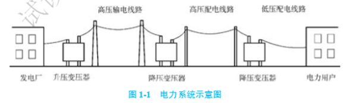
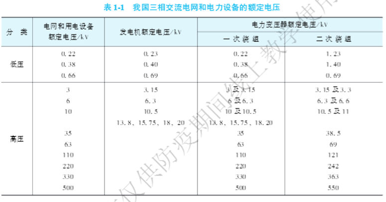
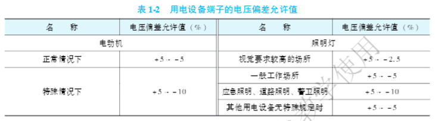
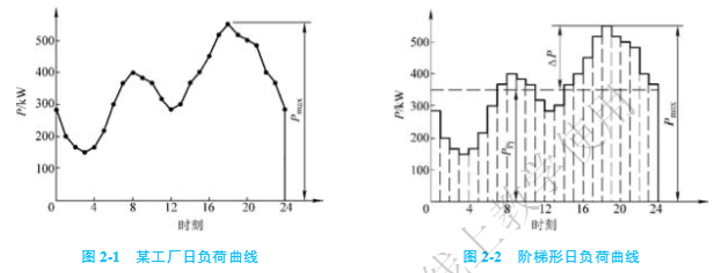
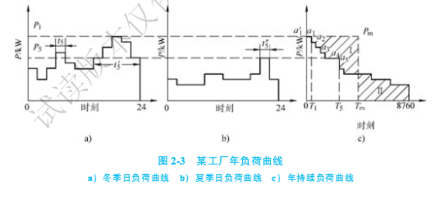
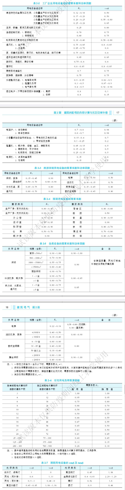
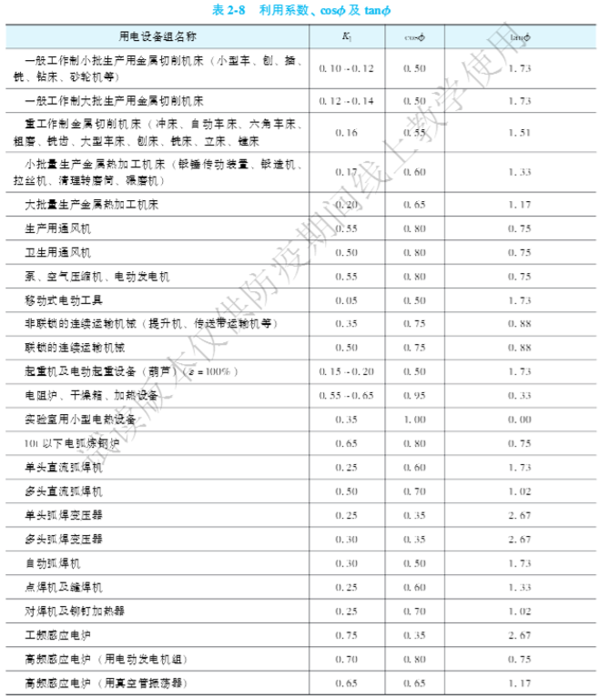
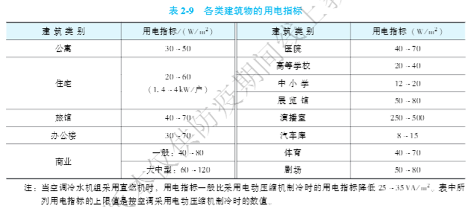
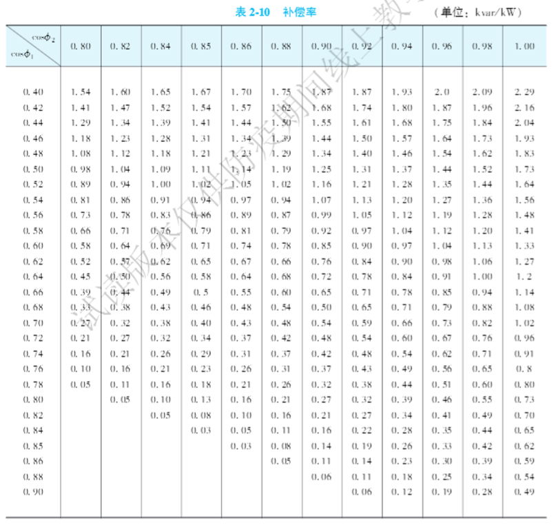

# 第 1 章 绪论
## 1.1 电力系统的概念及组成
1. 电力系统的组成
    电力系统是由发电厂、输配电网、变电站、及电力用户组成的统一整体。
    
    1. 发电厂
        产生电能的场所，将自然界一次能源转换为电能。
    2. 输配电网
        电能输送通道，分为*输电线路、配电线路*。
    3. 变电站
        电压变换和电能变换的场所，由*变压器*和*配电装置*组成。按变压性质和作用可分为*升压变电站、降压变电站*。仅装有受、配电设备而没有变压器的场所称为*变电所*。
        1. 升压变电站将发电厂发出的电能进行升压，便于大功率和远距离传输
        2. 降压变电站（配电变压所）是对电力系统的高压电减压，便于电气设备使用。根据变电站用途，可分为：
            1. **枢纽变电站**是整个电力系统的纽带连接电力系统，负责对整个系统中电能进行专属和分配。
            2. **区域变电站**是将枢纽变电站送来的电能降压后分给用户。
            3. **用户变电站**接受区域变电站的电能降压给用户。
    4. 电力用户
        消耗电能场所。
2. 建筑供配电系统及其组成
    各类建筑需要有一个内部供配电系统。建筑供配电系统由高压（35kV及以下）配电线路、变电站、低压配线路、用电设备组成，或由其中几部分组成。一般民用建筑的供电电压在20kV以下，少数特大型民用建筑群及用电负荷大的工业建筑的供电电压在35~110kV之间。
    注册电气工程师考试大纲中关于发输变电和供配电专业的划分规定：建筑供配电系统的学习重点应放在20kV以下电源及供配电系统、防雷接地系统、照明系统、电气传动控制系统、建筑智能化系统。
3. 电力系统运行的特点
    1. 电能的重要性
    2. 系统暂态过程的快速性
    3. 电能发、输、配、用的同时性
## 1.2 电力系统的额定电压
**额定电压**是指电气设备长期运行的最经济的电压。
1. 电力系统额定电压的规定
    
2. 用电设备、发电机、变压器的额定电压分析
    1. 用电设备的额定电压：额定工作条件下的电压。用电设备的额定电压和电网的额定电压应一致。用电设备应具有比电网电压允许偏差更广的正常工作电压。
    2. 发电机：额定电压一般比同级额定电压高5%，高出部分用于补偿电网的电压损失。
    3. 变压器：变压器额定电压分一次绕组、二次绕组。
        对一次绕组，当变压器接于电网时，性质等用于电网上的负荷（如，小区降压变压器），故额定电压与电网额定电压一致。当变压器接于发电机输出端（如，发电厂升压变压器），额定电压应与发电机额定电压相同。
        对二次绕组，额定电压指空载电压，考虑到变压器承载时自身电压损失（按5%计），变压器二次绕组额定电压应比电网额定电压高5%。当二次侧输电距离较长时，还用考虑线路电压损失（按5%计），此时二次绕组额定电压应比电网额定电压高10%。
3. 用电设备端子的电压允许偏差值
    
4. 电压等级选择
    1. 城镇高压配电电压宜采用20kV或10kV，低压应采用0.22kV/0.38kV。
    2. 用电单位根据电容量、用电设备特性、供电距离、回路数、电网现状、技术经济比较后确定。
    3. 小负荷用户宜接入当地低压电网。当用户总容量为300kW及以上，或安装容量在250kVA及以上时，宜采用20kV供电，否则可由低压供电。
    4. 供电距离超过300m，宜采用10kV及以上电压等级供电。
    5. 低压配电电压宜采用0.22kV/0.38kV；由地区公共低压电网供电的0.22kV负荷，线路电流小于等于60A时，可采用0.22kV单相供电；大于60A宜采用0.22kV/0.38kV三相四线制供电
    6. 当安全需要时，应采用特低压电压供电，即相见电压或相对地电压不超过交流方均根值50V的电压。具体的须查相关行业规范。
## 1.3 建筑供配电的负荷分级及供电要求
### 1.3.1 供电可靠性
**供电系统的供电质量**主要由**电能质量**和**供电可靠性**两大指标来衡量。
**电能质量**包括**电压、波形、频率**的质量。
**供电可靠性**指供电企业对用户供电的连续性。一般用实际供电小时数与全年实际总小时数的百分比来衡量。也可以应全年停电次数和停电持续时间来衡量。
### 1.3.2 负荷等级
电力负荷应根据对供电可靠性的要求及中断供电对人身安全、经济损失的影响程度分级。针对不同负荷等级确定其对供电电源的要求，应符合下列规定：
1. 符合下列情况之一，应视为一级负荷：
    1. 中断供电将造成人身伤害
    2. 中断供电将对经济造成重大损失
    3. 中断供电将影响重要用电单位的正常工作
    4. 在一级负荷中，中断供电将造成人员伤亡、重大设备损坏、发生中毒、爆炸、火灾等情况的负荷，以及特别重要场所不允许中断供电的负荷，应视为**一级负荷中特别重要的负荷**
2. 符合下列情况之一，应视为二级负荷：
    1.中断供电将造成较大经济损失
    中断供电将影响较重要用电单位的正常工作
3. 不属于一级和二级负荷的视为三级负荷
### 1.3.3 各类负荷分级

注：
1. 负荷分级表中“一级*”为一级负荷中特别重要负荷；
2. 各类建筑物的分级见现行的有关设计规范；
3. 本表未包含消防负荷分级，消防负荷分级见第3．2．3条及相关的国家标准、规范；
4. 当序号1～23各类建筑物与一类或二类高层建筑的用电负荷级别不相同时，负荷级别应按其中高者确定。

### 1.3.4 各级负荷的供电措施
1. 一级负荷用户和设备的供电措施
    1. 一级负荷由双重电源供电
        当一电源故障，另一电源不应同时受到损坏。且另一电源应能承担本用户全部一、二级负荷。
    2. 一级特别重要的负荷供电应满足：
        1. 除双重电源，还应设置应急电源，严谨将其他负荷接入应急电源。
        2. 设备供电电源的切换时间，应满足设备允许中断电供电时间。
    3. 高压电源的使用
        当一级负荷设备容量在300kW以上或有高压用电设备时，应采用两个高压电源，一般由两个区域变电站分别引来，两个电源的电压等级宜相同。但根据负荷需要及地区供电条件，采用不同电压更经济时，也可经当地供电部门同意，采用不同电压供电；或自备发电机组。
    4. 一级负荷供配电系统应符合下列要求：
        1. 一级负荷用户的变配电室的高低压配电系统，均应采用单母线分段系统，分别运行互为备用
        2. 一级负荷设备应采用双重电源供电，并在最末一级配电装置处自动切换
        3. 不同级别的负荷不应共用供电回路
        4. 应急电源与正常电源之间，应采取防止并列运行的措施。当有特殊要求，应急电源向正常电源转换需短暂并列运行时，应采取安全运行措施。
        5. 为以及负荷供电的低压配电系统，应简单可靠，尽量减少配电级数，一般低压配电不宜超过三级。
2. 二级负荷用户和设备的供电措施
    二级负荷的供电系统应做到当电力变压器发生故障时，不致中断供电或中断供电能及时恢复。
    1. 二级负荷用户的供电可依据当地电网条件，采取下列方法之一：
        1. 宜由两回线路供电，第二回路可由地区电力网或临近单位，也可自备发电机组（必须采取防止与正常电源并联运行的措施）
        2. 在负荷较小或地区变电条件困难时，可由一路6kV及以上的专用架空线路供电，当采用电力电缆敷设时，应由两根电缆供电，且每根电缆应能承担全部二级负荷的容量。
    2. 二级负荷的供配电系统应符合下列要求
        1. 双电源（或双回路）供电，在最末一级配电装置内自动切换
        2. 双电源（或双回路）供电到适当配电点自动互投后，用专线送到用电设备或其控制装置上
        3. 由变电所引出可靠的专用单回路供电
        4. 应急照明等分散的小容量负荷，可采用一路市电加EPS，或采用一路电源与设备自带的电池在设备处自动切换
3. 三级负荷用户和设备的供电措施
    三级负荷对供电无特殊要求，采用单回路供电，但应使配电系统简洁可靠，尽量减少配电级数，低压配电级数一般不超过四级。尽量减少电压偏差和电压波动。
    以三级负荷为主，有少量一、二级负荷用户，可设置仅满足一、二级符合需要的自备电源。
4. 自备电源
    1. 常用应急电源，有下列几种：
        1. 独立于正常电源的发电机组
        2. 供电网络中独立于正常电源的专用的馈电线路
        3. 蓄电池，包括大容量不间断电源装置（UPS）或应急电源装置（EPS）
        4. 干电池
    2. 设置自备电源的条件（符合其中一项宜设置）：
        1. 需要设置自备电源作为一级负荷中的特别重要负荷的应急电源时，或第二电源不能满足一级负荷的供电要求时
        2. 设置自备电源较从电力系统取得第二电源经济时
        3. 有常年稳定的余热、压差、废弃物可供发电，且技术可靠，经济合理
        4. 有设置分布式电源的条件，且经济合理，能源利用效率高
        5. 分散的小容量一级负荷（如，电话机房、消防中心、应急照明等）
    3. 应急电源
        应根据允许中断供电的时间选择，并应符合下列规定：
        1. 允许中断供电时间15s以上的供电
## 1.4 建筑电气施工的内容、程序与要求
1. 施工准备阶段
2. 安装施工阶段
3. 竣工验收阶段

# 第 2 章 建筑供配电的负荷计算与无功功率补偿
## 2.1 计算负荷的意义和计算目的
1. 计算负荷的意义
    计算负荷是一个假想负荷。它为选择供配电系统等级、变压器容量规格、导线开关等设备、保护元件、进行无功补偿、统计电网损耗、电能质量控制提供依据。这个假想的计算负荷是，在设计过程中，根据设备安装条件、设备额定容量、额定电压和工艺过程，经过一系列计算，将设备安装容量转变成计算负荷的。
    之所以不能简单用设备额定容量作为计算负荷，是因为，设备并不是同时运行，即使同时运行也不是每时每刻都在额定功率条件下运行，而是在不超过额定容量的范围内，时大时小地变化着。
    因此，负荷计算要力求接近现实，同时它也代表了实际电气设备运行地最大负荷。
2. 负荷曲线
    负荷曲线是反映电力负荷随时间变化的曲线。根据负荷性质不同，可分为有功负荷曲线、无功负荷曲线。根据持续工作时间不同，可分为日负荷曲线和年负荷曲线。
    年负荷曲线分为年最大负荷曲线、年持续负荷曲线。年最大负荷曲线（运行年负荷曲线）表示整年内逐日综合最大负荷的变化曲线。年持续负荷曲线的绘制，需借助一年中具有代表性的夏季和冬季日负荷曲线。一般取冬季213天，夏季152天，共8760小时。
    
    

3. 负荷曲线中的几个物理量
    1. 年最大负荷
        指负荷曲线的最高点。全年中最大工作班内半小时平均功率最大值。用$P_{max}、Q_{max}、S_{max}$分别代表年有功、无功、视在功率最大负荷。所谓最大工作班，指一年中最大负荷月份内最少出现2~3次的最大负荷工作班（不是偶然一次的）。
    2. 年最大负荷利用小时数
        $T_{max}$是个假想时间，标志负荷是否均匀的一个重要标志。物理意义：如果以最大负荷（$P_{max}$）持续运行$T_{max}$所消耗的电能恰好等于全年实际消耗的电能。有：
        $$T_{max}= \frac{W_p}{P_{max}}$$
        $$T_{max(无功)} = \frac{W_q}{Q_{max}}$$
        $W_p$——有功电量（kW·h）
        $W_q$——无功电量（kVar·h）
        $T_{max}$——年最大负荷利用小时数（h）
        $P_{max}$——年有功功率最大负荷（kW）
        $Q_{max}$——年无功功率最大负荷（kW）
    3. 平均负荷
        指一段时间内，消耗功率的平均值，分别记作$P_{av}、Q_{av}、S_{av}$，有：
        $$P_{av}= \frac{W_p}{t}$$
        $W_p$——0~t内消耗的有功功率（kW·h）
    4. 负荷系数
        也称负荷率、负荷曲线填充系数。表征负荷变化规律的一个参数。在最大工作班内，平均负荷与最大负荷之比称为负荷系数，用$\alpha、\beta$表示有功负荷系数、无功负荷系数。
        $$\alpha=\frac{P_{av}}{P_{max}}$$
        $$\beta=\frac{Q_{av}}{Q_{max}}$$
        负荷系数越大，曲线越平坦，负荷波动越小。有经验值$\alpha$=0.7 ~ 0.75，$\beta$=0.76 ~ 0.82。
    5. 需要系数$K_X$
        $$K_N=\frac{P_{max}}{P_r}$$
        $P_{max}(=P_e)$——用电设备组负荷曲线上最大有功负荷（kW）
        $P_r$——用电设备组的设备功率（kW）
        常用需要系数可查表
        
    6. 利用系数$K_l$
        用电设备在最大负荷班内的平均负荷。
        有功功率（kW）：$P_{av}=K_lP_e$
        无功功率（kVar）：$Q_{av}=P_{av}\tan\phi$
        $P_{av}$——用电设备组最大负荷工作班内消耗的平均功负荷（kW）
        $P_e$——用电设备组的设备功率（kW）
        $L_l$——用电设备组在最大负荷工作班内的利用系数，下表
        $\tan\phi$——用电设备组功率因数的正切值，下表
        
4. 负荷计算的主要内容
    1. 设备容量($P_e$)
        也称安装容量，是用户安装的所有用电设备的额定容量或额定功率之和。是配电系统设计、负荷计算的基础资料和依据。
    2. 计算容量($P_c$)
        也称计算负荷、需要符合、最大负荷。标志用户的最大用电功率。是选择变压器、确定备用电源容量、无功补偿容量、季节性负荷的依据。
    3. 计算电流($P_c$)
        是计算负荷在额定电压下的电流。是选配变压器、导体、电器、计算电压偏差值、功率耗损的依据，也可作为电能耗损及无功功率的估算依据。
    4. 尖峰流量($I_{jf}$)
        是负荷短时最大负荷电流（如，电动机起动）。是计算电压损失、电压波动、选择导体、电器、保护原件的依据。
## 2.2 用电设备的主要特征
用电设备工作制：
1. 长期连续工作制
    负荷较稳定，如通风机、水泵、空气压缩机、扶梯、电炉、照明灯等。连续工作时间大于30min的设备为长期连续工作制。
2. 短时工作制
    载流时达不到稳定的温度，断电后却能完全冷却。如机床上的府主电动机（进给电动机、升降电动机、水渠闸门电动机）
3. 断续周期工作制
    周期一般不超过10min，如电焊机、起重机械。载流达不到恒温，冷却也不能完全。可用负荷持续率（暂载率）来表征工作特性：
    $$\varepsilon = \frac{t}{T}\cdot 100\%=\frac{t}{t+t_0}\cdot 100\%$$
    $T$——工作周期
    $t$——周期内工作时间
    $t_0$——周期内停歇时间
## 2.3 计算负荷的方法
### 2.3.1 负荷计算的方法及设备功率的确定
1. 负荷计算的方法及用途
    1. 需要系数法
        用设备功率乘以需要系数和同时系数（一般$K_\Sigma=0.9$），直接求出计算负荷。
        方法简便，应用广泛，适用于用电设备数量多但单个设备容量小的供电系统以及配、变电所干线的负荷计算。
    2. 利用系数法
        采用利用系数求出最大负荷班的平均负荷，再考虑设备台数和功率差异的影响。乘以与有效台数有关的最大系数得出计算负荷。方法的理论依据是概率论和数理统计，结果比较接近实际。适用于工业企业电力负荷计算，但过程复杂。
    3. 二项式法
        将负荷分为基本部分、附加部分。后者考虑一定数量大容量设备的影响。适用于用电设备组内设备容量差异较大的机修类用电设备计算。
    4. 单位面积功率法、单位指标法、单位产品耗电量法
        前两者多用于民用建筑，后者适用工业建筑。因为是粗算，所以多用于可行性研究、方案初步设计。
    
    一般情况下，需要系数法用于初步设计及施工图设计阶段的负荷计算；单位面积功率法、单位指标法用于方案设计阶段进行电力负荷估算。对于住宅，在设计的各阶段均可采用单位指标法。
2. 设备功率的确定
    在负荷计算时，需将设备按工作性质分为不同的用电设备组，通过不同的换算公式确定设备功率$P_e$。
    1. 连续工作制
        $$P_e = P_r$$
        $P_r$——电动机额定功率（kW）
    2. 短时工作制
        $$P_e = P_r$$
    3. 断续工作制
        将额定功率换算为统一负载持续率的有功功率。
        1. 当采用需要系数法和二项式法计算负荷时，起重机用电动机类的设备功率为统一换算到负载持续率$\varepsilon = 25\%$的有功功率。
        $$P_r=\sqrt{\frac{\varepsilon_r}{\varepsilon_{25}}}P_r = 2P_r\sqrt{\varepsilon_r}$$
        $P_r$——负荷持续率为$\varepsilon_r$时的电动机额定功率（kW）
        $\varepsilon_r$——电动机的额定负载持续率
        2. 当采用需要系数法和二项式法计算负荷时，断续工作制电焊机的设备功率是指将额定容量换算到负载持续率$\varepsilon=100\%$时的有功功率。
        $$P_r=\sqrt{\frac{\varepsilon_r}{\varepsilon_{100}}}P_r = S_r\sqrt{\varepsilon_r}\cos\phi$$
        $S_r$——持续负载率为$\varepsilon_r$时的电焊机的额定容量（kVA）
        $\varepsilon_r$——电焊机的额定负载持续率
        $\cos\phi$——电焊机的功率因数
### 2.3.2 需要系数法确定计算负荷
1. 用电设备的计算负荷及计算电流
    有功功率（kW）
    $$P_c = K_NP_e$$
    无功功率（kvar）
    $$Q_c=P_c\tan\phi$$
    视在功率（kVA）
    $$S_c = \sqrt{P_c^2+Q_c^2}$$
    计算电流（A）
    $$I = \frac{S_c}{\sqrt{3}U_r}$$
2. 多组用电设备组的计算负荷
    配电干线上或在变电所低压母线上，常有多个用电设备组同时工作，但各个用电设备组的最大负荷并非同时出现，因此，在求配电干线或变压所低压母线的计算负荷时，应再计入一个同时系数（同期系数）$K_\Sigma$:
    有功功率（kW）
    $$P_c = K_{\Sigma_p}\sum_{i=1}^{n}{P_{ei}}$$
    无功功率（kvar）
    $$Q_c = K_{\Sigma_q}\sum_{i=1}^{n}{Q_{ei}}$$
    视在功率（kVA）
    $$S_c = \sqrt{P_c^2+Q_c^2}$$
    计算电流（A）
    $$I = \frac{S_c}{\sqrt{3}U_r}$$
    在计算多组用电设备组的计算负荷时应注意：当其中一组短时工作的设备容量相对较小时，短时工作的用电设备组的容量可不计入总容量。
3. 单相负荷计算
    单相负荷应均衡地分配在三相上。当无法使三相平衡，且最大相与最小相之差大于三相总负荷的15%，应取最大相负荷的三倍作为等效三相负荷计算。
4. 尖峰电流
    指单台或多台用电设备持续1~2s的短时最大负荷电流，尖峰流量一般出现在电动机起动过程中。计算电压波动、选熔断器和自动开关、整定继电保护装置、校验电动机起动条件时，需要校验尖峰电流值。
    1. 单台电动机的尖峰电流
        $$I_{jf} = KI_{rM}$$
    2. 多台电动机的尖峰电流
        $$I_{jf} = (KI_{rM})_{max} + \Sigma I_c$$
    3. 自起电动机组的尖峰电流
        $$I_{jf} = \sum_{i=1}^{n}{I_{jfi}}$$
### 2.3.3 进行负荷计算时应做的处理
进行负荷计算时，应先对应用电设备容量进行以下处理：
1. 单台设备的功率一般取其铭牌上的额定功率
2. 连续工作的电动机的设备容量，即铭牌上的额定功率，是轴输出功率，未计入电动机本身损耗
3. 照明负荷的用电设备容量应根据所用光源的额定功率加附属设备上的功率。如加上镇流器功耗。
4. 低压卤钨灯为灯泡的额定功率加上变压器功率。
5. 用电设备组的设备容量不应包括备用设备容量。非火灾时使用的消防设备容量应列入总设备容量，如应急灯、消防电梯。
6. 消防时的最大负荷与非火灾时使用的最大负荷应择其大者计入总量。
7. 大型建筑或建筑群消防用电设备的计算负荷，应按火灾发生时相邻防火分区可能同时使用的消防用电设备的计算负荷容量确定。
8. 季节性用电设备应则其大者计入总设备容量。
9. 住宅的设备容量采用每户用电指标之和。
### 2.3.4 单位面积功率法和负荷密度法确定计算负荷
$$P_c = \frac{P_e'S}{1000}$$

## 2.4 建筑用电负荷的特征
1. 给水排水动力负荷
    1. 消防泵、喷淋泵均为消防负荷，
    2. 生活水泵一般时为建筑物提供生活用水的。
2. 冷冻机组动力负荷
3. 电梯负荷
4. 照明负荷
5. 风机负荷
## 2.5 建筑供配电系统无功功率的补偿
1. 功率因数的求值
    1. 高压用户的功率因数应在0.9以上。
    2. 低压用户的功率因数应在0.85以上。
2. 无功补偿措施
    1. 提高自然功率因数
        1. 正确选择变压器容量。
        2. 正确选择变压器台数，可以切除季节性负荷用的变压器。
        3. 减少供电线路感抗。
        4. 有条件时，尽量采用同步电动机。
    2. 采用电力电容器补偿
    3. 补偿的容量
        1. 在供电系统进行方案设计时，无功补偿容量可按变压器容量的15%~25%估算。
        2. 在施工图设计时，应进行无功功率计算。
        
        电容器的补偿量为
        $$Q_C = P_C(\tan\phi_1-\tan\phi_2)$$
        常把$\tan\phi_1-\tan\phi_2 = \Delta q_C$称为补偿率。计算时可查表
        
        确定了总的补偿容量后，即可以根据所选并联电容器的单个容量$q_C$来确定点容器个数，即
        $$n=\frac{Q_C}{q_C}$$
        对于单相电容器来说，应取3的倍数，以便三相均衡分配。
        3. 采用自动调节补偿方案时，补偿电容器的安装容量宜有适当余量。
## 2.6 典型建筑工程的负荷计算

## 2.7 供配电系统的能量损耗
### 2.7.1 变压器的功率损耗
变压器的损耗包括有功功率损耗、无功功率损耗。
1. 有功功率损耗
    有功功率损耗由空载损耗（铁损）和短路损耗（铜损）两部分组成。
    $$\Delta P_T = \Delta P_0 + \Delta P_k(\frac{S_C}{S_r})^2$$
2. 无功功率损耗
    $$\Delta Q = \Delta Q_0 + \Delta Q_k(\frac{S_C}{S_r})^2$$
### 2.7.2 供电线路的功率损耗
三相供电线路的有用功率损耗为
$$\Delta P_L = 3I_C^2r_0 l\times10^3$$
无功功率损耗为
$$\Delta Q_L = 3I_C^2x_0 l\times10^3$$

### 2.7.3 供配电系统年电能损耗
1. 线路年电能损耗为
    $$\Delta W_L = \Delta P_L\tau$$
2. 变压器年电能损耗
    $$\Delta W_T = \Delta P_0t + \Delta P_k(\frac{S_C}{S_r})^2\tau$$
### 2.7.4 线损率和年电能需要量计算
1. 线损率计算
    $$\eta = \frac{\sum\Delta{W_L} + \sum{\Delta{W_r}}}{W}\times100\%$$
2. 年电能需要量计算
    $$W_y = \alpha_{av}P_CT_n$$
    $$W_m = \beta_{av}Q_CT_n$$
