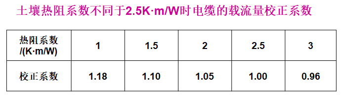
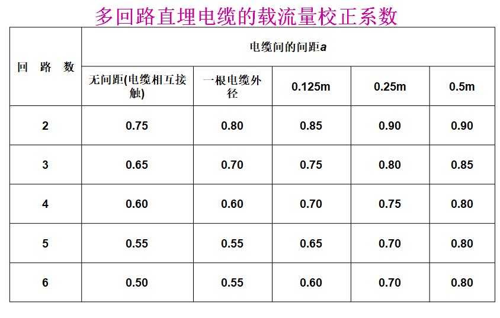

# 第 1 章 绪论
## 1.1 电力系统的概念及组成
1. 电力系统的组成
    电力系统是由发电厂、输配电网、变电站、及电力用户组成的统一整体。
    
    1. 发电厂
        产生电能的场所，将自然界一次能源转换为电能。
    2. 输配电网
        电能输送通道，分为*输电线路、配电线路*。
    3. 变电站
        电压变换和电能变换的场所，由*变压器*和*配电装置*组成。按变压性质和作用可分为*升压变电站、降压变电站*。仅装有受、配电设备而没有变压器的场所称为*变电所*。
        1. 升压变电站将发电厂发出的电能进行升压，便于大功率和远距离传输
        2. 降压变电站（配电变压所）是对电力系统的高压电减压，便于电气设备使用。根据变电站用途，可分为：
            1. **枢纽变电站**是整个电力系统的纽带连接电力系统，负责对整个系统中电能进行专属和分配。
            2. **区域变电站**是将枢纽变电站送来的电能降压后分给用户。
            3. **用户变电站**接受区域变电站的电能降压给用户。
    4. 电力用户
        消耗电能场所。
2. 建筑供配电系统及其组成
    各类建筑需要有一个内部供配电系统。建筑供配电系统由高压（35kV及以下）配电线路、变电站、低压配线路、用电设备组成，或由其中几部分组成。一般民用建筑的供电电压在20kV以下，少数特大型民用建筑群及用电负荷大的工业建筑的供电电压在35~110kV之间。
    注册电气工程师考试大纲中关于发输变电和供配电专业的划分规定：建筑供配电系统的学习重点应放在20kV以下电源及供配电系统、防雷接地系统、照明系统、电气传动控制系统、建筑智能化系统。
3. 电力系统运行的特点
    1. 电能的重要性
    2. 系统暂态过程的快速性
    3. 电能发、输、配、用的同时性
## 1.2 电力系统的额定电压
**额定电压**是指电气设备长期运行的最经济的电压。
1. 电力系统额定电压的规定
    
2. 用电设备、发电机、变压器的额定电压分析
    1. 用电设备的额定电压：额定工作条件下的电压。用电设备的额定电压和电网的额定电压应一致。用电设备应具有比电网电压允许偏差更广的正常工作电压。
    2. 发电机：额定电压一般比同级额定电压高5%，高出部分用于补偿电网的电压损失。
    3. 变压器：变压器额定电压分一次绕组、二次绕组。
        对一次绕组，当变压器接于电网时，性质等用于电网上的负荷（如，小区降压变压器），故额定电压与电网额定电压一致。当变压器接于发电机输出端（如，发电厂升压变压器），额定电压应与发电机额定电压相同。
        对二次绕组，额定电压指空载电压，考虑到变压器承载时自身电压损失（按5%计），变压器二次绕组额定电压应比电网额定电压高5%。当二次侧输电距离较长时，还用考虑线路电压损失（按5%计），此时二次绕组额定电压应比电网额定电压高10%。
3. 用电设备端子的电压允许偏差值
    
4. 电压等级选择
    1. 城镇高压配电电压宜采用20kV或10kV，低压应采用0.22kV/0.38kV。
    2. 用电单位根据电容量、用电设备特性、供电距离、回路数、电网现状、技术经济比较后确定。
    3. 小负荷用户宜接入当地低压电网。当用户总容量为300kW及以上，或安装容量在250kVA及以上时，宜采用20kV供电，否则可由低压供电。
    4. 供电距离超过300m，宜采用10kV及以上电压等级供电。
    5. 低压配电电压宜采用0.22kV/0.38kV；由地区公共低压电网供电的0.22kV负荷，线路电流小于等于60A时，可采用0.22kV单相供电；大于60A宜采用0.22kV/0.38kV三相四线制供电
    6. 当安全需要时，应采用特低压电压供电，即相见电压或相对地电压不超过交流方均根值50V的电压。具体的须查相关行业规范。
## 1.3 建筑供配电的负荷分级及供电要求
### 1.3.1 供电可靠性
**供电系统的供电质量**主要由**电能质量**和**供电可靠性**两大指标来衡量。
**电能质量**包括**电压、波形、频率**的质量。
**供电可靠性**指供电企业对用户供电的连续性。一般用实际供电小时数与全年实际总小时数的百分比来衡量。也可以应全年停电次数和停电持续时间来衡量。
### 1.3.2 负荷等级
电力负荷应根据对供电可靠性的要求及中断供电对人身安全、经济损失的影响程度分级。针对不同负荷等级确定其对供电电源的要求，应符合下列规定：
1. 符合下列情况之一，应视为一级负荷：
    1. 中断供电将造成人身伤害
    2. 中断供电将对经济造成重大损失
    3. 中断供电将影响重要用电单位的正常工作
    4. 在一级负荷中，中断供电将造成人员伤亡、重大设备损坏、发生中毒、爆炸、火灾等情况的负荷，以及特别重要场所不允许中断供电的负荷，应视为**一级负荷中特别重要的负荷**
2. 符合下列情况之一，应视为二级负荷：
    1.中断供电将造成较大经济损失
    中断供电将影响较重要用电单位的正常工作
3. 不属于一级和二级负荷的视为三级负荷
### 1.3.3 各类负荷分级

注：
1. 负荷分级表中“一级*”为一级负荷中特别重要负荷；
2. 各类建筑物的分级见现行的有关设计规范；
3. 本表未包含消防负荷分级，消防负荷分级见第3．2．3条及相关的国家标准、规范；
4. 当序号1～23各类建筑物与一类或二类高层建筑的用电负荷级别不相同时，负荷级别应按其中高者确定。

### 1.3.4 各级负荷的供电措施
1. 一级负荷用户和设备的供电措施
    1. 一级负荷由双重电源供电
        当一电源故障，另一电源不应同时受到损坏。且另一电源应能承担本用户全部一、二级负荷。
    2. 一级特别重要的负荷供电应满足：
        1. 除双重电源，还应设置应急电源，严谨将其他负荷接入应急电源。
        2. 设备供电电源的切换时间，应满足设备允许中断电供电时间。
    3. 高压电源的使用
        当一级负荷设备容量在300kW以上或有高压用电设备时，应采用两个高压电源，一般由两个区域变电站分别引来，两个电源的电压等级宜相同。但根据负荷需要及地区供电条件，采用不同电压更经济时，也可经当地供电部门同意，采用不同电压供电；或自备发电机组。
    4. 一级负荷供配电系统应符合下列要求：
        1. 一级负荷用户的变配电室的高低压配电系统，均应采用单母线分段系统，分别运行互为备用
        2. 一级负荷设备应采用双重电源供电，并在最末一级配电装置处自动切换
        3. 不同级别的负荷不应共用供电回路
        4. 应急电源与正常电源之间，应采取防止并列运行的措施。当有特殊要求，应急电源向正常电源转换需短暂并列运行时，应采取安全运行措施。
        5. 为以及负荷供电的低压配电系统，应简单可靠，尽量减少配电级数，一般低压配电不宜超过三级。
2. 二级负荷用户和设备的供电措施
    二级负荷的供电系统应做到当电力变压器发生故障时，不致中断供电或中断供电能及时恢复。
    1. 二级负荷用户的供电可依据当地电网条件，采取下列方法之一：
        1. 宜由两回线路供电，第二回路可由地区电力网或临近单位，也可自备发电机组（必须采取防止与正常电源并联运行的措施）
        2. 在负荷较小或地区变电条件困难时，可由一路6kV及以上的专用架空线路供电，当采用电力电缆敷设时，应由两根电缆供电，且每根电缆应能承担全部二级负荷的容量。
    2. 二级负荷的供配电系统应符合下列要求
        1. 双电源（或双回路）供电，在最末一级配电装置内自动切换
        2. 双电源（或双回路）供电到适当配电点自动互投后，用专线送到用电设备或其控制装置上
        3. 由变电所引出可靠的专用单回路供电
        4. 应急照明等分散的小容量负荷，可采用一路市电加EPS，或采用一路电源与设备自带的电池在设备处自动切换
3. 三级负荷用户和设备的供电措施
    三级负荷对供电无特殊要求，采用单回路供电，但应使配电系统简洁可靠，尽量减少配电级数，低压配电级数一般不超过四级。尽量减少电压偏差和电压波动。
    以三级负荷为主，有少量一、二级负荷用户，可设置仅满足一、二级符合需要的自备电源。
4. 自备电源
    1. 常用应急电源，有下列几种：
        1. 独立于正常电源的发电机组
        2. 供电网络中独立于正常电源的专用的馈电线路
        3. 蓄电池，包括大容量不间断电源装置（UPS）或应急电源装置（EPS）
        4. 干电池
    2. 设置自备电源的条件（符合其中一项宜设置）：
        1. 需要设置自备电源作为一级负荷中的特别重要负荷的应急电源时，或第二电源不能满足一级负荷的供电要求时
        2. 设置自备电源较从电力系统取得第二电源经济时
        3. 有常年稳定的余热、压差、废弃物可供发电，且技术可靠，经济合理
        4. 有设置分布式电源的条件，且经济合理，能源利用效率高
        5. 分散的小容量一级负荷（如，电话机房、消防中心、应急照明等）
    3. 应急电源
        应根据允许中断供电的时间选择，并应符合下列规定：
        1. 允许中断供电时间15s以上的供电
## 1.4 建筑电气施工的内容、程序与要求
1. 施工准备阶段
2. 安装施工阶段
3. 竣工验收阶段

# 第 2 章 建筑供配电的负荷计算与无功功率补偿
## 2.1 计算负荷的意义和计算目的
1. 计算负荷的意义
    计算负荷是一个假想负荷。它为选择供配电系统等级、变压器容量规格、导线开关等设备、保护元件、进行无功补偿、统计电网损耗、电能质量控制提供依据。这个假想的计算负荷是，在设计过程中，根据设备安装条件、设备额定容量、额定电压和工艺过程，经过一系列计算，将设备安装容量转变成计算负荷的。
    之所以不能简单用设备额定容量作为计算负荷，是因为，设备并不是同时运行，即使同时运行也不是每时每刻都在额定功率条件下运行，而是在不超过额定容量的范围内，时大时小地变化着。
    因此，负荷计算要力求接近现实，同时它也代表了实际电气设备运行地最大负荷。
2. 负荷曲线
    负荷曲线是反映电力负荷随时间变化的曲线。根据负荷性质不同，可分为有功负荷曲线、无功负荷曲线。根据持续工作时间不同，可分为日负荷曲线和年负荷曲线。
    年负荷曲线分为年最大负荷曲线、年持续负荷曲线。年最大负荷曲线（运行年负荷曲线）表示整年内逐日综合最大负荷的变化曲线。年持续负荷曲线的绘制，需借助一年中具有代表性的夏季和冬季日负荷曲线。一般取冬季213天，夏季152天，共8760小时。
    
    

3. 负荷曲线中的几个物理量
    1. 年最大负荷
        指负荷曲线的最高点。全年中最大工作班内半小时平均功率最大值。用$P_{max}、Q_{max}、S_{max}$分别代表年有功、无功、视在功率最大负荷。所谓最大工作班，指一年中最大负荷月份内最少出现2~3次的最大负荷工作班（不是偶然一次的）。
    2. 年最大负荷利用小时数
        $T_{max}$是个假想时间，标志负荷是否均匀的一个重要标志。物理意义：如果以最大负荷（$P_{max}$）持续运行$T_{max}$所消耗的电能恰好等于全年实际消耗的电能。有：
        $$T_{max}= \frac{W_p}{P_{max}}$$
        $$T_{max(无功)} = \frac{W_q}{Q_{max}}$$
        $W_p$——有功电量（kW·h）
        $W_q$——无功电量（kVar·h）
        $T_{max}$——年最大负荷利用小时数（h）
        $P_{max}$——年有功功率最大负荷（kW）
        $Q_{max}$——年无功功率最大负荷（kW）
    3. 平均负荷
        指一段时间内，消耗功率的平均值，分别记作$P_{av}、Q_{av}、S_{av}$，有：
        $$P_{av}= \frac{W_p}{t}$$
        $W_p$——0~t内消耗的有功功率（kW·h）
    4. 负荷系数
        也称负荷率、负荷曲线填充系数。表征负荷变化规律的一个参数。在最大工作班内，平均负荷与最大负荷之比称为负荷系数，用$\alpha、\beta$表示有功负荷系数、无功负荷系数。
        $$\alpha=\frac{P_{av}}{P_{max}}$$
        $$\beta=\frac{Q_{av}}{Q_{max}}$$
        负荷系数越大，曲线越平坦，负荷波动越小。有经验值$\alpha$=0.7 ~ 0.75，$\beta$=0.76 ~ 0.82。
    5. 需要系数$K_X$
        $$K_N=\frac{P_{max}}{P_r}$$
        $P_{max}(=P_e)$——用电设备组负荷曲线上最大有功负荷（kW）
        $P_r$——用电设备组的设备功率（kW）
        常用需要系数可查表
        
    6. 利用系数$K_l$
        用电设备在最大负荷班内的平均负荷。
        有功功率（kW）：$P_{av}=K_lP_e$
        无功功率（kVar）：$Q_{av}=P_{av}\tan\phi$
        $P_{av}$——用电设备组最大负荷工作班内消耗的平均功负荷（kW）
        $P_e$——用电设备组的设备功率（kW）
        $L_l$——用电设备组在最大负荷工作班内的利用系数，下表
        $\tan\phi$——用电设备组功率因数的正切值，下表
        
4. 负荷计算的主要内容
    1. 设备容量($P_e$)
        也称安装容量，是用户安装的所有用电设备的额定容量或额定功率之和。是配电系统设计、负荷计算的基础资料和依据。
    2. 计算容量($P_c$)
        也称计算负荷、需要符合、最大负荷。标志用户的最大用电功率。是选择变压器、确定备用电源容量、无功补偿容量、季节性负荷的依据。
    3. 计算电流($P_c$)
        是计算负荷在额定电压下的电流。是选配变压器、导体、电器、计算电压偏差值、功率耗损的依据，也可作为电能耗损及无功功率的估算依据。
    4. 尖峰流量($I_{jf}$)
        是负荷短时最大负荷电流（如，电动机起动）。是计算电压损失、电压波动、选择导体、电器、保护原件的依据。
## 2.2 用电设备的主要特征
用电设备工作制：
1. 长期连续工作制
    负荷较稳定，如通风机、水泵、空气压缩机、扶梯、电炉、照明灯等。连续工作时间大于30min的设备为长期连续工作制。
2. 短时工作制
    载流时达不到稳定的温度，断电后却能完全冷却。如机床上的府主电动机（进给电动机、升降电动机、水渠闸门电动机）
3. 断续周期工作制
    周期一般不超过10min，如电焊机、起重机械。载流达不到恒温，冷却也不能完全。可用负荷持续率（暂载率）来表征工作特性：
    $$\varepsilon = \frac{t}{T}\cdot 100\%=\frac{t}{t+t_0}\cdot 100\%$$
    $T$——工作周期
    $t$——周期内工作时间
    $t_0$——周期内停歇时间
## 2.3 计算负荷的方法
### 2.3.1 负荷计算的方法及设备功率的确定
1. 负荷计算的方法及用途
    1. 需要系数法
        用设备功率乘以需要系数和同时系数（一般$K_\Sigma=0.9$），直接求出计算负荷。
        方法简便，应用广泛，适用于用电设备数量多但单个设备容量小的供电系统以及配、变电所干线的负荷计算。
    2. 利用系数法
        采用利用系数求出最大负荷班的平均负荷，再考虑设备台数和功率差异的影响。乘以与有效台数有关的最大系数得出计算负荷。方法的理论依据是概率论和数理统计，结果比较接近实际。适用于工业企业电力负荷计算，但过程复杂。
    3. 二项式法
        将负荷分为基本部分、附加部分。后者考虑一定数量大容量设备的影响。适用于用电设备组内设备容量差异较大的机修类用电设备计算。
    4. 单位面积功率法、单位指标法、单位产品耗电量法
        前两者多用于民用建筑，后者适用工业建筑。因为是粗算，所以多用于可行性研究、方案初步设计。
    
    一般情况下，需要系数法用于初步设计及施工图设计阶段的负荷计算；单位面积功率法、单位指标法用于方案设计阶段进行电力负荷估算。对于住宅，在设计的各阶段均可采用单位指标法。
2. 设备功率的确定
    在负荷计算时，需将设备按工作性质分为不同的用电设备组，通过不同的换算公式确定设备功率$P_e$。
    1. 连续工作制
        $$P_e = P_r$$
        $P_r$——电动机额定功率（kW）
    2. 短时工作制
        $$P_e = P_r$$
    3. 断续工作制
        将额定功率换算为统一负载持续率的有功功率。
        1. 当采用需要系数法和二项式法计算负荷时，起重机用电动机类的设备功率为统一换算到负载持续率$\varepsilon = 25\%$的有功功率。
        $$P_r=\sqrt{\frac{\varepsilon_r}{\varepsilon_{25}}}P_r = 2P_r\sqrt{\varepsilon_r}$$
        $P_r$——负荷持续率为$\varepsilon_r$时的电动机额定功率（kW）
        $\varepsilon_r$——电动机的额定负载持续率
        2. 当采用需要系数法和二项式法计算负荷时，断续工作制电焊机的设备功率是指将额定容量换算到负载持续率$\varepsilon=100\%$时的有功功率。
        $$P_r=\sqrt{\frac{\varepsilon_r}{\varepsilon_{100}}}P_r = S_r\sqrt{\varepsilon_r}\cos\phi$$
        $S_r$——持续负载率为$\varepsilon_r$时的电焊机的额定容量（kVA）
        $\varepsilon_r$——电焊机的额定负载持续率
        $\cos\phi$——电焊机的功率因数
### 2.3.2 需要系数法确定计算负荷
1. 用电设备的计算负荷及计算电流
    有功功率（kW）
    $$P_c = K_NP_e$$
    无功功率（kvar）
    $$Q_c=P_c\tan\phi$$
    视在功率（kVA）
    $$S_c = \sqrt{P_c^2+Q_c^2}$$
    计算电流（A）
    $$I = \frac{S_c}{\sqrt{3}U_r}$$
2. 多组用电设备组的计算负荷
    配电干线上或在变电所低压母线上，常有多个用电设备组同时工作，但各个用电设备组的最大负荷并非同时出现，因此，在求配电干线或变压所低压母线的计算负荷时，应再计入一个同时系数（同期系数）$K_\Sigma$:
    有功功率（kW）
    $$P_c = K_{\Sigma_p}\sum_{i=1}^{n}{P_{ei}}$$
    无功功率（kvar）
    $$Q_c = K_{\Sigma_q}\sum_{i=1}^{n}{Q_{ei}}$$
    视在功率（kVA）
    $$S_c = \sqrt{P_c^2+Q_c^2}$$
    计算电流（A）
    $$I = \frac{S_c}{\sqrt{3}U_r}$$
    在计算多组用电设备组的计算负荷时应注意：当其中一组短时工作的设备容量相对较小时，短时工作的用电设备组的容量可不计入总容量。
3. 单相负荷计算
    单相负荷应均衡地分配在三相上。当无法使三相平衡，且最大相与最小相之差大于三相总负荷的15%，应取最大相负荷的三倍作为等效三相负荷计算。
4. 尖峰电流
    指单台或多台用电设备持续1~2s的短时最大负荷电流，尖峰流量一般出现在电动机起动过程中。计算电压波动、选熔断器和自动开关、整定继电保护装置、校验电动机起动条件时，需要校验尖峰电流值。
    1. 单台电动机的尖峰电流
        $$I_{jf} = KI_{rM}$$
    2. 多台电动机的尖峰电流
        $$I_{jf} = (KI_{rM})_{max} + \Sigma I_c$$
    3. 自起电动机组的尖峰电流
        $$I_{jf} = \sum_{i=1}^{n}{I_{jfi}}$$
### 2.3.3 进行负荷计算时应做的处理
进行负荷计算时，应先对应用电设备容量进行以下处理：
1. 单台设备的功率一般取其铭牌上的额定功率
2. 连续工作的电动机的设备容量，即铭牌上的额定功率，是轴输出功率，未计入电动机本身损耗
3. 照明负荷的用电设备容量应根据所用光源的额定功率加附属设备上的功率。如加上镇流器功耗。
4. 低压卤钨灯为灯泡的额定功率加上变压器功率。
5. 用电设备组的设备容量不应包括备用设备容量。非火灾时使用的消防设备容量应列入总设备容量，如应急灯、消防电梯。
6. 消防时的最大负荷与非火灾时使用的最大负荷应择其大者计入总量。
7. 大型建筑或建筑群消防用电设备的计算负荷，应按火灾发生时相邻防火分区可能同时使用的消防用电设备的计算负荷容量确定。
8. 季节性用电设备应则其大者计入总设备容量。
9. 住宅的设备容量采用每户用电指标之和。
### 2.3.4 单位面积功率法和负荷密度法确定计算负荷
$$P_c = \frac{P_e'S}{1000}$$

## 2.4 建筑用电负荷的特征
1. 给水排水动力负荷
    1. 消防泵、喷淋泵均为消防负荷，
    2. 生活水泵一般时为建筑物提供生活用水的。
2. 冷冻机组动力负荷
3. 电梯负荷
4. 照明负荷
5. 风机负荷
## 2.5 建筑供配电系统无功功率的补偿
1. 功率因数的求值
    1. 高压用户的功率因数应在0.9以上。
    2. 低压用户的功率因数应在0.85以上。
2. 无功补偿措施
    1. 提高自然功率因数
        1. 正确选择变压器容量。
        2. 正确选择变压器台数，可以切除季节性负荷用的变压器。
        3. 减少供电线路感抗。
        4. 有条件时，尽量采用同步电动机。
    2. 采用电力电容器补偿
    3. 补偿的容量
        1. 在供电系统进行方案设计时，无功补偿容量可按变压器容量的15%~25%估算。
        2. 在施工图设计时，应进行无功功率计算。
        
        电容器的补偿量为
        $$Q_C = P_C(\tan\phi_1-\tan\phi_2)$$
        常把$\tan\phi_1-\tan\phi_2 = \Delta q_C$称为补偿率。计算时可查表
        
        确定了总的补偿容量后，即可以根据所选并联电容器的单个容量$q_C$来确定点容器个数，即
        $$n=\frac{Q_C}{q_C}$$
        对于单相电容器来说，应取3的倍数，以便三相均衡分配。
        3. 采用自动调节补偿方案时，补偿电容器的安装容量宜有适当余量。
## 2.6 典型建筑工程的负荷计算

## 2.7 供配电系统的能量损耗
### 2.7.1 变压器的功率损耗
变压器的损耗包括有功功率损耗、无功功率损耗。
1. 有功功率损耗
    有功功率损耗由空载损耗（铁损）和短路损耗（铜损）两部分组成。
    $$\Delta P_T = \Delta P_0 + \Delta P_k(\frac{S_C}{S_r})^2$$
2. 无功功率损耗
    $$\Delta Q = \Delta Q_0 + \Delta Q_k(\frac{S_C}{S_r})^2$$
### 2.7.2 供电线路的功率损耗
三相供电线路的有用功率损耗为
$$\Delta P_L = 3I_C^2r_0 l\times10^3$$
无功功率损耗为
$$\Delta Q_L = 3I_C^2x_0 l\times10^3$$

### 2.7.3 供配电系统年电能损耗
1. 线路年电能损耗为
    $$\Delta W_L = \Delta P_L\tau$$
2. 变压器年电能损耗
    $$\Delta W_T = \Delta P_0t + \Delta P_k(\frac{S_C}{S_r})^2\tau$$
### 2.7.4 线损率和年电能需要量计算
1. 线损率计算
    $$\eta = \frac{\sum\Delta{W_L} + \sum{\Delta{W_r}}}{W}\times100\%$$
2. 年电能需要量计算
    $$W_y = \alpha_{av}P_CT_n$$
    $$W_m = \beta_{av}Q_CT_n$$

# 第 4 章 电线、电缆及电器设备的选择
## 4.1 电线、电缆及母线的选择
线芯材料：铝芯、铜芯
绝缘导线的绝缘外皮材料：塑料绝缘：绝缘性能良好，价格低，适用于室内；橡胶绝缘：高温时不宜软化，低温时不宜变硬变脆，适用于室外。
### 4.1.1 常用电线和电缆型号的选择
1. 铜芯电缆、电线选用
    电缆、电线可选用铜芯或铝芯,民用建筑宜采用铜芯电缆或电线。下列场所应选择铜芯电缆或导线:
    1. 供电可靠性要求较高的干线回路,一、二级负荷或三级负荷中重要负荷的配线。
    2. 居住建筑、幼儿园、福利院、医院等用电设备的配电线路。
    3. 有爆炸、火灾危险、潮湿、腐蚀、按八度及以上抗震设防的场所及连接移动设备的配电线路。
    4. 重要公共建筑及人员聚集场所。
    5. 监测及控制回路。
    6. 应急(含消防)系统的线路。
    7. 室外配电的电缆线路。
2. 电力电缆芯数、导线根数的选择
    1. 三相电路中电力电缆芯数及导线根数的选择
        * 1kV及以下的TN-C系统应采用4芯电缆或4根导线。
        * 1kV及以下TN-S系统应选用5芯电缆或5根导线。
    2. 单相电路中电力电缆芯数及导线根数的选择
        * 1kV及以下TN-C系统的单相回路应选用2芯电缆或2根导线。
        * 1kV及以下TN-S系统的单相回路应选用3芯电缆或3根导线。
3. 绝缘水平
    室内低压配线(包括软线)的绝缘水平应不低于0.45kV/0.75kV;电缆配线不低于0.6kV/1.0kV
4. 尽量选用塑料绝缘电线
    因为塑料绝缘线的绝缘性能好、成本低,当在建筑物表面直接敷设时,应选用聚氯乙烯绝缘和护套电线。
5. 注意选用新材料、新品种的电线、电缆
    不选用淘汰产品及限制使用的产品。
6. 电线、电缆具体型号选用
    应根据使用环境和敷设方式而定，应查表。

电线、电缆材料：   
* BV(BLV):铜(铝)芯聚氯乙烯绝缘线
* BX:铜芯橡胶绝缘线
* VV(VLV):铜(铝)芯塑料绝缘塑料护套电缆
* YJV:铜芯交联聚乙烯绝缘聚乙烯护套电缆
* VV22:铜芯聚乙烯绝缘聚乙烯护套铠装电缆
* BTTZ(重载):矿物绝缘电缆

### 4.1.2 常用电线和电缆截面积的选择方法
1. 电线和电缆的截面积选择应满足的主要要求
    1. 不因长期通过负荷电流使*导线过热*,以避免损坏绝缘或短路失火等事故
    2. 有足够的*机械强度*,避免因刮风、结冰或施工等原因被拉断
    3. 线路上*电压损失*不能过大,对于电力线路,电压损失一般不能超过额定电压的10%,对于照明线路,一般不能超过5%
2. 选择导线截面积的方法
    * 对于距离$L\leq200m$的低压电力线路,一般先按发热条件的计算方法来选择导线截面积,然后用电压损失条件和机械强度条件进行校验。
    * 对于距离$L>200m$较长的供电线路,一般先按允许电压损失的计算方法来选择截面积,然后用发热条件和机械强度条件进行验算。
    * 对于高压线路,一般先按经济电流密度选择法来选择导线截面积,然后用发热条件和电压损失条件进行校验。所谓经济电流密度选择法,是指从经济角度出发,综合考虑输电线路的电能损耗和投资效益等指标,来确定导线单位面积内流过的电流值,其数据可查有关手册。
3. 选择导线截面积的具体方法
    1. 按发热条件选择导线截面积 
        * 不同材料和绝缘导线的**允许载流量**，可查表
        * 在这个允许载流量范围内运行,**导线的升温不会超过允许值**
        * 按发热条件选择**导线截面积**就是*要求计算电流不超过导线正常运行时的允许载流量*：
            $$
            I_z \geq I_c
            $$
            $I_z$——导线或电缆的长期允许载流量
            $I_c$——根据计算负荷求出的总计算电流
        * 由于允许载流量$I_z$与环境温度有关,所以选择导线截面积时,要注意导线安装地点的环境温度,导体敷设的环境温度与载流量校正系数应符合下列规定：
            1. 当沿敷设路径各部分的散热条件不相同时,电缆载流量应按最不利的部分选取。
            2. 导体敷设处的环境温度,应满足下列规定:
                * 对于直接敷设在土壤中的电缆,应采用埋深处历年最热月的平均地温。
                * 敷设在室外空气中或电缆沟中时,应采用敷设地区最热月的日最高温度平均值。
                * 敷设在室内空气中时,应采用敷设地点最热月的日最高温度平均值,有机械通风的应按通风设计温度。
                * 敷设在室内电缆沟中时,应采用敷设地点最热月的日最高温度平均值加5℃。
            3. 由于导体敷设环境条件不同,电线、电缆的载流量会有很大的不同,因此应根据敷设环境对其载流量进行校正：
                
                
                
                
                
                
    2. 按允许电压损失选择导线截面积
        1. 电压损失表示方法和允许值
            由于线路存在阻抗,所以在负荷电流通过线路时要产生电压损失,电压损失用线路的始端电压和末端电压的代数差占额定电压的百分数来表示,有些手册中把它称为**电压变化率**：
            $$
            \Delta U\% = \frac{U_1-U_2}{U_r}
            $$
            $U_1$——线路的始端电压
            $U_2$——线路的末端电压
            $U_r$——线路的额定电压

            为了保证用电设备的正常工作,有关规程规定了用电设备端子处电压偏移的允许范围为:
            * 电动机:±5%;
            * 照明灯 在一般工作场所为±5%;在视觉要求较高的屋内场所为-2.5% ~ 5%;在远离变电所面积较小的一般工作场所,难以满足上述要求时,允许为-10%。其他用电设备无特殊规定时为±5%
        2. 导线截面积的计算
            对于**纯电阻性负载**(如照明、电热设备等)的电压损失,可用下式来计算：
            $$
            S = \frac{\sum_{i=1}^{n}P_iL_i}{C\Delta U\%} = \frac{\sum_{i=1}^{n}M_i}{C\Delta U\%}
            $$
            电压损失计算公式为：
            $$
            \Delta U\% = \frac{\sum_{i=1}^{n}P_{ci}L_i}{CS}
            $$
            $S$——导线截面积
            $P_{ci}$——待选导线上的负载总计算负荷(单相或三相)(kW)
            $L_i$——导线长度(指单程距离)(m)
            $\Delta U\%$——电压变化率
            $M_i$——负荷矩(kW·m)
            $C$——由电路的相数、额定电压及导线材料的电阻率等决定的常数,称为电压损失计算常数,见表

            

            对于**感性负载**(如电动机等)选择截面积的计算公式为:
            $$
            S = B\frac{\sum_{i=1}^{n}P_cL}{C\Delta U\%} = B\frac{\sum_{i=1}^{n}M}{C\Delta U\%}
            $$

            

    3. 按机械强度选择导线截面积 
        * 配电导线在正常运行时,由于受其自身重力和风、雨、雪、冰等外部作用力的影响,以及在安装过程中也要受到拉伸的作用力,为保证在安装和运行过程中,导线不致折断而中断正常供电和发生其他事故
        * 在各种不同的敷设条件下,导线按机械强度要求的最小截面积,见表
        
        

### 4.1.3 母线的选择
* 母线分裸母线和母线槽两种。
* 母线槽按绝缘方式可分为密集绝缘型和空气绝缘型两种。
* 空气绝缘型质量轻,结构简单,价格便宜;
* 密集绝缘型散热条件较好,可制成大电流等级。
* 选型时,630A及以下可选用空气绝缘型,630A以上应优先考虑用密集绝缘型。
* 母线槽可为交流三相三线、三相四线、三相五线制
* 频率为50~60Hz
* 额定工作电压有400V(500V)、660V、6kV及10kV四种,额定电流有25A、40A、63A、100A、160A、200A、250A、400A、630A、800A、1000A、1250A、1600A、2000A、2500A、3150A、4000A、5000A,共18种。

## 4.2 电器设备选择的原则
### 4.2.1 按正常工作条件选择额定电压和额定电流
1. 电器设备的最高电压不应小于所在回路的系统最高电压,即
    $$
    U_{max} \geq U_y
    $$
2. 电器设备的额定电流应大于或等于该回路的最大持续工作电流,即
    $$
    I_r\geq I_{max}
    $$

    我国目前生产的电器设备,设计时取周围空气温度40℃作为计算值。若装置地点日最高气温大于40℃,但不超过60℃,则因散热条件较差,最大连续工作电流应适当降低,即设备的额定电流应乘以温度矫正系数Kθ。

    $$
    I_r' = I_rK_\theta = I_r\sqrt{\frac{\theta_r-\theta}{\theta_r-40}}
    $$
    $I_r、I_r'$——设备的额定电流、经温度修正后的允许电流值 (A);
    $\theta$——实际环境温度,取最热月平均最高气温(℃);
    $\theta_r$——电器设备的额定温度,或载流导体的最高允许温度(℃);
    $K_\theta$——温度修正系数。当θ≤θr时,每降低1℃允许电流增加0.5％Ir,但总数不得超过20%;当θ<θr≤60℃时,每增高1℃允许电流应减少1.8%Ir。
### 4.2.2 按短路情况来校验电器设备的动稳定和热稳定
$$
I_m\geq I_{sh(3)}
\\
i_m\geq i_{sh(3)}
\\
I_t^2t\geq I_a^2t_{ima}
\\
I_t\geq I_a\sqrt{t_{ima}/t}
$$
$I_m, i_m$——制造厂规定的电器设备极限通过电流的峰值和有效值(kA)
$I_{sh(3)}, i_{sh(3)}$——按三相短路计算所得的短路冲击电流和短路全电流有效值(kA)
$I_t$——制造厂规定的电器设备在时间t(s)内的热稳定电流(kA)
$I_a, t_{ima}$——短路稳态电流(kA)及假想时间(s)

### 4.2.3 按装置地点的三相短路容量来校验开关电器的断流能力(遮断容量)
按装置地点的三相短路容量来校验开关电器的断流能力(遮断容量)即
$$
I_k(3)\leq I_{N\cdot off}\\
S_k(3)< S_{N\cdot off}
$$
$I_k(3), S_k(3)$——电器设备安装处的短路电流、短路容量
$I_{N\cdot off}, S_{N\cdot off}$——制造厂提供的在额定电压下允许的开断电流、允许的断流容量

### 4.2.4 按装置地点、工作环境、使用要求及供货条件来选择电器设备的适当型式

## 4.3 高压电器设备及其选择
### 4.3.1 高压断路器
1. 用途
    在正常运行时用来接通或切断负荷电流;在发生故障或严重过负荷时,借助继电保护装置用它自动、迅速地切断故障电流,以防止事故发生。
2. 类型
    高压断路器包括导电回路、灭弧室、外壳、绝缘支体、操作和传动机构等部分。根据所采用的灭弧介质和灭弧方式,大体可分下列几种:
    1. 油断路器
        * 油断路器用绝缘油作为灭弧介质
        * 按断路器油量和油的作用又分多油断路器和少油断路器
        * 多油断路器出现较早,体积大,维护麻烦,不太受用户欢迎
        * 少油断路器其油量少,体积小,价格便宜,维护方便,所以目前应用广泛
    2. 空气断路器 
        * 采用压缩空气为灭弧介质的叫压缩空气断路器,简称空气断路器。
        * 类型断路器断流容量大,分闸速度快,但结构复杂,价格昂贵,维护要求高,因而一般用于国家电网110kV及以上大型电站或变电所。
    3. 六氟化硫断路器
        * 它采用具有良好灭弧和绝缘性能的气体六氟化硫(SF6)作为灭弧介质。
        * 这种断路器动作快、断流容量大、使用寿命长、无火灾和爆炸危险、可频繁通断、体积小,虽然价格偏高、维护要求严格,但仍受人们的欢迎,发展较快。在全封闭的组合电器中,多采用该型断路器。
    4. 真空断路器
        * 利用稀薄空气的高绝缘强度来熄灭电弧。
        * 真空断路器能适合频繁操作的负载,并具有开距小、动作快、燃弧时间短、开断能力强、结构简单、质量轻、体积小、寿命长、无噪声、维修容易和无爆炸危险等优点。
3. 高压断路器铭牌所列的技术数据
    1. 额定电压$U_r, Q_F$
        额定电压时保证长期正常工作时断路器所耐受的电压值。铭牌上所标称的电压时指线电压的额定值。 
    2. 额定电流$I_r, Q_F$ 
        额定电流是断路器可以长期通过的最大电流。在长期通过额定电流时，断路器各部分不会升温超过国家标准。
    3. 额定开断电流$I_{r\cdot off}$　
        额定开断电流时指断路器在额定的电压下能正常开断的最大电流。它表示了断路器切断电路的能力。额定开断电流必须大于或等于其安装处的短路电流。
    4. 额定断流容量$S_r, Q_F$
        额定断流容量是额定电压与额定开断电流的乘积。额定断流容量必须大于或等于其安装处的短路容量。　 
    5. 热稳定电流$I_{ts}$
        热稳定电流表示断路器能承受短路电流热效应的能力。通常以电流有效值表示。其物理意义是：当热稳定电流通过断路器时，在规定时间t（s）内，断路器各部分温度不超过国家规定的短时允许发热温度、保证断路器不被损坏。
    6. 动稳定电流$i_{rs}$
        动稳定电流表示断路器能承受短路电流电动力作用的能力，通常用短路电流峰值表示。
4. 高压断路器的选择
    * 首先考虑工作条件确定断路器的额定值(电压、电流、频率、机械负荷)。
    * 结合环境条件(环境温度、相对湿度、海拔、最大风速等)选用断路器的型号和规格。
    * 根据短路电流进行断流容量,以及动稳定性和热稳定性校验。
    * 在可用的几种断路器之间进行经济指标分析,在能满足工作要求的前提下,尽量选用维修方便、价格便宜、运行费用少的设备。
### 4.3.2 高压隔离开关
1. 用途
    高压隔离开关主要是用来隔离高压电源,并形成明显可见的间隔,以保证其他电气设备能安全检修。但因隔离开关没有灭弧设置,因而不能接通和切断负荷电流,只能接通或者断开较小电流。
2. 类型
    * 隔离开关按安置位置分为户内型和户外型(60kV及以上电压无户内型)
    * 按极数分为单极和三极
    * 按构造可分为双柱式、三柱式和V形
    * 按绝缘情况分为普通型及加强绝缘型两类
    * 按接地情况可分为带接地刀闸和不带接地刀闸两种。
    * 一般是开启式,特定条件下也可以定制成封闭式隔离开关。
3. 隔离开关的选择
    选用隔离开关时,首先应根据安装地点选择户内型(GN)或户外型(GW),然后根据工作电压或工作电流选择额定值,校验其动、热稳定值。一般采用三极联动的三相隔离开关,只有在高压系统中性点接地回路中,采用GW9-10型单极隔离开关。选用35kV及以上断路器的两侧隔离开关和线路隔离开关,宜选用带接地刀闸的产品。往往出于安装或运行上的需要,而把较高额定电压或较大额定电流的隔离开关设计用在低电压或小电流的电路中,如变压器低压出口采用GN2-10/1000 ~ 2000型。选择时,还要根据工作环境和配电装置的布置特点,计算开关接线端的机械负荷。
### 4.3.3 高压负荷开关
1. 用途
    在高压配电装置中,负荷开关是专门用于接通和断开负荷电流的电器设备;在装有脱扣器时,在过负荷情况下也能自动跳闸。但它仅具有简单的灭弧装置,所以不能切断断路电流。在大多数情况下,负荷开关与高压熔断器(一般为RN型)串联,借助熔断器切除短路电流。
2. 类型
    * FN型户内高压负荷开关　 
    * FW型户外产气式负荷开关
3. 高压负荷开关的选择
    选用高压负荷开关时,除注意环境条件和额定值外,要进行动、热稳定和断流容量校验,以保证安全。带熔断器的负荷开关要选好熔体管的额定电流值。户内型开关要选好配套操作机构,其中CS4-T型机构具有远距离脱扣功能。
### 4.3.4 高压熔断器
1. 用途
    * 高压熔断器是常用的一种简单的保护电器。
    * 它广泛用于配电装置中,常用作保护线路、变压器及电压互感器等设备。
    * 它由熔体、支持金属体的触头和保护外壳三部分组成,串接在电路中。
    * 当电路发生超负荷或短路故障,故障电流超过熔体的额定电流时,熔体被迅速加热熔断,从而切断电流,防止故障扩大。
2. 类型
    按使用场所高压熔断器分为户内型和户外型两种。户内型制成规定式,而户外型制成跌落式(熔丝熔断后熔体管自动断开)。
3. 选择
    选择高压熔断器时,应按以下要求进行:
    * 熔断器的额定电压应符合线路或设备的额定电压。
    * 熔断器的额定电流$I_{r\cdot FU}$是指熔管的额定电流。熔体的额定电流$I_{r\cdot FE}$应大于回路的正常工作电流IW,而小于或等于熔管的额定电流$I_{r\cdot FU}$。
    * 熔断器的最大开断电流(上限断流容量)应大于所要切断的最大短路电流。其最小开断电流(下限断流容量)要小于短路电流的最小值。如不满足此条件,可串联限流电阻。
    此外,选择$I_{r\cdot FE}$还应考虑符合选择性灵敏度配合要求。即后级或上级的$I_{r\cdot FE}$,要比前级或下级的$I_{N\cdot FE}$相差2 ~ 3个额定电流级差。这样,一般就能满足选择性要求。
### 4.3.5 高压开关柜
1. 用途
    * 6 ~ 35kV高压开关柜适用于交流50Hz、3 ~ 35kV电压的电力系统,作电能接受、分配的通、断和监视保护之用。
    * 它由制造厂按一定的接线方式,将同一回路的开关电器、母线、测量仪表、保护电器和辅助设备等都装配在封闭的金属柜中,成套供应用户。
    * 这种设备结构紧凑、使用方便,广泛用于控制和保护变压器、高压线路和高压电动机等。
2. 类型
    * 高压开关柜主要分固定式和手车式两种;
    * 就结构而言,又分开启式、封闭式、半封闭式;
    * 就使用环境而言,又有户内、户外之分。
    * 就操作方式而言,有电磁操作机构、弹簧操作机构和手动操作机构等。
3. 选择
    * 根据使用环境决定户内还是户外型
    * 根据开关柜的数量和对可靠性的要求来确定使用固定式还是手车式。
    * 固定式开关柜价格便宜些,但是灵活性不如手车式。
    * 对可靠性要求不高、开关柜台数又较少的变电所,尽量选用固定式开关柜以降低投资。
## 4.4 低压电器设备及其选择
低压电器通常是指工作在交流电压为1000V或直流电压为1500V以下的电路中的电器。
### 4.4.1 常用低压电器
1. 刀开关
    * 刀开关俗称闸刀开关,是一种简单的手动操作电器,广泛应用于各种配电设备和供电线路中,通常用于非频繁接通和切断、容量不大的低压供电线路,并兼作电源隔离开关。
    * 按工作原理和结构形式,刀开关可分为刀形转换开关、开启式负荷开关、封闭式负荷开关、熔断式刀开关和组合开关等5类。
    * 各种类型的刀开关还可按其额定电流、刀的极数(单极、双极或三极)、有无灭弧罩以及操作方式来区分。
    * 除在电力系统等特殊场合中,大电流刀开关采用电动操作外,一般都是采用手动操作方式。
    
2. 熔断器
    * 作用：保护电器设备和配电线路免受过载电流和短路的损害。
    * 熔断器的保护作用是靠熔体来完成的。熔体是由低熔点的铅锡合金或其他材料制成的,截面为一定值的熔体只能承受一定值的电流(规定值)。
3. 断路器
    * 作用：断路器俗称自动空气开关或自动开关,它是一种能自动切断电路故障的保护电器,主要用于保护低压交直流电路的线路及电气设备,使它们免遭过电流、短路和欠电压等不正常情况的损害。
    * 原理：断路器具有良好的灭弧性能,它能带负荷通断电路,可用于电路的不频繁操作,主要由触头系统、灭弧系统、脱扣器和操作机构等组成。它的操作机构比较复杂,主触头的通断可以手动,也可以电动,故障时能自动脱扣。实际上它相当于刀开关、熔断器、热继电器和欠电压继电器的组合。
    * 分类：
        * 按其用途可分为配电线路用断路器、电动机保护用断路器、照明用断路器和控制线路用断路器
        * 按其结构可分为塑料外壳式、框架式、快速式和限流式等。
        * 基本形式有万能式和装置式两种系列。
        * 塑料外壳式断路器属于装置式,是民用建筑中常用的一种,它具有保护性能好、安全可靠等优点。
        * 框架式断路器,其结构是敞开装在框架上,因其保护方案和操作方式比较多,故有“万能式”之称。
        * 快速式断路器主要用于对半导体整流器等的过载、短路快速保护。限流式断路器是用于交流电网的快速动作的限流自动保护电器,以限制短路电流。
4. 剩余电流断路器
    * 按动作原理分　电压型、电流型和脉冲型。
    * 按脱扣的型式分：
        * 电磁式:不受电压波动、环境温度变化以及断相等影响,性能良好,可靠性高。
        * 电子式:灵敏度高,制造技术简单,可制成大容量产品,但需要辅助电源,抗磁干扰性能不强。
    * 按其保护功能及用途分
        * 漏电保护继电器:是指具有对漏电流检测和判断的功能,而不具有切断和接通主回路功能的漏电保护装置。漏电保护继电器由零序互感器、脱扣器和输出信号的辅助接点组成。它可与大电流的自动开关配合,作为低压电网的总保护或主干路的漏电、接地或绝缘监视保护。
        * 漏电保护开关:是指不仅与其他断路器一样可将主电路接通或断开,而且具有对漏电流检测和判断的功能,当主回路发生漏电或绝缘破坏时,漏电保护开关可根据判断结果将主电路接通或断开的开关元件。它与熔断器、热继电器配合可构成功能完善的低压开关元件。
        * 漏电断路器:具有过载保护和漏电保护的功能,它是在断路器上加装漏电保护器件而构成。
5. 接触器
    * 接触器是一种用来频繁地接通或断开交直流主电路的自动电器。接触器按其主触头和控制线圈所通过的电流而分为交流和直流两种,此处主要介绍交流接触器。
    * 交流接触器主要由电磁机构、触头系统、灭弧装置、支架和底座等几部分组成。
    * 电磁机构是接触器的关键部件,主要由吸引线圈、动铁心、静铁心三部分组成。它利用吸引线圈通电后使电磁铁心产生吸引力而动作,并带动触头系统进行工作。
    * 常用的国产交流接触器有CJ20等系列。
    * 它采用了拼装结构和导轨安装;体积小、结构紧凑、动作可靠、具有较高的通断能力和机电寿命。
    * 在选用接触器时,应注意它的主触头的额定电流、线圈电压及触头数量等是否符合需要。
    * 通常主触头的额定电流有5A、10A、20A、40A、60A、100A、150A、200A、250A等。控制线圈的电压通常有36V、110V、220V、380V等。
6. 继电器
    * 继电器是根据电量或非电量(如电流、电压、时间、温度、压力等)的变化,来断开或接通电路的自动电器。
    * 继电器的触头容量较小,一般在5A以下。 
        1. 热继电器　热继电器是用来对电动机等设备进行过载保护的一种保护电器。
        2. 时间继电器　时间继电器是实现时间控制的一种电器。
        3. 电流继电器、电压继电器、中间继电器
            * 电流继电器是一种根据电流的大小起控制和保护作用的自动电器,有过电流继电器和欠电流继电器两类。
            * 电压继电器是反映被测电路电压变化的继电器
            * 电磁式中间继电器实质上是一个电压线圈继电器,它与小型接触器相类似;所不同的是它具有较多的触头数(8~12对)、触头容量较大(额定电流为5~10A)、动作灵敏等特点,可以用它来增加控制回路数和放大控制信号。 
7. 电度表
    * 电度表(也称电能表)是专门用来测量交流电能的,它将功率和时间的乘积累计起来反映电能的数量。计量电能的常用单位是千瓦时(kW·h)
    * 俗称为“度”,电度表因此而得名,1度(电)=1kW·h。
    * 电度表分为单相电度表和三相电度表两种。
        * 三相电度表又根据用途的不同分为三相有功电度表和三相无功电度表。
        * 三相有功电度表根据线数不同,又分为三相三线有功电度表和三相四线有功电度表。
### 4.4.2 常用低压电器的选择

# 第 7 章 建筑防雷及接地系统
## 7.1 过电压
**过电压**是指电气设备上或线路上出现的超过正常工作要求的电压。在电力系统中,按过电压产生的原因不同,可分为**内部过电压**和**雷电过电压**两大类。

1. 内部过电压
**内部过电压**是由于电力系统的开关操作、故障和某些不正常运行状态,使电力系统的工作状态突然改变,从而在其过渡过程中出现因电磁能在系统内部发生振荡而引起的过电压。运行经验证明,内部过电压的幅值与电网的额定电压成正比,一般不会超过系统正常运行时相对地(单相)额定电压的3 ~ 4倍,因此对电气设备或线路的绝缘威胁不是很大。

2. 雷电过电压
**雷电过电压**又称为**大气过电压**或**外部过电压**,它是大气中带电云块之间或带电云层与地面之间所发生的一种强烈的自然放电现象。

3. 雷电流特性
雷云放电具有很高的电压幅值和强大的电流幅值。通常可能测量的是**雷电流幅值**及其**增长变化速度**(也称为**雷电流陡度**)这两个参数。

4. 雷电过电压的基本形式
    1. 直击雷(Direct Lightning Flash)
    2. 闪电感应(Lightning Induction)
    3. 闪电电涌侵入(Lightning Surge on Incoming Services)

5. 雷电的危害
    1. 雷电的热效应
    2. 雷电的电磁效应
    3. 雷电的机械效应
    4. 雷电的闪络放电

## 7.2 建筑物的防雷等级分类
### 7.2.1　雷电活动规律
1. 雷暴日
**雷暴日**是指每年中有雷电活动的天数,在一天内只要听到雷声或看到雷闪就算一个雷暴日。**雷暴日次数**一般由当地气象台、站统计多年雷暴日的年平均值,称为**年平均雷暴日数**。年平均雷电日数超过90的地区叫作**强雷区**，把超过40的地区叫作**多雷区**，把不足15的地区叫作**少雷区**。

2. 建筑物年预计雷击次数
    1. 建筑物年预计雷击次数计算公式：
        $$
        N = kN_gA_e
        $$
        $N$——建筑物预计雷击次数(次/a)
        $k$——校正系数,在一般情况下取1,在下列情况下取相应数值:位于河边、湖边、山坡下或山地中土壤电阻率较小处、地下水露头处、土山顶部、山谷风口等处的建筑物,以及特别潮湿的建筑物取1.5;金属屋面没有接地的砖木结构建筑物取1.7;位于山顶上或旷野的孤立建筑物取2
        $N_g$——建筑物所处地区雷击大地的年平均密度[次/(km2·a)]
        $A_e$——与建筑物截收相同雷击次数的等效面积(km2)

    2. 雷击大地的年平均密度计算公式：
        $$
        N_g = 0.1T_d
        $$
        $T_d$——年平均雷暴日,根据当地气象台、站资料确定(d/a)

    3. 与建筑物截收相同雷击次数的等效面积$A_e$计算公式：
        1. 当建筑物的高小于100 m 时，其每边的扩大宽度和等效面积应按下列公式计算：
            $$
            A_e = \left(LW+(L+W)\sqrt{H(200-H)}+\frac{\pi H(200-H)}{4}\right)\times10^{-6}
            $$
            $$
            D = \sqrt{H(200-H)}
            $$
            $D$——建筑物每边的扩大宽度(m)
            $L,W,H$——分别为建筑物的长、宽、高(m)

        1. 当建筑物的高度小于100m,同时其周边在2D范围内有等高或比它低的其他建筑物,这些建筑物不在所考虑建筑物以hr=100m的保护范围内时按式(7-4)算出的Ae 可减去(D/2)×(这些建筑物与所考虑建筑物边长平行以米计的长度总和)×10-6(km2)。当四周在2D范围内都有等高或比它低的其他建筑物时,其等效面积可按下式计算:
            $$
            A_e = \left(LW+(L+W)\sqrt{H(200-H)}+\frac{\pi H(200-H)}{4}\right)\times10^{-6}
            $$

        2. 当建筑物的高度小于100m,同时其周边在2D范围内有比它高的其他建筑物时,按式(7-4)算出的等效面积可减去D×(这些建筑物与所考虑建筑物边长平行以米计的长度总和)×10-6(km2)。当四周在2D范围内都有比它高的其他建筑物时,其等效面积可按式(7-6)计算:
            $$
            A_e = LW\times10^{-6}
            $$

        3. 当建筑物的高H等于或大于100m时,其每边的扩大宽度应按等于建筑物的高H计算;建筑物的等效面积Ae应按式(7-7)确定:
            $$
            A_e = \left(LW + 2H(L+W+\pi H^2)\right)\times10^{-6}
            $$

        4. 当建筑物的高度等于或大于100m,同时其周边在2H范围内有等高或比它低的其他建筑物,且不在所确定建筑物以滚球半径等于建筑物高度(m)的保护范围内时,按式(7-7)算出的等效面积可减去(H/2)×(这些建筑物与所确定建筑物边长平行以米计的长度总和)×10-6(km2)。当四周在2H范围内都有等高或比它低的其他建筑物时,其等效面积可按式(7-8)计算:
            $$
            A_e = \left(LW+(L+W)+\frac{\pi H^2}{4}\right)\times10^{-6}
            $$

        5. 当建筑物的高度等于或大于100m,同时其周边在2H范围内有比它高的其他建筑物时,按式(7-7)算出的等效面积可减去H×(这些其他建筑物与所确定建筑物边长平行以米计的长度总和)×10-6(km2)。当四周在2H范围内都有比它高的其他建筑物时,其等效面积可按式(7-6)计算：
            $$
            A_e = LW\times10^{-6}
            $$

        6. 当建筑物各部位的高不同时,应沿建筑物周边逐点算出最大扩大宽度,其等效面积Ae应按每点最大扩大宽度外端的连接线所包围的面积计算。
3. 容易遭受雷击的建筑物及相关因素
    1. 建筑群中的高耸建筑物及尖顶建筑物、构筑物,如水塔、宝塔、烟囱及发射台天线等。
    2. 空旷地区孤立物,如野外孤立建筑、输电线杆、塔及高大树木等。
    3. 建筑物的突出部位,如屋脊、屋角、女儿墙、屋顶蓄水箱、烟囱及天线等。
    4. 屋顶为金属结构的建筑物,地下埋设的金属管道,内部有大量金属设备的厂房或排放带电尘埃的工厂等。
    5. 特别潮湿的建筑物和地下水位较高的地方。
    6. 金属矿藏地区,由于地下金属矿的存在,容易引起雷电感应,从而造成雷击。

### 7.2.2　建筑物的防雷分类
建筑物应根据建筑物重要性、使用性质、发生雷电事故的可能性和后果,按防雷要求分为三类：第一类防雷建筑物、第二类防雷建筑物、第三类防雷建筑物
1. 第一类防雷建筑物
    在可能发生对地闪击的地区,遇下列情况之一时,应划为第一类防雷建筑物：
    * 凡制造、使用或贮存火炸药及其制品的危险建筑物,因电火花而引起爆炸、爆轰,会造成巨大破坏和人身伤亡者。
    * 具有 0区或 20区爆炸危险场所的建筑物。
    * 具有 1区或 21区爆炸危险场所的建筑物,因电火花而引起爆炸,会造成巨大破坏和人身伤亡者。
2. 第二类防雷建筑物
    在可能发生对地闪击的地区,遇下列情况之一时,应划为第二类防雷建筑物：
    * 国家级重点文物保护的建筑物。
    * 国家级的会堂、办公建筑物、大型展览和博览建筑物、大型火车站和飞机场（飞机场不含停放飞机的露天场所和跑道）、国宾馆,国家级档案馆、大型城市的重要给水泵房等特别重要的建筑物。
    * 国家级计算中心、国际通信枢纽等对国民经济有重要意义的建筑物。
    * 国家特级和甲级大型体育馆。
    * 制造、使用或贮存火炸药及其制品的危险建筑物,且电火花不易引起爆炸或不致造成巨大破坏和人身伤亡者。
    * 具有 1区或 21区爆炸危险场所的建筑物,且电火花不易引起爆炸或不致造成巨大破坏和人身伤亡者。
    * 具有 2区或 22区爆炸危险场所的建筑物。
    * 有爆炸危险的露天钢质封闭气罐。
    * 预计雷击次数大于 0.05次/a的部、省级办公建筑物和其他重要或人员密集的公共建筑物以及火灾危险场所。
    * 预计雷击次数大于 0.25次/a的住宅、办公楼等一般性民用建筑物或一般性工业建筑物。

3. 第三类防雷建筑物
    在可能发生对地闪击的地区,遇下列情况之一时,应划为第三类防雷建筑物：
    * 省级重点文物保护的建筑物及省级档案馆。
    * 预计雷击次数大于或等于 0.01次/a,且小于或等于 0.05次/a 的部、省级办公建筑物和其他重要或人员密集的公共建筑物,以及火灾危险场所。
    * 预计雷击次数大于或等于 0.05次/a,且小于或等于 0.25次/a 的住宅、办公楼等一般性民用建筑物或一般性工业建筑物。
    * 在平均雷暴日大于 15d/a的地区,高度在15m及以上的烟囱、水塔等孤立的高耸建筑物;在平均雷暴日小于或等于 15 d/a的地区,高度在 20m及以上的烟囱、水塔等孤立的高耸建筑物。

## 7.3 建筑物的防雷原理、装置及措施
### 7.3.1 防雷原理
**外部防雷装置**由*接闪器、引下线和接地装置*组成。**内部防雷装置**由*防雷等电位联结*和*与外部防雷装置的间隔距离*组成。

用接闪器引来雷电,还要安全地导流入地,所有接闪器都必须经过接地引下线与接地体(接地装置)相连。

### 7.3.2 建筑物的防雷装置
防直接雷击装置：
作用：将雷电引向自身并安全导入地中，保护附近建筑物免遭雷击。
1. 接闪器
    专门敷设的接闪器应由下列的一种或多种方式组成:独立接闪杆、架空接闪线或架空接闪网、直接装设在建筑物上的接闪杆、接闪带或接闪网、金属屋面（除一类防雷建筑物外,金属屋面的建筑物宜利用其屋面作为接闪器）
    1. 接闪杆
        接闪杆实质上是引雷杆,它把雷电波引入地下,从而保护了线路、设备及建筑物等。
    2. 接闪带、接闪网
        1. 接闪带和接闪网普遍用来保护高层建筑物免遭直击雷和感应雷,**适用于宽大的建筑物**。
        2. 接闪带和接闪网的安装方法有**明装和暗装**,一般建筑物用明装,古典建筑物为了不影响文物本身的美观,常采用暗装方式。
        3. 接闪带、接闪网**必须经1~2根引下线与接地装置可靠地连接**。
    3. 接闪环
        接闪环是在烟囱或其他建筑物顶上用环状金属做成的接闪器。当烟囱上采用接闪环时,其圆钢直径不应小于12mm。扁钢截面积不应小于100$mm^2$,其厚度不应小于4mm。
    4. 金属屋面

2. 防雷引下线
    作用：用于将雷电流从接闪器传导至接地装置的导体。
    材料：引下线一般采用圆钢或扁钢,宜优先采用圆钢,圆钢直径不应小于8mm,扁钢截面积不应小于50$mm^2$,其厚度不应小于4mm。
    敷设方式：明敷设、暗敷设（增大一级
    测试：采用多根专设引下线时，应在各引下线上距地面0.3m~1.8m处装设断接卡或测试点。

3. 接地装置
    接地装置是埋入地下土壤中的金属导体,由接地线、接地体组成,其作用是把雷电流疏散到大地中去,以限制防雷装置对地电压过高,因此接地体的接地电阻要小。
    1. 人工接地体
        利用圆钢、角钢、钢管、扁钢等制成一定形状并敷设在地下。
        防直击雷的人工接地体距建筑物出入口或人行道不应小于3m。当小于3m时应采取下列措施之一:
            * 水平接地体局部深埋不应小于1m。
            * 水平接地体局部应包绝缘物,可采用50~80mm厚的沥青层。
            * 采用沥青碎石地面或在接地体上面敷设50~80mm厚的沥青层,其宽度应超过接地体2m。
    2. 自然接地体
        利用建筑物的钢筋混凝土基础内的钢筋作为接地体,不再专门设置人工接地体。

### 7.3.3 建筑物的防雷措施
根据GB 50057—2010《建筑物防雷设计规范》基本规定：
* 一类防雷建筑物
    防直击雷、防雷电感应和防雷电波侵入、侧击雷。
* 二类防雷建筑物
    防直击雷、防雷电波侵入、有爆炸危险场所应有防闪电感应的措施、侧击雷。
* 三类防雷建筑物
    防直击雷和防雷电波侵入的措施、侧击雷。

1. 防直击雷的措施
    1. 第一类防雷建筑物防雷的措施　
        * 应装设独立接闪杆或架空接闪线、网,架空接闪网的网格尺寸不应大于5m×5m或6m×4m,使被保护的建筑物及风帽、放散管等突出屋面的物体均处于接闪器的保护范围内。
        * 接闪器之间应互相连接。
        * 引下线不应少于两根,并应沿建筑物四周和内庭院四周均匀或对称布置,其间距沿周长计算不宜大于12m。
        * 排放爆炸危险气体、蒸气或粉尘的管道应符合防雷规范的相关要求。
        * 当建筑物高度超过30m时,首先应沿屋顶周边敷设接闪带,接闪带应设在外墙外表面或屋檐边垂直面上,也可设在外墙外表面或屋檐边垂直面外 
        * 建筑物应装设等电位联结环,环间垂直距离不应大于12m,所有引下线、建筑物的金属结构和金属设备均应连到环上。等电位联结环可利用电气设备的等电位联结干线环路。
        * 外部防雷的接地装置应围绕建筑物敷设成环形接地体,每根引下线的冲击接地电阻不应大于10Ω,并应与电气电子系统等接地装置及所有进入建筑物的金属管道相连,此接地装置可兼作防雷电感应接地之用。
    2. 第二类防雷建筑物外部防雷的措施　
        * 宜采用装设在建筑物上的接闪网、接闪带或接闪杆,也可采用由接闪网、接闪带或接闪杆混合组成的接闪器。
        * 接闪网、接闪带应沿屋角、屋脊、屋檐和檐角等易受雷击的部位敷设,并应在整个屋面组成不大于10m×10m或12m×8m的网格;
        * 当建筑物高度超过45m时,首先应沿屋顶周边敷设接闪带,接闪带应设在外墙外表面或屋檐边垂直面上,也可设在外墙外表面或屋檐边垂直面外。接闪器之间应互相连接。
        * 专设引下线不应少于两根,并应沿建筑物四周和内庭院四周均匀对称布置,其间距沿周长计算不应大于18m。当建筑物的跨度较大,无法在跨距中间设引下线时,应在跨距端设引下线并减小其他引下线的间距,专设引下线的平均间距不应大于18m。
        * 外部防雷装置的接地应和防闪电感应、内部防雷装置、电气和电子系统等的接地共用接地装置,并应与引入的金属管线做等电位联结。外部防雷装置的专设接地装置宜围绕建筑物敷设成环形接地体。
    3. 第三类防雷建筑物外部防雷的措施　
        * 宜采用装设在建筑物上的接闪网、接闪带或接闪杆,也可采用由接闪网、接闪带和接闪杆混合组成的接闪器。
        * 接闪网、接闪带应沿屋角、屋脊、屋檐和檐角等易受雷击的部位敷设,并应在整个屋面组成不大于20m×20m或24m×16m的网格
        * 当建筑物高度超过60m时,首先应沿屋顶周边敷设接闪带,接闪带应设在外墙外表面或屋檐边垂直面上,也可设在外墙外表面或屋檐边垂直面外。接闪器之间应互相连接。
        * 专设引下线不应少于两根,并应沿建筑物四周和内庭院四周均匀对称布置,其间距沿周长计算不应大于25m。当建筑物的跨度较大,无法在跨距中间设引下线时,应在跨距两端设引下线并减小其他引下线的间距,专设引下线的平均间距不应大于25m。
        * 防雷装置的接地应与电气和电子系统等接地共用接地装置,并应与引入的金属管线做等电位联结
        * 外部防雷装置的专设接地装置宜围绕建筑物敷设成环形接地体。
2. 防闪电感应的措施
    第一类防雷建筑物防闪电感应符合下列规定:
    * 建筑物内的设备、管道、构架、电缆金属外皮、钢屋架、钢窗等较大金属物和突出屋面的放散管、风管等金属物,均应接到防闪电感应的接地装置上。
    * 平行敷设的管道、构架和电缆金属外皮等长金属物,其净距小于100mm时,应采用金属线跨接,跨接点的间距不应大于30m;交叉净距小于100mm时,其交叉处也应跨接。
    * 防闪电感应的接地装置应与电气和电子系统的接地装置共用,其工频接地电阻不宜大于10Ω。防闪电感应的接地装置与独立接闪杆、架空接闪线或架空接闪网的接地装置之间的间隔距离,应符合防雷规范的规定。
3. 防闪电电涌侵入的措施
* 低压线路宜全线采用电缆直接埋地敷设,在入户端应将电缆的金属外皮、钢管接到防雷电感应的接地装置上。
* 当全线采用电缆有困难时,可采用钢筋混凝土杆和铁横担的架空线,并应使用一段金属铠装电缆或护套电缆穿钢管直接埋地引入,其埋地长度应符合规范要求,但不应小于15m。
* 在电缆与架空线连接处,还应装设电涌保护器。电涌保护器、电缆金属外皮、钢管和绝缘子铁脚、金具等应连在一起接地。
* 所装设的电涌保护器应选用符合防雷设计要求的产品,其电压保护水平、冲击电流、安装处的环境温度、安装箱的防护等级和连接形式,都应与建筑防雷等级相适应。

4. 防侧击雷措施
    
    

    1. 对第一类防雷建筑物防侧击雷措施
        * 从30m起每隔不大于6m沿建筑物四周设水平避雷带并与引下线相连。
        * 30m及以上外墙上的栏杆、门窗等较大的金属物应与防雷装置连接。
    2. 高度超过45m的第二类防雷建筑物　
        1. 对水平突出外墙的物体,当滚球半径45m球体从屋顶周边接闪带外向地面垂直下降接触到突出外墙的物体时,应采取相应的防雷措施。
        2. 高于60m的建筑物,其上部占高度20%并超过60m的部位应防侧击,防侧击应符合下列规定:
            * 在建筑物上部占高度20%并超过60m的部位,各表面上的尖物、墙角、边缘、设备以及显著突出的物体,应按屋顶上的保护措施处理。
            * 在建筑物上部占高度20%并超过60m的部位,布置接闪器应符合对本类防雷建筑物的要求,接闪器应重点布置在墙角、边缘和显著突出的物体上。
            * 外部金属物,当其最小尺寸符合《建筑物防雷设计规范》第5.2.7条第2款的规定时,可利用其作为接闪器,还可利用布置在建筑物垂直边缘处的外部引下线作为接闪器。
            * 符合《建筑物防雷设计规范》第4.3.5条规定的钢筋混凝土内钢筋和符合《建筑物防雷设计规范》第5.3.5条规定的建筑物金属框架,当作为引下线或与引下线连接时,均可利用其作为接闪器。 
        3. 外墙内、外竖直敷设的金属管道及金属物的顶端和底端,应与防雷装置等电位联结 
    3. 对第三类防雷建筑物中高度超过60m的高层建筑物　
        其防侧击雷和等电位的保护措施,除了将滚球半径改为60m外,基本与第二类防雷建筑物的保护措施相同。
5. 防雷击电磁脉冲
    * 在工程的设计阶段不知道电子系统的规模和具体位置的情况下,若预计将来会有需要防雷击电磁脉冲的电气和电子系统,应在设计时将建筑物的金属支撑物、金属框架或钢筋混凝土的钢筋等自然构件、金属管道、配电的保护接地系统等与防雷装置组成一个接地系统,并应在需要之处预埋等电位联结板。
    * 当电源采用TN系统时,从建筑物总配电箱起供电给本建筑物内的配电线路和分支线路必须采用TN-S系统。

### 7.3.4 现代建筑的防雷措施及防雷设计
1. 接闪器
    * 大部分建筑所采用的接闪器常为接闪带或接闪网,较少
    * 接闪杆接闪带宜安装在屋顶的外沿和建筑物的突出部位,在屋面的不同平面的接闪带应至少有两处互相连接。连接应采用焊接,搭焊长度应为圆钢直径的6倍或扁钢宽度的2倍并且不少于100mm。
    * 有些大厦在女儿墙的拐角处增设有长约1.5m的短针,并将之与女儿墙上的接闪带相结合作为接闪器。
    * 屋面上的所有金属管道和金属构件都应与防雷装置连接,这一点在设计和施工中特别是建筑建成后在屋面二次增加新设备(如电视天线、太阳能热水器)时常被忽视,应予以重视。
2. 引下线
    利用建筑内柱或剪力墙中的钢筋作为防雷引下线是我国常用的方法。建筑中柱内主筋在16mm以上。
    对于作为引下线的钢筋的接续连接方法,在高层建筑中应坚持通长焊接,搭焊长度应不小于100mm。
    高层建筑防侧击雷施工时,应将圈梁内两根主筋连接成封闭水平环状作为均压环且与引下线可靠连接。由此,均压环引出一条钢筋与超过规定高度的金属门窗、玻璃幕墙等外露金属物体可靠连接。
3. 接地装置
    目前,我国建筑的接地装置大多以建筑的深基础作为接地极,用基础作接地极有以下诸方面的优点:
        * 接地电阻低　
        * 电位分布均匀,均压效果好　
        * 施工方便,维护工程量少　 
        * 节省材料　

### 7.3.5 接闪器的保护范围及计算
所谓“滚球法”是以hr为半径的一个球体,沿需要防直击雷的部位滚动,当球体只触及接闪器(包括被利用作为接闪器的金属物),或只触及接闪器和地面(包括与大地接触并能承受雷击的金属物),而不触及需要保护的部位时,则该部分就得到接闪器的保护,也就在接闪器的保护范围之内。

接闪器在被保护物高度$h_x$的平面上和在地面上的保护半径：
$$
r_x = \sqrt{h(2h_r-h)}-\sqrt{h_x(2h_r-h_x)}
$$
$r_x$——接闪杆在hx高度的xx'平面上的保护半径(m)
$h_r$——滚球半径(m),按上表确定
$h_x$——被保护物的高度(m)
$r_0$——接闪杆在地面上的保护半径(m)

## 7.4 低压配电系统接地方式
### 7.4.1 接地概述
1. 接地电阻和接地电流
    接地电阻是指电流从埋入地中的接地体流向周围土壤时，接地体与大地远处的电位差与该电流之比，而不是接地体的表面电阻。
    接地电流是指当电气设备发生接地故障时，电流就通过接地体向大地作半球形散开，这一电流称为接地电流。
2. 对地电压、接触电压和跨步电压
    [对地电压](https://baike.baidu.com/item/对地电压/11044620)
    [接触电压](https://baike.baidu.com/item/接触电压/243092)
    [跨步电压](https://baike.baidu.com/item/跨步电压)

### 7.4.2 接地的类型和作用
* 接地
    * 工作接地
    * 保护接地
        * IT系统
        * TT系统
        * TN系统(TN-S系统\TN-C系统\TN-C-S系统)

* 工作接地（系统接地）
    定义：电源测的接地称为工作接地
    作用：保证电力系统和设备达到正常工作
    方法：变压器中性点接地
* 保护接地
    定义：负载则的接地称为保护接地
    作用：保障人身安全、防止间接触电
    方法：将设备的外露可导电部分进行接地

1. 工作接地
    为保证电力系统和电气设备在正常和事故情况下可靠运行,人为地将电力系统的中性点(如发电机和变压器的中性点)及电气设备的某一部分(如接闪杆和接闪线的接地引下线)直接或经消弧线圈、电阻、击穿熔断器等与地做金属连接。
    1. 电源中性点不接地的电力系统
        
        
    2. 电源中性点经消弧线圈接地的电力系统
        
    3. 电源中性点直接接地的电力系统 
        
2. 保护接地的类型和命名方式
    TT系统、TN系统、 IT系统 
    第一个字母表示电源侧中性点接地状态，即：
        T——表示直接接地；
        I——表示不直接接地(即对地绝缘)或经阻抗接地。
    第二个字母表示负载侧接地状态，即：
        T——表示电气设备外露导体的接地与系统接地相互独立；
        N——表示负载侧接地与系统接地直接作电气连接
    第二个字母后面的字母则表明中性线与保护线的组合情况:
        S——表示整个系统的中性线与保护线是分开的;
        C——表示整个系统的中性线与保护线是共用的,即PEN线;C-S系统中有一部分中性线与保护线是共用的。
    1. TN-C系统
        通常用于三相负荷比较平衡,单相负荷容量比较小的工厂、车间的供配电系统中。
        
    2. TN-S系统
        这种系统多用于环境条件较差,对安全可靠性要求较高及设备对电磁干扰要求较严的场合。
        
    3. TN-C-S系统 
        这种系统兼有TN-C系统和TN-S系统的特点,常用于配电系统末端环境条件较差或有数据处理等设备的场所。
        
    4. TT系统
        TT系统的中性点直接接地,而电气设备外露可导电部分(金属外壳)通过与系统接地点(此接地点通常指中性点)无关的接地体直接接地 
        
    5. IT系统
        适用于对数据处理、精密检测装置等供电。
        IT系统在我国矿山、医疗、冶金等行业应用相对较多,在建筑供电中应用较少。
        
    6. 重复接地
        在TN系统中,为提高安全程度,应当采用重复接地。
        在没有重复接地的情况下,当PE线或PEN线发生断线并有设备发生一相接地故障时,接在断线后面的所有设备的外露可导电部分都将呈现接近于相电压的对地电压,即UE=UΦ,这是很危险的。
        
        
        下列地方应进行必要的重复接地:
            * 在架空线的干线和分支线的终端及沿线每1km处,如终端前一处接地不超过50m,则不需要重复接地。
            * 电缆或架空线在引入车间或大型建筑物处。

## 7.5 接地装置与接地电阻
### 7.5.1 接地装置的设置
1. 一般要求
    在接地体设计时,应首先充分利用自然接地体,以节约投资、节省钢材。如果实地测量所利用的自然接地体电阻已能满足要求,而且这些自然接地体又能满足热稳定条件时,就不必再装设人工接地体。
    电气设备的人工接地体的布置,应使接地装置附近的电位分布尽可能均匀,以降低接触电压和跨步电压,保证人身安全。如接触电压和跨步电压超过规定值时,应采取措施。

2. 自然接地体的利用
    自然接地体主要有:地下水管道,非可燃、非爆炸性液、气金属管道,行车的钢轨,敷设于地下而数量不少于两根的电缆金属外皮;建筑物的钢结构和钢筋混凝土基础的钢筋等。利用自然接地体时,一定要保证良好的电气连接,在建筑物钢结构的接合处,除已焊接者外,凡用螺栓连接或其他连接的,都要采用跨接焊接,而且跨接线尺寸不得小于规定值。

3. 人工接地体的装设
    1. 单根接地体的装设
        
    2. 多根接地体的装设
        
    3. 环路接地体及接地网的装设
        
        
    4. 防雷装置的接地要求
        接闪杆宜装设独立的接地装置,而且接闪杆及其接地装置,与被保护的建筑物和配电装置及其接地装置之间应按设计规范规定保持足够的安全距离,以免雷击时发生反击闪络事故。
        为了降低跨步电压,防护直击雷的接地装置距离建筑物出人口及人行道,不应小于3m。当小于3m时应采取下列措施:
        * 水平接地体局部深埋不小于1m。
        * 水平接地体局部包绝缘体,例如涂50~80mm厚的沥青层。
        * 采用沥青碎石路面,或在接地装置上面敷设厚50~80mm的沥青层,其宽度超过接地装置2m。

### 7.5.2 接地装置接地电阻
1. 接地电阻的概念及影响接地电阻的因素
    * 接地线的电阻和接地体自身的电阻。
    * 接地体的表面与其所接触的土壤之间的接触电阻。
    * 接地体周围的土壤所具有的电阻值。
2. 工程实际的做法
    * 外引接地法。即将接地装置埋设在附近土壤电阻率较低的地方,但连接线不宜过长,连接的地干线最少两根。
    * 深埋接地体法。即将接地体埋于地下深处较潮湿、地下层土壤电阻率较小的地方。
    * 化学处理法。在土壤中填充以降阻剂,即在接地体周围土壤中加入食盐、木炭屑、炉灰等。但这种方法宜少用,因为充填物质不但易于流失而且腐蚀接地体和接地引下线。
    * 换土法。即在埋设接地装置的周围用电阻率低的黏土、黑土替换电阻率高的土壤。
    * 加大接地网的占地面积。
3. 接地电阻的测量
    1. 电压电流表测量法
        
    2. 接地电阻测量仪测量法
        
        * 接地电阻测量仪俗称接地摇表,其工作原理与电工绝缘电阻表相近。图中,P‘和C’分别表示电压和电流探测针,要把它们与接地极排成一条直线。
        * 测量前,首先要将被测的接地体和接地线断开,再将仪表水平摆放,使指针位于中心线的零位上。否则要用调零螺钉调节。还要合理选择倍率盘的倍率,使被测接地电阻的阻值等于倍率乘以指示盘的读数。
        * 测量时,转动摇把并逐渐加快,这时仪器指针如果偏转较为缓慢,说明所选倍率适当,否则要加大倍率;在升速过程中随时调整指示盘,使其指针位于中心线的零位上,当摇把转速达到120r/min,并且指针平稳指零时,则停止转动和调节,这时倍率盘的倍数乘以指示盘的读数就是接地电阻的阻值。例如,倍率盘的倍率是“10”,指示盘的读数为0.3,则接地电阻阻值为10×0.3Ω=3Ω。
        * 测量接地电阻时,因接地体和辅助接地体周围都有较大的跨步电压,所以在30~50m范围内禁止人、畜进入。

## 7.6 建筑物等电位联结
### 7.6.1 等电位联结的作用
* 将建筑物电气装置内外露可导电部分、电气装置外可导电部分、人工或自然接地体用导体连接起来,以达到减少电位差的目的,称为等电位联结。
* 等电位联结对用电安全、防雷以及电子信息设备的正常工作和安全使用,都是十分必要的。
* 根据理论分析,等电位联结作用范围越小,电气上越安全。
* 实际上,安全接地也是等电位联结,它是以大地电位为参考电位的大范围的等电位联结。

### 7.6.2 等电位联结的组成及分类 
1. 总等电位联结(MEB)
    总等电位联结要设置总的联结端子箱,将建筑物内的保护干线、煤气、给水总管、通风管道等各种公用设施的金属管道及建筑物金属构件等导体汇接到箱的端子排板上进行连接 
    
2. 辅助等电位联结(SEB)
    * 在可导电部分,用导线直接连接,使其电位相等或接近。
    * 在建筑物做了总等电位联结之后,在伸臂范围内的某些外露可导电部分与装置外可导电部分之间,再用导线附加连接,以使其间的电位相等或接近。
    * 局部等电位联结可看作在一局部场所范围内的多个辅助等电位联结。

3. 局部等电位联结(LEB)
    在一局部场所范围内将各可导电部分连通。
    通过局部等电位联结端子板将PE母线或PE干线、公用设施的金属管道及建筑物金属构件互相连通。 

# 第 8 章 火灾自动报警与消防联动系统
## 8.1 
### 8.1.1 建筑防火分类
根据GB 50016-2018《建筑设计防火规范》

### 8.1.2 防火分区
**防火分区**是指在建筑内部采用防火墙、楼板及其他防火分隔设施分隔而成,能在一定时间内防止火灾向同一建筑的其余部分蔓延的局部空间。

### 8.1.3 与火灾相关的消防过程
尽早发现火灾、及时报警、启动有关消防设施引导人员疏散,在人员疏散完后,如果火灾发展到需要启动自动灭火设施的程度,就应启功相应的自动灭火设施,扑灭初期火灾,防止火灾蔓延。

### 8.1.4 报警区域和探测区域的划分
1. 报警区域
    1. 报警区域应根据防火分区或楼层划分;可将一个防火分区或一个楼层划分为一个报警区域,也可将发生火灾时需要同时联动消防设备的相邻几个防火分区或楼层划分为一个报警区域。
    2. 电缆隧道的一个报警区域宜由一个封闭长度区间组成,一个报警区域不应超过相连的3个封闭长度区间;道路隧道的报警区域应根据排烟系统或灭火系统的联动需要确定,且不宜超过150m。
    3. 甲、乙、丙类液体储罐区的报警区域应由一个储罐区组成,每个50000m3及以上的外浮顶储罐应单独划分为一个报警区域。
    4. 列车的报警区域应按车厢划分,每节车厢应划分为一个报警区域。

2. 探测区域
    1. 探测区域应按独立房(套)间划分。一个探测区域的面积不宜超过500m2。从主要出入口能看清其内部,且面积不超过1000m2的房间,也可划为一个探测区域。
    2. 红外光束感烟火灾探测器和缆式线型感温火灾探测器的探测区域的长度,不宜超过100m;空气管差温火灾探测器的探测区域长度宜为20~100m。
    3. 下列场所应单独划分探测区域:
        * 敞开或封闭楼梯间、防烟楼梯间。
        * 防烟楼梯间前室、消防电梯前室、消防电梯与防烟楼梯间合用的前室、走道、坡道。
        * 电气管道井、通信管道井、电缆隧道。
        * 建筑物闷顶、夹层。

## 8.2 火灾自动报警系统的组成与形式
### 8.2.1 火灾自动报警系统的组成
火灾自动报警系统一般由火灾触发器件、火灾警报装置、火灾报警控制器、消防控制室图形显示装置等组成。

1. 火灾触发器件
    1. 火灾探测器
        * 火灾发展过程大致可以分为*初期阶段、发展阶段、衰减熄灭阶段*。
        * 火灾探测器是火灾自动探测系统的传感部分,能在现场发出火灾报警信号或向控制和指示设备发出现场火灾状态信号的装置。

    2. 手动报警按钮
        它是手动方式产生火灾报警信号,启动火灾自动报警系统的器件,也是火灾自动报警系统中不可缺少的组成部分之一。
2. 火灾报警控制器
    作为火灾自动报警系统的控制中心,能够接受并发出火灾报警信号和故障信号，同时完成相应的显示和控制功能。
3. 火灾显示盘（区域显示器）
    接收火灾报警控制器发出的信号,显示发出火警部位或区域,并能发出声光火灾信号的装置。

4. 火灾警报装置
    与火灾报警控制器分开设置,在火灾情况下能够发出声和/或光火灾警报信号的装置,又称声和/或光警报器。

5. 消防联动控制系统
    * 消防联动控制器：接收火灾报警控制器或其他火灾触发器件发出的火灾报警信号,根据设定的控制逻辑发出控制信号,控制各类消防设备实现相应功能的控制设备。
    * 消防应急广播：火灾情况下专用的广播设备。
    * 消防电话：用于消防控制中心（室）与建筑物中各部位之间通话的电话系统,由**消防电话总机、消防电话分机、传输介质**构成。
    * 模块：用于控制器和其所连接的受控设备和受控部件之间信号传输的设备。
    * 消防控制中心图形显示装置：电动消防设施的电气驱动释放装置。

### 8.2.2 火灾自动报警系统的基本形式

## 8.3 探测器的选用
### 8.3.1 火灾探测器分类
1. 感烟探测器
    感烟探测器又可分为*离子型、光电型、电容式或半导体型等类型*。
    光电型火灾探测器：减光型（烟雾遮挡减少光通量）_和散光型（烟雾对光的散射）等两种。

2. 感温探测器
    定温型：环境温度达到或超过预定值时响应
    差温型：环境温升速率超过预定值时响应
    差定温型：兼有差温、定温两种功能

3. 火焰探测器
    又称感光火灾探测器。主要对火焰辐射出的红外、紫外、可见光予以响应。常用的有红外火焰型和紫外火焰型两种。

4. 吸气式感烟探测器
    对于一些具有高速气流的场所,如`通信机房、计算机房、无尘室`等任何通过空气调节作用而保持**正压**的场所,烟雾通常被气流高度稀释,这给点型感烟探测技术的可靠探测带来了困难。由于采用*主动的吸气式采样方式*,并且系统通常具有很高的灵敏度,加之布管灵活,所以成功地解决了气流对于烟雾探测的影响。

5. 气体火灾探测器
    对探测区域某一点周围的*特殊气体参数敏感响应*的探测器,其探测的主要气体种类有*天然气、液化气、酒精、一氧化碳等*。用于`宾馆厨房或燃料气储备间、汽车库、压气机站、过滤车间、溶剂库、炼油厂、燃油电厂`等存在可燃气体的场所。

6. 复合火灾探测器
    可以响应两种或两种以上火灾参数的火灾探测器,主要有**感温感烟型、感光感烟型、感光感温型**。

### 8.3.2 火灾探测器的选择
1. 火灾探测器选择的基本原则
    1. 对火灾初期有阴燃阶段、产生大量烟和少量的热、很少或没有火焰辐射的场所，应选择感烟火灾探测器。
    2. 对火灾发展迅速,可产生大量热、烟和火焰辐射的场所,可选择感温火灾探测器、感烟火灾探测器、火焰探测器或其组合。
    3. 对火灾初期有阴燃阶段,且需要早期探测的场所,宜增设一氧化碳火灾探测器。
    4. 对使用、生产可燃气体或可燃蒸气的场所,应选择可燃气体探测器。
    5. 应根据保护场所可能发生火灾的部位和燃烧材料的分析,以及火灾探测器的类型、灵敏度和响应时间等选择相应的火灾探测器,对火灾形成特征不可预料的场所,可根据模拟试验的结果选择火灾探测器。
    6. 同一探测区域内设置多个火灾探测器时,可选择具有复合判断火灾功能的火灾探测器和火灾报警控制器。

2. 点型火灾探测器的选择
    1. 对不同高度的房间，选择点型火灾探测器。
        
    2. 下列场所**宜**选择点型感烟探测器：
        * 饭店、旅馆、教学楼、办公楼的厅堂、卧室、办公室、商场、列车载客车厢等。
        * 计算机房、通信机房、电影或电视放映室等。
        * 楼梯、走道、电梯机房、车库等。
        * 书库、档案库等。
    3. 符合下列条件之一的场所,**不宜**选择*点型离子感烟火灾探测器*：
        * 相对湿度经常大于95%。
        * 气流速度大于5m/s。
        * 有大量粉尘、水雾滞留。
        * 可能产生腐蚀性气体。
        * 在正常情况下有烟滞留。
        * 产生醇类、醚类、酮类等有机物质。
    4. 符合下列条件之一的场所,**不宜**选择*点型光电感烟火灾探测器*：
        * 有大量粉尘、水雾滞留。
        * 可能产生蒸气和油雾。
        * 高海拔地区。
        * 在正常情况下有烟滞留。
    5. 符合下列条件之一的场所,**宜**选择*点型感温火灾探测器*：
        * 相对湿度经常大于95%。
        * 可能发生无烟火灾。
        * 有大量粉尘。
        * 吸烟室等在正常情况下有烟或蒸气滞留的场所。
        * 厨房、锅炉房、发电机房、烘干车间等不宜安装感烟火灾探测器的场所。
        * 需要联动熄灭“安全出口”标志灯的安全出口内侧。
        * 其他无人滞留且不适合安装感烟火灾探测器,但发生火灾时需要及时报警的场所。
    6. 可能产生阴燃火或发生火灾不及时报警将造成重大损失的场所,**不宜**选择*点型感温火灾探测器*;温度在0℃以下的场所,**不宜**选择*定温探测器*;温度变化较大的场所,**不宜**选择*具有差温特性的探测器*。
    7. 符合下列条件之一的场所,**宜**选择*点型火焰探测器*或*图像型火焰探测器*：
        * 火灾时有强烈的火焰辐射。
        * 可能发生液体燃烧等无阴燃阶段的火灾。
        * 需要对火焰做出快速反应。

    8. 符合下列条件之一的场所,不宜选择点型火焰探测器和图像型火焰探测器：
    * 在火焰出现前有浓烟扩散。
    * 探测器的镜头易被污染。
    * 探测器的“视线”易被油雾、烟雾、水雾和冰雪遮挡。
    * 探测区域内的可燃物是金属和无机物。
    * 探测器易受阳光、白炽灯等光源直接或间接照射。
    9. 探测区域内正常情况下有高温物体的场所,不宜选择单波段红外火焰探测器。
    10. 正常情况下有明火作业,探测器易受X射线、弧光和闪电等影响的场所,不宜选择紫外火焰探测器。
    11. 下列场所宜选择可燃气体探测器:
        * 使用可燃气体的场所。
        * 燃气站和燃气表房以及存储液化石油气罐的场所。
        * 其他散发可燃气体和可燃蒸气的场所。
	12. 在火灾初期产生一氧化碳的下列场所可选择点型一氧化碳火灾探测器:
		* 烟不容易对流或顶棚下方有热屏障的场所。
		* 在棚顶上无法安装其他点型火灾探测器的场所。
		* 需要多信号复合报警的场所。
	13. 污物较多且必须安装感烟火灾探测器的场所,应选择间断吸气的点型采样吸气式感烟火灾探测器或具有过滤网和管路自清洗功能的管路采样吸气式感烟火灾探测器。
		

3. 线型火灾探测器
    1. 无遮挡的大空间或有特殊要求的房间,宜选择线型光束感烟火灾探测器。
   	2. 符合下列条件之一的场所,不宜选择线型光束感烟火灾探测器:
		* 有大量粉尘、水雾滞留。
		* 可能产生蒸气和油雾。
		* 在正常情况下有烟滞留。
		* 固定探测器的建筑结构由于振动等原因会产生较大位移的场所。
	3. 下列场所或部位,宜选择缆式线型感温火灾探测器:
		* 电缆隧道、电缆竖井、电缆夹层、电缆桥架。
		* 不易安装点型探测器的夹层、闷顶。
		* 各种传送带输送装置。
		* 其他环境恶劣不适合点型探测器安装的场所。
	4. 下列场所或部位,宜选择线型光纤感温火灾探测器:
		* 除液化石油气外的石油储罐。
		* 需要设置线型感温火灾探测器的易燃易爆场所。
		* 需要监测环境温度的地下空间等场所宜设置具有实时温度监测功能的线型光纤感温火灾探测器。
		* 公路隧道、敷设动力电缆的铁路隧道和城市地铁隧道等。
	5. 线型定温火灾探测器的选择,应保证其不动作温度符合设置场所的最高环境温度的要求。

4. 吸气式感烟火灾探测器的选择
    1. 下列场所宜选择吸气式感烟火灾探测器：
		* 具有高速气流的场所。
		* 点型感烟、感温火灾探测器不适宜的大空间、舞台上方、建筑高度超过12m或有特殊要求的场所。
		* 低温场所。
		* 需要进行隐蔽探测的场所。
		* 需要进行火灾早期探测的重要场所。
		* 人员不宜进入的场所。
    2. 灰尘比较大的场所,不应选择没有过滤网和管路自清洗功能的管路采样式吸气感烟火灾探测器。

## 8.4 火灾自动报警系统的设置
### 8.4.1 火灾自动报警系统的设置的一般规则
1. 火灾自动报警系统可用于人员居住和经常有人滞留的场所、存放重要物资或燃烧后产生严重污染需要及时报警的场所。
2. 火灾自动报警系统**应**设有**自动和手动**两种触发装置。
3. 火灾自动报警系统设备应选择符合国家有关标准和有关市场准入制度的产品。
4. 系统中各类设备之间的接口和通信协议的兼容性应符合现行国家标准GB 22134—2008《火灾自动报警系统组件兼容性要求》的有关规定。
5. 任一台火灾报警控制器所连接的火灾探测器、手动火灾报警按钮和模块等设备总数和地址总数,均不应超过**3200点**,其中每一总线回路连接设备的总数不宜超过**200点**,且应留有不少于额定容量**10%的余量**;任一台消防联动控制器地址总数或火灾报警控制器(联动型)所控制的各类模块总数不应超过**1600点**,每一联动总线回路连接设备的总数不宜超过**100点**,且应留有不少于额定容量**10%的余量**。
6. 系统总线上应设置总线短路隔离器,每只总线短路隔离器保护的火灾探测器、手动火灾报警按钮和模块等消防设备的总数不应超过**32点**;总线穿越防火分区时,应在穿越处设置总线短路隔离器。
7. 高度超过**100m**的建筑中,除消防控制室内设置的控制器外,每台控制器直接控制的火灾探测器、手动报警按钮和模块等设备不应跨越避难层。
8. 水泵控制柜、风机控制柜等消防电气控制装置不应采用变频起动方式。
9. 地铁列车上设置的火灾自动报警系统,应能通过无线网络等方式将列车上发生火灾的部位信息传输给消防控制室。

### 8.4.2 火灾报警控制器和消防联动控制器
1. 火灾报警控制器和消防联动控制器,**应**设置在*消防控制室内*或*有人值班的房间和场所*。
2. 火灾报警控制器和消防联动控制器等在消防控制室内的布置,应符合消防控制室内设备的布置的相关规定。
3. 火灾报警控制器和消防联动控制器安装在墙上时,其主显示屏高度宜为1.5 ~ 1.8m,其靠近门轴的侧面距墙不应小于0.5m,正面操作距离不应小于1.2m。
4. *集中报警系统*和*控制中心报警系统*中的区域火灾报警控制器在满足下列条件时,可设置在无人值班的场所:
	* 本区域内无需要手动控制的消防联动设备。
	* 本火灾报警控制器的所有信息在集中火灾报警控制器上均有显示,且能接收集中控制功能的火灾报警控制器的联动拉制信号,并自动启动相应的消防设备。
	* 设置的场所只有值班人员可以进入。

### 8.4.3 点型火灾探测器的设置
1. 探测器的保护面积和保护半径
    保护面积：一支火灾探测器有效探测面积
    保护半径：一支火灾探测器能有效探测的单向最大水平距离。

	

2. 探测器的设置数量
    $$
    N \geq\frac{S}{KA}
    $$
    $N$——探测器数量，应取整数（只）;
    $S$——探测区面积
    $K$——修正系数，容纳人数超过10000人的公共场所宜取0.7 ~ 0.8；容纳人数为2000 ~ 10000人的公共场所宜取0.8 ~ 0.9，容纳入数为500 ~ 2000人的公共场所宜取0.9 ~ 1.0,其他场所可取1.0
    $A$——探测器的保护面积

3. 点型火灾探测器设计的一些规范
    1. 在有梁的顶棚上设置点型感烟火灾探测器、感温火灾探测器时，应符合下列规定：
        1. 当梁突出顶棚的高度小于200mm 时,可不计梁对探测器保护面积的影响。
        2. 当梁突出顶棚的高度为200~600mm 时,应按图8-5、表8-5 确定梁对探测器保护面积的影响和一只探测器能够保护的梁间区域的数量。
        3. 当梁突出顶棚的高度超过600mm 时,被梁隔断的每个梁间区域应至少设置一只探测器。
        4. 当被梁隔断的区域面积超过一只探测器的保护面积时,被隔断的区域应按式(8-1)计算探测器的设置数量。
        5. 当梁间净距小于1m 时,可不计梁对探测器保护面积的影响。

		
		

    2. 在宽度小于3m 的内走道顶棚上设置点型探测器时,宜居中布置。感温火灾探测器的安装间距不应超过10m;感烟火灾探测器的安装间距不应超过15m;探测器至端墙的距离,不应大于探测器安装间距的1/2。
    3. 点型探测器至墙壁、梁边的水平距离,不应小于0.5m。
    4. 点型探测器周围0.5m内,不应有遮挡物。
    5. 房间被书架、设备、隔断等分隔，其顶部至顶棚或梁的距离小于房间净高的5%时，每个被隔开的部分应至少安装一支点型火灾探测器。
    6. 点型探测器至空调送风口边的水平距离不应小于1.5m,并宜接近回风口安装。探测器至多孔送风顶棚孔口的水平距离不应小于0.5m。

### 8.4.4 手动火灾报警按钮的设置
1. 每个防火分区应至少设置一只手动火灾报警按钮。从一个防火分区内的任何位置到最邻近的手动火灾报警按钮的步行距离不应大于30m。手动火灾报警按钮宜设置在疏散通道或出入口处。列车上设置的手动火灾报警按钮,应设置在每节车厢的出入口和中间部位。
2. 手动火灾报警按钮应设置在明显和便于操作的部位。当采用壁挂方式安装时,其底边距地高度宜为1.3~1.5m,且应有明显的标志。

### 8.4.5 区域显示器的设置
1. 每个报警区域宜设置一台区域显示器(火灾显示盘);宾馆、饭店等场所应在每个报警区域设置一台区域显示器。当一个报警区域包括多个楼层时,宜在每个楼层设置一台仅显示本楼层的区域显示器。
2. 区域显示器应设置在出入口等明显便于操作的部位。当采用壁挂方式安装时,其底边距地高度宜为1.3 ~ 1.5m。

### 8.4.6 火灾警报器的设置
1. 火灾警报器应设置在每个楼层的楼梯口、消防电梯前室、建筑内部拐角等处的明显部位,且不宜与安全出口指示标志灯具设置在同一面墙上。
2. 每个报警区域内应均匀设置火灾警报器,其声压级不应小于60dB;在环境噪声大于60dB的场所,其声压级应高于背景噪声15dB。
3. 当火灾警报器采用壁挂方式安装时,其底边距地面高度应大于2.2m。

### 8.4.7 消防应急广播的设置
1. 消防应急广播的设置应符合下列规范：
	* 民用建筑内扬声器应设置在走道和大厅等公共场所。每个扬声器的额定功率不应小于3W,其数量应能保证从一个防火分区内的任何部位到最近一个扬声器的直线距离不大于25m,走道末端距最近的扬声器距离不应大于12.5m。
	* 在环境噪声大于60dB 的场所设置的扬声器,在其播放范围内最远点的播放声压级应高于背景噪声15dB。

2. 高度
	壁挂扬声器的底边距地面高度应大于2.2m。

### 8.4.8 消防专用电话的设置
1. 消防专用电话网络应为独立的消防通信系统。
2. 消防控制室应设置消防专用电话总机。
3. 多线制消防专用电话系统中的每个电话分机应与总机单独连接。

### 8.4.9 模块的设置
1. 每个报警区域内的模块宜相对集中设置在本报警区域内的金属模块箱中。
2. 模块严禁设置在配电(控制)柜(箱)内。
3. 本报警区域内的模块不应控制其他报警区域的设备。
4. 未集中设置的模块附近应有尺寸不小于100mm×100mm的标志。

### 8.4.10 消防控制室图形显示装置的设置
1. 消防控制室图形显示装置应设置在消防控制室内,并应符合火灾报警控制器的安装设置要求。
2. 消防控制室图形显示装置与火灾报警控制器、消防联动控制器、电气火灾监控器、可燃气体报警控制器等消防设备之间,应采用专用线路连接。

## 8.5 消防联动系统设计
### 8.5.1 一般规定
1. 消防联动控制器应能按设定的控制逻辑向各相关的受控设备发出联动控制信号,并接收相关设备的联动反馈信号。
2. 消防联动控制器的电压控制输出应采用直流24V,其电源容量应满足受控消防设备同时启动且维持工作的控制容量要求。
3. 各受控设备接口的特性参数应与消防联动控制器发出的联动控制信号相匹配。
4. 消防水泵、防烟和排烟风机的控制设备,除应采用联动控制方式外,还应在消防控制室设置手动直接控制装置。
5. 启动电流较大的消防设备宜分时启动。
6. 需要火灾自动报警系统联动控制的消防设备,其联动触发信号应采用两个独立的报警触发装置报警信号的“与”逻辑组合。

### 8.5.2 自动喷水灭火系统的联动控制设计
1. 湿式系统和干式系统的联动控制设计应符合的规定
    1. 联动控制方式,应由湿式报警阀压力开关的动作信号作为触发信号,直接控制起动喷淋消防泵,联动控制不应受消防联动控制器处于自动或手动状态影响。
    2. 手动控制方式,应将喷淋消防泵控制箱(柜)的启动、停止按钮用专用线路直接连接至设置在消防控制室内的消防联动控制器的手动控制盘,直接手动控制喷淋消防泵的起动、停止。
    3. 水流指示器、信号阀、压力开关、喷淋消防泵的起动和停止的动作信号应反馈至消防联动控制器。

2. 预作用系统的联动控制设计应符合的规定
	1. 联动控制方式,应由同一报警区域内两只及以上独立的感烟火灾探测器或一只感烟火灾探测器与一只手动火灾报警按钮的报警信号,作为预作用阀组开启的联动触发信号。由消防联动控制器控制预作用阀组的开启,使系统转变为湿式系统;当系统设有快速排气装置时,应联动控制排气阀前的电动阀的开启。湿式系统的联动控制设计应符合相应规范的规定。
	2. 手动控制方式,应将喷淋消防泵控制箱(柜)的启动和停止按钮、预作用阀组和快速排气阀入口前的电动阀的启动和停止按钮,用专用线路直接连接至设置在消防控制室内的消防联动控制器的手动控制盘,直接手动控制喷淋消防泵的启动、停止及预作用阀组和电动阀的开启。
	3. 水流指示器、信号阀、压力开关、喷淋消防泵的启动和停止的动作信号,有压气体管道气压状态信号和快速排气阀入口前电动阀的动作信号应反馈至消防联动控制器。

3. 雨淋系统的联动控制设计应符合下列规范
	1. 联动控制方式,应由同一报警区域内两只及两只以上独立的感温火灾探测器或一只感温火灾探测器与一只手动火灾报警按钮的报警信号,作为雨淋阀组开启的联动触发信号,应由消防联动控制器控制雨淋阀组的开启。
	2. 手动控制方式,应将雨淋消防泵控制箱(柜)的启动和停止按钮、雨淋阀组的启动和停止按钮,用专用线路直接连接至设置在消防控制室内的消防联动控制器的手动控制盘,直接手动控制雨淋消防泵的起动、停止及雨淋阀组的开启。
	3. 水流指示器、压力开关,雨淋阀组、雨淋消防泵的起动和停止的动作信号应反馈至消防联动控制器。

4. 水幕系统的联动控制设计应符合下列规范
    1. 联动控制方式,当自动控制的水幕系统用于防火卷帘的保护时,应由防火卷帘下落到楼板面的动作信号与本报警区域内任一火灾探测器或手动火灾报警按钮的报警信号作为水幕阀组启动的联动触发信号,并应由消防联动控制器联动控制水幕系统相关控制阀组的启动;仅用水幕系统作为防火分隔时,应由该报警区域内两只独立的感温火灾探测器的火灾报警信号作为水幕阀组启动的联动触发信号,并应由消防联动控制器联动控制水幕系统相关控制阀组的启动。
    2. 手动控制方式,应将水幕系统相关控制阀组和消防泵控制箱(柜)的启动、停止按钮用专用线路直接连接至设置在消防控制室内的消防联动控制器的手动控制盘,并应直接手动控制消防泵的启动、停止及水幕系统相关控制阀组的开启。
    3. 压力开关、水幕系统相关控制阀组和消防泵的启动、停止的动作信号,应反馈至消防联动控制器。

### 8.5.3 消火栓系统的联动控制设计
1. 联动控制方式，应由消火栓系统出水干管上设置的低压压力开关、高位消防水箱出水管上设置的流量开关或报警阀压力开关等信号作为触发信号,直接控制启动消火栓泵,联动控制不应受消防联动控制器处于自动或手动状态影响。当设置消火栓按钮时,消火栓按钮的动作信号应作为报警信号及启动消火栓泵的联动触发信号,由消防联动控制器联动控制消火栓泵的启动。
2. 手动控制方式，应将消火栓泵控制箱(柜)的启动、停止按钮用专用线路直接连接至设置在消防控制室内的消防联动控制器的手动控制盘,并应直接手动控制消火栓泵的启动、停止。
3. 消火栓泵的动作信号应反馈至消防联动控制器。

### 8.5.4 防烟排烟系统的联动控制设计
1. 防烟排烟系统的联动控制方式应符合的规定
    1. 应由加压送风口所在防火分区内的两只独立的火灾探测器或一只火灾探测器与一只手动火灾报警按钮的报警信号,作为送风门开启和加压送风机启动的联动触发信号,并应由消防联动控制器联动控制相关层前室等,需要加压送风场所的加压送风口开启和加压送风机启动。
    2. 应由同一防烟分区内且位于电动挡烟垂壁附近的两只独立的感烟火灾探测器的报警信号,作为电动挡烟垂壁降落的联动触发信号,并应由消防联动控制器联动控制电动挡烟垂壁的降落。
2. 排烟系统的联动控制方式应符合的规定
	1. 应由同一防烟分区内的两只独立的火灾探测器的报警信号,作为排烟口、排烟窗或排烟阀开启的联动触发信号,并应由消防联动控制器联动控制排烟口、排烟窗或排烟阀的开启,同时停止该防烟分区的空气调节系统。
	2. 应由排烟口、排烟窗或排烟阀开启的动作信号,作为排烟风机启动的联动触发信号,并应由消防联动控制器联动控制排烟风机的启动。
3. 防烟系统、排烟系统的手动控制方式
	1. 应能在消防控制室内的消防联动拉制器上手动控制送风口、电动挡烟垂壁、排烟口、排烟窗、排烟阀的开启或关闭及防烟风机、排烟风机等设备的启动或停止,防烟、排烟风机的启动、停止按钮应采用专用线路直接连接至设置在消防控制室内的消防联动控制器的手动控制盘,并应直接手动控制防烟、排烟风机的启动、停止。
	2. 送风口、排烟口、排烟窗或排烟阀开启和关闭的动作信号,防烟、排烟风机启动和停止及电动防火阀关闭的动作信号,均应反馈至消防联动控制器。
	3. 排烟风机入口处的总管上设置的280℃排烟防火阀在关闭后应直接联动控制风机停止,排烟防火阀及风机的动作信号应反馈至消防联动控制器。

### 8.5.5 防火门及防火卷帘系统的联动控制设计
1. 防火门系统的联动控制设计应符合的规定
	* 应由常开防火门所在防火分区内的两只独立的火灾探测器或一只火灾探测器与一只手动火灾报警按钮的报警信号,作为常开防火门关闭的联动触发信号,联动触发信号应由火灾报警控制器或消防联动控制器发出,并应由消防联动控制器或防火门监控器联动控制防火门关闭。
	* 疏散通道上各防火门的开启、关闭及故障状态信号应反馈至防火门监控器。

2. 防火卷帘的升降
	卷帘的升降应由防火卷帘控制器控制。

3. 疏散通道上设置的防火卷帘的联动控制设计应符合的规定
	* 联动控制方式,防火分区内任两只独立的感烟火灾探测器或任一只专门用于联动防火卷帘的感烟火灾探测器的报警信号应联动控制防火卷帘下降至距楼板面1.8m处;任一只专门用于联动防火卷帘的感温火灾探测器的报警信号应联动控制防火卷帘下降到楼板面;在卷帘的任一侧距卷帘纵深0.5~5m内应设置不少于两只专门用于联动防火卷帘的感温火灾探测器。
	* 手动控制方式,应由防火卷帘两侧设置的手动控制按钮控制防火卷帘的升降。
4. 非疏散通道上设置的防火卷帘的联动控制设计应符合的规定
	* 联动控制方式,应由防火卷帘所在防火分区内任两只独立的火灾探测器的报警信号,作为防火卷帘下降的联动触发信号,并应联动控制防火卷帘直接下降到楼板面。
	* 手动控制方式,应由防火卷帘两侧设置的手动控制按钮控制防火卷帘的升降,并应能在消防控制室内的消防联动控制器上手动控制防火卷帘的降落。

5. 信号反馈
	防火卷帘下降至距楼板面1.8m处,下降到楼板面的动作信号和防火卷帘控制器直接连接的感烟、感温火灾探测器的报警信号,应反馈至消防联动控制器。

### 8.5.6 电梯的联动控制设计
1. 消防联动控制器应具有发出联动控制信号
2. 电梯运行状态信息和停于首层或转换层的反馈信号,应传送给消防控制室显示,轿厢内应设置能直接与消防控制室通话的专用电话。

### 8.5.7 火灾警报和消防应急广播系统的联动控制设计
1. 火灾自动报警系统应设置火灾声光警报器,并应在确认火灾后启动建筑内的所有火灾声光警报器。
2. 未设置消防联动控制器的火灾自动报警系统,火灾声光警报器应由火灾报警控制器控制;设置消防联动控制器的火灾自动报警系统,火灾声光警报器应由火灾报警控制器或消防联动控制器控制。
3. 公共场所宜设置具有同一种火灾变调声的火灾声警报器;具有多个报警区域的保护对象,宜选用带有语音提示的火灾声警报器;学校、工厂等各类日常使用电铃的场所,不应使用警铃作为火灾声警报器。
4. 火灾声警报器设置带有语音提示功能时,应同时设置语音同步器。
5. 同一建筑内设置多个火灾声警报器时,火灾自动报警系统应能同时启动和停止所有火灾声警报器工作。
6. 火灾声警报器单次发出火灾警报时间宜为8~20s,同时设有消防应急广播时,火灾声警报应与消防应急广播交替循环播放。
7. 集中报警系统和控制中心报警系统应设置消防应急广播。
8. 消防应急广播系统的联动控制信号应由消防联动控制器发出。当确认火灾后,应同时向全楼进行广播。
9. 消防应急广播的单次语音播放时间宜为10~30s,应与火灾声警报器分时交替工作,可采取1次火灾声警报器播放、1次或2次消防应急广播播放的交替工作方式循环播放。
10. 在消防控制室应能手动或按预设控制逻辑联动控制选择广播分区、启动或停止应急广播系统,并应能监听消防应急广播。在通过传声器进行应急广播时,应自动对广播内容进行录音。
11. 消防控制室内应能显示消防应急、广播分区的工作状态。
12. 消防应急广播与普通广播或背景音乐广播合用时,应具有强制切入消防应急广播的功能。

### 8.5.8 消防应急照明和疏散指示系统的联动控制设计
1. 消防应急照明和疏散指示系统的联动控制设计应符合的规范
    1. 集中控制型消防应急照明和疏散指示系统,应由火灾报警控制器或消防联动控制器启动应急照明控制器实现。
    2. 集中电源非集中控制型消防应急照明和疏散指示系统,应由消防联动控制器联动应急照明集中电源和应急照明分配电装置实现。
    3. 自带电源非集中控制型消防应急照明和疏散指示系统,应由消防联动控制器联动消防应急照明配电箱实现。
    4. 。
    5. 。
2. 火灾后,系统的启动时间
	当确认火灾后,由发生火灾的报警区域开始,顺序启动全楼疏散通道的消防应急照明和疏散指示系统,系统全部投入应急状态的启动时间不应大于5s。

### 8.5.9 相关联动控制设计
1. 消防联动控制器应具有切断火灾区域及相关区域的非消防电源的功能,当需要切断正常照明时,宜在自动喷淋系统、消火栓系统动作前切断。
2. 消防联动控制器应具有自动打开涉及疏散的电动栅栏等的功能,宜开启相关区域安全技术防范系统的摄像机监视火灾现场。
3. 联动控制器应具有打开疏散通道上由门禁系统控制的门和庭院电动大门的功能,并应具有打开停车场出入口挡杆的功能。

## 8.6 消防符合分级及供电要求
1. 一级消防负荷的供电要求

2. 二级消防负荷的供电要求

3. 系统供电的一般规定
    1. 火灾自动报警系统应设置交流电源和蓄电池备用电源。
    2. 火灾自动报警系统的交流电源应采用消防电源,备用电源可采用火灾报警控制器和消防联动控制器自带的蓄电池电源或消防设备应急电源。当备用电源采用消防设备应急电源时,火灾报警控制器和消防联动控制器应采用单独的供电回路,并应保证在系统处于最大负载状态下不影响火灾报警控制器和消防联动控制器的正常工作。
    3. 消防控制室图形显示装置、消防通信设备等的电源,宜由UPS或消防设备应急电源供电。
    4. 火灾自动报警系统主电源不应设置剩余电流动作保护和过负荷保护装置。
    5. 消防设备应急电源输出功率应大于火灾自动报警及联动控制系统全负荷功率的120%,蓄电池组的容量应保证火灾自动报警及联动控制系统在火灾状态同时工作负荷条件下连续工作3h以上。
    6. 消防用电设备应采用专用的供电回路,其配电设备应设有明显标志。其配电线路和控制回路宜按防火分区划分。

4. 系统接地
    1. 火灾自动报警系统接地装置的接地电阻值应符合下列规定：
        * 采用共用接地装置时，接地电阻不应大于
        * 采用专用接地装置时
    2. 消防控制室内的电气和电子设备的金属外壳、机柜、机架和金属管、槽等,应采用等电位联结。
    3. 由消防控制室接地板引至各消防电子设备的专用接地线,应选用铜芯绝缘导线,其线芯截面积不应小于$4mm^2$。
    4. 消防控制室接地板与建筑接地体之间,应采用线芯截面积不小于$25mm^2$的铜芯绝缘导线连接。

## 8.7 系统布线
1. 一般规定
    1. 火灾自动报警系统的传输线路和50V以下供电的控制线路,应采用电压等级不低于交流300V/500V的铜芯绝缘导线或铜芯电缆。采用交流220V/380V的供电和控制线路,应采用电压等级不低于交流450V/750V的铜芯绝缘导线或铜芯电缆。
    2. 火灾自动报警系统传输线路的线芯截面积选择,除应满足自动报警装置技术条件的要求外,还应满足机械强度的要求。铜芯绝缘导线和铜芯电缆线芯的最小截面积,不应小于表8-6所示的规定。
	
	3. 火灾自动报警系统的供电线路和传输线路设置在室外时,应埋地敷设。
	4. 火灾自动报警系统的供电线路和传输线路设置在地(水)下隧道或湿度大于90%的场所时,线路及接线处应做防水处理。
	5. 采用无线通信方式的系统设计,应符合下列规定:
		* 无线通信模块的设置间距不应大于额定通信距离的75%。
		* 无线通信模块应设置在明显部位,且应有明显标志。

2. 室内布线
    1. 火灾自动报警系统的传输线路应采用金属管、绕性(金属)电气导管、B1级以上的刚性塑料管或封闭式线槽保护。
    2. 火灾自动报警系统的供电线路、消防联动控制线路应采用耐火铜芯电线电缆,报警总线、消防应急广播和消防专用电话等传输线路应采用阻燃或阻燃耐火电线电缆。
    3. 线路暗敷设时,应采用金属管、绕性(金属)电气导管或B1级以上的刚性塑料管保护,并应敷设在不燃烧体的结构层内,且保护层厚度不宜小于30mm;线路明敷设时,应采用金属管、可绕性(金属)电气导管或金属封闭线槽保护。矿物绝缘类不燃性电缆可直接明敷。
	4. 火灾自动报警系统用的电缆竖井,宜与电力、照明用的低压配电线路电缆竖井分别设置。受条件限制必须合用时,应将火灾自动报警系统用的电缆和电力、照明用的低压配电线路电缆分别布置在竖井的两侧。
	5. 不同电压等级的线缆不应穿入同一根保护管内,当合用向一线槽时,线槽内应有隔板分隔。
	6. 采用穿管水平敷设时,除报警总线外,不同防火分区的线路不应穿入同一根管内。
	7. 从接线盒、线槽等处引到探测器底座盒、控制设备盒、扬声器箱的线路,均应加金属保护管保护。
	8. 火灾探测器的传输线路,宜选择不同颜色的绝缘导线或电缆。正极(“+”)线应为红色,负极(“-”)线应为蓝色或黑色。同一工程中相同用途导线的颜色应一致,接线端子应有标号。