# 第 1 章 建筑内部给水系统
## 1.1 给水系统分类和组成
### 1.1.1 给水系统的分类
1. 生活给水系统
   	可分为 `生活饮用水系统、直饮水系统、杂用水系统`
2. 生产给水系统
   	种类多,水质差异大
3. 消防给水系统
   	根据建筑设计防火规范要求足够的水量和水压。可分为`消火栓给水系统,自动喷水灭火系统,水幕系统,水喷雾灭火系统等` 
4. 组合给水系统
	上述三种基本给水系统可根据具体情况、建筑物的用途和性质、设计规范等要求，设置独立的某种系统或组合系统。如，*生活——生产给水系统、生活——消防给水系统、生产——消防给水系统、生活——生产——消防给水系统*等。
	应根据系统的选择，生活、生产、消防等各项用水对水质、水量、水压、水温的要求，结合室外给水系统的实际情况，经技术经济比较、综合评判法确定。

### 1.1.2 给水系统的组成
1. 引入管(进户管)     设水表,阀门等
2. 水表节点     指装设在引入管上的水表及其前后设置的阀门和泄水装置的总成. 只有一条引入管时,宜在水表井设旁通管. 避免水表冻裂,可设在采暖房间. 
3. 给水管网
	1. 干管:总干管, 将水从引入管输送至建筑各区域的管段.
	2. 立管:竖管, 将水从干管输送至各楼层的管段. 
	3. 支管:分配管, 将水从立管输送至各房间的管段.
	4. 分支管:配水支管, 将水从支管输送至各用水设备的管段
4. 给水附件
	1. [截止阀](https://baike.baidu.com/item/截止阀)
		关闭严密，阻力大，局部阻力系数与管径成正比，只适用于管径$\leq50mm$的管道上。
	2. [闸阀](https://baike.baidu.com/item/闸阀)
		阻力小，适用于管径>50mm的管道上。但易产生磨损、漏水。
	3. [蝶阀](https://baike.baidu.com/item/蝶阀)
		可起调节、节流、关闭作用。扭矩小，体积小。
	4. [止回阀](https://baike.baidu.com/item/止回阀)
		* [旋启式止回阀](https://baike.baidu.com/item/旋启式止回阀)
		* [升降式止回阀](https://baike.baidu.com/item/升降式止回阀)
		* [消声止回阀](https://baike.baidu.com/item/消声止回阀)
		* [梭式止回阀](https://www.912688.com/info/15002.html)
	5. 液位控制阀
		用来控制水箱、水池等贮水设备的水位，以免溢流。如，浮球阀。
	6. [液压水位控制阀](https://baike.baidu.com/item/液压水位控制阀/1710279)
		水位下降时阀内浮筒下降，管道内的压力将阀门密封面打开，水阀门两侧喷出，水位上升，浮筒上升，活塞上移阀门关闭停止进水，克服了浮球阀的弊病，是浮球阀的升级换代产品。
	7. [安全阀](https://baike.baidu.com/item/安全阀)
		为避免管网、用具、密闭水箱超压破坏，需安装安全阀。一般有[弹簧式](https://baike.baidu.com/item/弹簧式安全阀)、[杠杆式](https://baike.baidu.com/item/杠杆式安全阀)。
5. 配水设施
	配水设施是生活、消防给水系统其管网终端用水点上的设备。
6. 增压和贮水设备
7. 水表
	1. 水表分类
		1. 按*计量元件运动原理*分类：
			* [容积式水表](https://baike.baidu.com/item/容积式水表)
			* [速度式水表](https://baike.baidu.com/item/速度式水表/1911877)可分为旋翼式（单流束、多流束）、[螺翼式](https://baike.baidu.com/item/螺翼式水表)（[水平螺翼式](https://baike.baidu.com/item/水平螺翼式水表/10641078)、[垂直螺翼式](https://baike.baidu.com/item/垂直螺翼式水表/7171223)）。

			**旋翼式单流束水表**的工作原理是：水流从表壳进水口切向冲击叶轮使之旋转，然后通过齿轮减速机构连续记录叶轮的转数，从而记录流经水表的累积流量。 **旋翼式多流束水表**的工作原理与单流束水表基本相同，它是通过叶轮盒的分配作用，将多束水流从叶轮盒的进水口切向冲击叶轮，使水流对叶轮的轴向冲击力得到平衡，减少了叶轮支承部分的磨损，并从结构上减少水表安装、结垢对水表误差的影响。**总体性能多流束水表明显高于单流束水表**。 
		2. 按*读数机构的位置*分类：
			* 现场显示型
			* 远传型
			* 远传、现场组合型
		3. 按*水温*分类：
			* 冷水表：小于等于40℃
			* 热水表：小于等于100℃
		4. 按*计数器工作现状*分类：
			* 湿式水表：计数器淹没
			* 干式水表：与被测水隔开
			* 液封式水表：用特殊液体与被测水隔离
		5. 按*被测水压力*分类：
			* 普通型水表：公称压力不大于1.0MPa
			* 高压水表：公称压力为1.6MPa、2.0MPa

	2.  水表性能的比较
		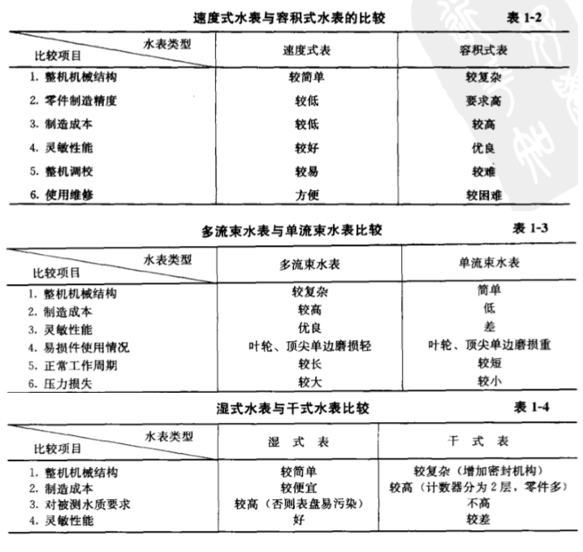

	3. 水表常用术语
		1. 过载流量$(Q_{max})$：规定误差限内使用的上限流量。在过载流量时，水表只能短时间使用而不至损坏。旋翼式水表水头损失为100kPa，螺翼式水表的水头损失为10kPa。
		2. 常用流量$(Q_{n})$:在误差限内允许长期通过的流量，数值为过载流量$(Q_{max})$的1/2。
		3. 分界流量$(Q_{t})$：水表误差限改变时的流量，其数值是[公称流量](https://baike.baidu.com/item/水表公称流量)的函数。
		4. 最小流量$(Q_{min})$：水表在规定误差限内使用的下限流量，数值是常用流量的函数。
		5. 始动流量$(Q_{s})$：水表开始连续指示时的流量。螺翼式水表没有始动流量。
		6. 流量范围：过载流量和最小流量之间的范围。
		7. 公称压力：水表的最大允许工作压力，单位为MPa。
		8. 压力损失：水流经水表所引起的压力降低，单位为MPa。
		9. 示值误差：水表的示值和被测水量真值之间的差值。
		10. 示值误差限：技术标准给定的水表所允许的误差极限值，也称最大允许误差。
			* 当$Q_{min}\leq Q < Q_t$时，示值误差$\pm5\%$
			* 当$Q_{t}\leq Q < Q_{max}$时，示值误差$\pm2\%$
		11. 计量等级:水表按始动流量、最小流量、分界流量分为A、B两个等级。
	4. 水表的技术参数（查表）
	5. IC卡预付费水表和远程自动抄表系统

## 1.2 给水方式
根据建筑性质、高度、配水点的布置情况以及所需水压、室内管网水压、室外管网水压、配水量等因素，通过综合评判法决定给水系统布置形式。合理的供水方案应综合工程涉及的各种因素：
* **技术因素**：
  	供水可靠性、水质对城市给水系统的影响、节水节能效果、操作管理、自动化程度等
* **经济因素**：
  	基建投资、年经常费用、现值等
* **社会和环境因素**：
  	对建筑立面和城市观瞻的影响、对结构和基础的影响、占地对环境的影响、建设难度和建设周期、抗寒防冻性能、分期建设的灵活性、对使用带来的影响等

在初步确定给水方式时，对层高不超过3.5m的民用建筑给水系统所需的压力H（自室外地面算起）可用以下经验法估算：1层100kPa，2层120kPa，3层以上每加一层增加40kPa（即$H = 120+40(n-2)kPa$）。

### 1.2.1 给水方式的基本形式
1. 依靠外网压力的供水方式
	1. 直接给水方式
		适用于室外给水管网的水量、水压在一天内均能满足用水要求的建筑。
		特点：可充分利用外网管网水压，节约能源，供水系统简单，投资少，减少水质受污染的可能性。但是对外网具有依赖性。
	2. 设水箱的给水方式
		设水箱的给水方式宜在室外管网水压周期性不足的情况下采用。（a）适用于多层建筑，下面几层利用室外管网水压供水，上面几层则靠屋顶水箱调节水量和水压，由水箱供水。（b）室外管网直接将水输入水箱。
	
	
2. 依靠水泵升压的给水方式
	3. 设水泵的给水方式
	4. 设水泵、水箱的给水方式
	5. 气压给水方式
		1. 变压式
		2. 定压式
	7. 分区给水方式
		1. 水泵并联分区给水方式
		2. 水泵串联分区给水方式
		3. 水泵供水减压阀减压分区给水方式
    1. 分质给水方式

### 1.2.2 给谁方式选择原则

## 1.3 管道的布置与敷设
### 1.3.1 管道布置
1. 基本要求
	1. 确保供水安全和良好的水力条件，力求经济合理
	2. 保护管道不受损坏
	3. 不影响生产安全和建筑物的使用
	4. 便于安装维修
   
2. 布置形式

### 1.3.2 管道敷设
1. 敷设形式
2. 敷设要求

### 1.3.3 管道防护
1. 防腐
2. 防冻、防露
3. 防漏
4. 防振

# 第 2 章 建筑内部给水系统的计算
## 2.1 给水系统所需水压

## 2.2 给水系统所需水量

## 2.3 给水设计秒流量

# 第 3 章 建筑消防系统
建筑消防系统根据灭火剂的种类和灭火方式可分为：
1. 消火栓给水系统
2. 自动喷水灭火系统
3. 其他使用非水灭火剂的固体灭火系统（如：二氧化碳灭火系统、干粉灭火系统、其他气体灭火系统等）

本章重点介绍低于10层的住宅、建筑高度（室外地面到女儿墙顶部檐口高度）不超过24m的低层民用建筑中，以水作为灭火剂的消火栓给水系统和自动喷水灭火系统。
## 3.1 消防给水系统及布置
### 3.1.1 设置室内消火栓给水系统的原则
按照《建筑设计防火规范》，下列建筑应设置消火栓给水系统并设置$DN65$的室内消火栓：（**教材这个是旧的规范，要更新，待会儿**）
1. 建筑占地面积大于$300m^2$的厂房、仓库；
2. 体积大于$5000m^2$的车站、码头、机场的候车楼、展览建筑、商店、旅馆建筑、病房楼、门诊楼、图书馆等；
3. 特等、甲等剧场，超过800个座位的其他等级的剧场和电影院等、超过1200个座位的礼堂、体育馆等；
4. 超过5层或体积超过$10000m^2$的办公楼、教学楼、非住宅类居住建筑等其他民用建筑；
5. 超过7层的住宅应设置室内消火栓系统。当有困难时，可只设置干式消防竖管和不带消火栓箱的$DN65$的室内消火栓，消防竖管的管径不应小于$DN65$；

国家级文物保护单位的重点砖木、木结构古建筑，宜设置室内消火栓。
设置有室内消火栓的人员密集的公共建筑宜设置消防软盘卷盘，建筑，面积大于$200m^2$的商业服务网点应设置消防软盘卷盘或轻便消防水嘴。

下列建筑物可不设消火栓给水系统：
1. 耐火等级为一、二级且可燃物较少的丁、戊类厂房；耐火等级为三、四级且建筑体积小于等于$3000m^3$的丁类厂房和建筑体积小于等于$5000m^3$的戊类厂房、粮仓、金库。
2. 存有与水接触能引起燃烧爆炸的物品的建筑物和室内没有生产、生活给水管道，室外消防用水取自储水池且建筑体积小于等于$5000m^3$的其他建筑物。

## 3.1.2 消火栓给水系统的组成与供水方式
1. 消火栓给水系统的组成
	建筑消火栓给水系统一般由水枪、水带、消火栓、消防管道、消防水池、高位水箱、水泵接合器及增压水泵等组成。
	
	1. 消火栓设备
		由水枪、水带、消火栓组成，均在消火栓箱内。
		水枪一般为直流式。喷嘴口径有13、16、19mm三种口径。13配50mm的水带；16配50、65；19配65。低层建筑的消火栓可用13或16口径水枪。
		水带口径有50、65mm两种。长度一般为15、20、25、30m。水带材料有*麻织*和*化纤*两种，有*衬胶、不衬胶*之分。
		消火栓均为内扣式接口和球形阀式龙头，有单出口和双出口之分。双出口消火栓直径为65mm；单出口消火栓直径有50、65mm两种。当每只水枪最小流量小于5L/s时，选用直径50mm消火栓；最小流量$\geq5L/s$时选用65mm消火栓。
	2. 水泵接合器
		连接消防车向室内消防给水系统加压供水的装置。有地上式、地下式、墙壁式。公称直径有100、150mm两种，具体用那种根据当地主要消防车的指标来选择。
	3. 消防管道
		是否与其他给水系统合并或独立使用，应根据建筑物的性质和使用要求确定。
	4. 消防水池
		可设于室外地下或地面，也可设置在室内地下室，或与室内游泳池、水景池兼用。消防水池应设有水位控制阀的进水管和溢流管、通气管、泄水管、出水管、水位指示器等附属设备。根据各种用水系统的供水水质是否要求一致，可将消防水池与生活或生产贮水池合用，也可单独使用。
	5. 消防水箱
		应在建筑最高部位设置重力自流的消防水箱；消防用水与其他用水合并的水箱，应有消防用水不作他用的技术设施；水箱的安装高度应满足室内最不利点消火栓所需的水压要求，且应贮存10min的室内消防用水量。
2. 消火栓给水系统的给水方式
   室内消火栓给水系统有以下几种给水方式：
    1. 由室外给水管网直接供水的消防给水方式
		该方式中消防管道有两种布置形式：
		1. 消防管道和生活生产给水管网共用：此时在水表处应设旁通管，水表应选择能够承受短历时的消防水量。这样可节省一根给水干管、简化系统
		2. 设水箱的消火栓给水方式：宜在室外管网一天之内有一定时间能保证消防水量、水压时（或是由生活水泵向水箱补水）采用。由水箱贮存10min的消防水量，灭火初期由水箱供水。
		3. 设水泵、水箱的消火栓给水方式：宜在室外给水管网的压力不能满足室内消火栓给水系统的水压时采用。水箱由生活泵补水，贮存10min的消防用水量，火灾发生初期由水箱供水，消防水泵启动后由消防水泵供水灭火。
    2. 设水箱的消火栓给水方式
    3. 设水泵、水箱的消火栓给水方式
		宜在室外给水管网的水压不能满足室内消火栓给水系统的水压要求时采用。水箱由生活泵补水，贮存10min的消防用水量，火灾发生初期由水箱供水灭火，消防水泵启动后由消防水泵供水灭火。

## 3.1.3 消火栓给水系统的布置
1. 水枪充实水柱长度
	消防栓设备的水枪射流灭火需要一定强度的密实水流。水枪射流中在26 ~ 28cm直径圆断面内、包含全部水量75% ~ 90%的密实水柱长度称为**充实水柱长度**，以$H_m$表示。根据实验，当水枪充实水柱长度小于7m时，或长的辐射热使人员无法接近着火点。；当水枪充实水柱长度大于15m时，消防人员无法把握水枪灭火。
	

2. 消火栓布置
	每层（无可燃物的设备层内）均应设置雄安火栓。消火栓间距布置应满足下列要求:
	1. 建筑高度$\leq24m$且体积$\leq5000m^3$的多层库房，应保证有1支水枪的充实水柱达到同层任何部位，距离应按下列公式计算：
		$$S_1 \leq 2\cdot\sqrt{R^2-b^2}$$
		$$R = C\cdot L_d+h$$
		$S_1$——消火栓间距，m
		$R$——消火栓保护半径，m
		$C$——水带展开式的弯曲折减系数，0.8 ~ 0.9
		$L_d$——水带长度，每条水带的长度不应大于25m
		$h$——水枪充实水柱倾斜45°时的水平投影长度，m，$h = 0.71H_m$，对一般建筑（层高3 ~ 3.5m）由于两楼板限制，一般取$h = 3.0m$
		$H_m$——水枪充实水柱长度，m
		$b$——消火栓的最大保护宽度，应为一个房间加走廊的宽度（这里应视实际情况分析），m
		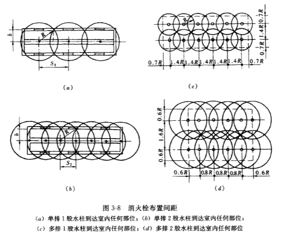
	2. 其他民用建筑应保证每一防火分区同层有2支水枪的充实水柱同时达到任何部位，其布置间距按下列公式：
		$$S_2\leq\sqrt{R^2-b^2}$$
		$S_1$——消火栓间距（2股水柱达到同层任何位置），m
		高层厂房（仓库）、高架仓库和甲、乙类厂房室内消火栓的间距不应大于30m，其他单层和多层建筑室内消火栓的间距不应大于50m。
	3. **消火栓口距地面安装高度为1.1m**，栓口宜向下或与墙面垂直安装。同一建筑内应选用*同一规格*的消火栓、水带、水枪，为方便使用，**每条水带的长度不应大于25m**。为保证及时灭火，每个消火栓处应设置直接启动消防水泵按钮、警报信号装置。
	4. 消火栓应设置在位置明显且操作方便的走道内，宜靠近疏散方便的通道口处、楼梯间内。**建筑物设有消防电梯时，其前室应设消火栓**。冷库内的消火栓应设置在常温穿堂内或楼梯间内。**在建筑物屋顶应设1个消火栓**，以利于消防人员经常试验和检查消防给水系统是否正常运行，同时还能起到保护本建筑物免受临近建筑火灾波及。**在寒冷地区，屋顶消火栓可设在顶层出口处、水箱间或采取防冻技术措施**。

3. 建筑内消火栓给水管道布置应满足下列要求：
	1. 室内消防竖管管径不应小于$DN100$。当室内消火栓个数多于10个且消防用水量大于15L/s时，室内消防给水管网应设置成环状，且至少应有两条进水管与室外给水管道或消防水泵连接。当其中一条进水管发生事故时，其余的进水管应仍能供应全部消防用水量。单元式、塔式住宅的消火栓宜设置在楼梯间的首层和各层楼层休息平台上，当设置两根消防竖管困难时，可设1根消防竖管，但必须采用[双口双阀型消火栓](images2.dichan.com/member/business/files/2012/12/5/2012125103444531892.jpg)。
	2. 高层厂房（仓库）应设置独立的消防给水系统，室内消防立管应连成环状。
	3. 消火栓给水管网应与自动喷水灭火管网分开设置。若设置有困难可共用给水干管，在自喷水灭火系统报警阀后不允许设消火栓。
	4. 闸门设置应便于管网维修和使用安全，对于*多层民用建筑和其他厂房（仓库）*，检修关闭阀门后，停止使用的消防竖管不超过1根，但管网设置的竖管超过3根时，可关闭2根。对于单层厂房（仓库）和公共建筑，检修停止使用的消火栓不应多于5个。阀门应保持常开，并应有明显的启闭标志或信号。
	5. `高层厂房`、`设置室内消火栓且层数超过4层的厂房`、`设置室内消火栓且层数超过5层的公共建筑`，消火栓给水系统**应设置消防水泵接合器**。水泵接合器应设置在消防车易到达的地点，同时还应考虑在其**附近15 ~ 40m范围内**有供消防车取水的*室外消火栓*或*贮水池取水口*。水泵接合器的数量应按室内消防用水量计算确定，每个水泵接合器**进水流量可按10 ~ 15L/s**计算，*一般不少于两个*。

## 3.2 消火栓给水系统的水力计算
### 3.2.1 消火栓口所需的水压
消火栓口所需水压按下式计算：
$$
H_{xh} = H_q + h_d + H_k
$$
$H_{xh}$——消火栓口的水压，kPa
$H_q$——水枪喷嘴处的压力，kPa
$h_d$——水带的水头损失，kPa
$H_k$——消火栓栓口的水头损失，按20kPa计算

理想的射流高度为（即不考虑空气对射流的阻力）：
$$
H_q = \frac{v^2}{2g}
$$
$v$——水流在喷嘴口处的流速，m/s

实际射流对空气的阻力为：
$$
\Delta H= H_q-H_f = \frac{K_1}{d_f}\cdot\frac{v^2}{2g}\cdot H_f
$$

$$
H_q-H_f = \frac{K_1}{d_f}H_q\cdot H_f
$$
$$
H_q = \frac{H_f}{1-\frac{K_1}{d_f}\cdot H_f}
$$

设$\frac{K_1}{d_f} = \varphi$，则：
$$
H_q = \frac{10\cdot H_f}{1-\varphi H_f}
$$
$K_1$——阻力系数（试验确定）
$d_f$——水枪喷水口径，m
$H_f$——垂直射流高度，m
$\varphi$——与水枪喷嘴口径有关的阻力系数，可按经验公式$\varphi = \frac{0.25}{d_f+(0.1d_f)^3}$计算，可查表

水枪充实水柱高度$H_m$与垂直射流高度$H_f$的关系式：
$$
H_f = a_fH_m
$$
$a_f$——实验系数，$a_f=1.19+80(0.01H_m)^4$，可查表

水枪充实水柱高度$H_m$与垂直射流高度$H_f$的关系式由下列公式表示：
$$
H_f = a_fH_m
$$

可得到水枪喷嘴处的压力与充实水柱高度的关系为：
$$
H_q = \frac{10a_f H_f}{1-\varphi a_f H_f}
$$
水枪在使用时常倾斜$45°\sim60°$，实验可得充实水柱长度几乎与倾角无关，计算时充实水柱长度可与充实水柱高度可视为相等。
水枪射出流量与喷嘴压力之间的关系可用下列公式计算：
根据孔口出流公式：
$$
q_{xh} = \mu\frac{\pi d_f^2}{4}\sqrt{2gH_q}/1000 = 0.003477\mu d_f^2\sqrt{H_q}
$$
令$B = (0.003477\mu d_f^2)^2$，则：
$$
q_{xh} = \sqrt{BH_q}
$$
$q_{xh}$——水枪的射流量，L/s
$\mu$——孔口流量系统，采用$\mu=1.0$
$B$——水枪水流特性系数，与口径有关，可查表
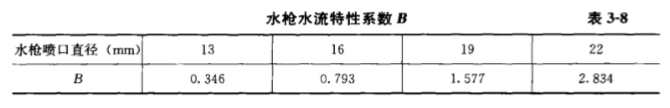

为方便使用，根据以上绘制表格，根据水枪口径和充实水柱长度可查出水枪的射流量和压力值：

水带水头损失应按下列公式计算：
$$
h_d = 10A_zL_dq_{xh}^2
$$
$h_d$——水带水头损失，kPa
$L_d$——水带长度，m
$A_z$——水带阻力系数，查表
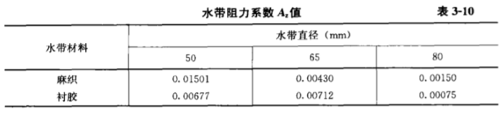

### 3.2.2 消防水池、水箱的贮存容积
1. 消防水池
	下列情况下应设置消防水池：
	1. 市政给水管网为支装管网或只有一条进水管，且室内外消防用水之和大于25L/s；
	2. 当生产、生活用水量达到最大时，市政给水管道、进水管、天然水源不能满足室内外消防水量。

	消防水池的消防贮水量应按下式确定：
	$$
	V_f = 3.6(Q_f-Q_L)T_x
	$$
	$V_f$——消防水池贮存消防水量，$m^3$
	$Q_f$——室内消防用水量与室外消防用水量之和，L/s
	$Q_L$——市政管网可连续补充的水量，L/s
	$T_x$——火灾延续时间，h，可查表
	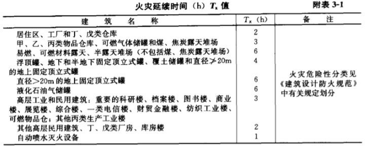

	消防水池补水时间不宜超过48h；对于独立的石油库区，不应超过96h。当容积大于$500m^3$时，应分设成两个独立使用的消防水池。生产、生活用水与消防用水共用的水池，应有确保消防用水不被他用的技术措施。
   
2. 消防水箱的消防注水量
	按照建筑设计防火规范，消防水箱应贮存10min的室内消防用水总量，以扑救初期火灾。计算公式：
	$$
	V_x = 0.6Q_x
	$$
	$V_x$——消防水箱贮存消防水量，$m^3$
	$Q_x$——室内消防用水总量，L/s
	$0.6$——单位换算系数：$V_x = \frac{Q_x\times10\times60}{1000}=0.6Q_x$
	
	为避免水箱容积过大，当时内消防用水量小于等于25L/s，经计算消防水箱所需消防储水量大于$12m^3$时，仍可采用$12m^3$；当室内消防用水量大于25L/s，经计算消防水箱所需消防贮水量大于$18m^3$时，仍可采用$18m^3$。生产、生活用水与消防用水共用的水箱，应有确保消防用水不被他用的技术措施。发生火灾时，由消防水泵供给的消防用水不能进入消防水箱。
3. 消防水泵的选择计算
	消防水泵的流量计算公式：
	$$
	Q_{xb} = \frac{Q_x}{N_x}
	$$
	$Q_{xb}$——消防水泵的流量，L/s
	$Q_x$——室内消防用水总量，L/s
	$N_x$——消防水泵台数

	消防水泵扬程计算公式：
	$$
	H_{xb} = H_{xh}+h_{xg}+10H_z
	$$
	$H_{xb}$——消防水泵的扬程，kPa
	$H_{xh}$——最不利点处消火栓口的水压，kPa
	$h_{xg}$——计算管路的水头损失，kPa
	$H_z$——消防水池最低水位与最不利点消火栓之高差，m

	当消防水泵直接从市政给水管网中吸水时，消防水泵的扬程应按市政给水管网的*最低压力计算*，并以市政给水管网的*最高压力校核*。

	**消防水泵应设置备用泵**，其工作能力不应小于最大一台消防工作泵的能力。当工厂、仓库、堆场、储罐的室外消防用水量小于等于25L/s或建筑的室内消防用水量小于等于10L/s时，可不设备用泵。

### 3.2.3 消防管网水力计算
主要目的是*确定给水管网的管径、计算或校核消防水箱的设置高度、选择消防水泵*。
由于建筑物发生火灾地点随机，以及水枪充实水柱的数量的限定（即用水量限定），在进行消防管网水力计算时，对于支状管网应首先选择最不利立管和最不利雄安火栓，以此计算管路，并按照消防规范规定的室内消防用水量进行流量分配，低层建筑应按下标确定。在最不利点水枪射流量确定后，以下各层水枪的实际射流流量应根据消火栓口处的实际压力计算。在确定了消防管各管段的流量后，便可根据流量计算出各管段管径，通常可从钢管水力计算表中查表得到单位长度沿程水头损失。
**消火栓给水管道中流速一般以1.4 ~ 1.8m/s为宜，不允许大于2.5m/s。局部水头损失按沿程水头损失的10%采用。**
当有消防水泵时，应以水箱的最低水位作为起点选择计算管路，计算管径和水损，确定水箱的设计高度或补压设备。当设有消防水泵时，应以消防水池最低水位作为起点，选择计算管路，计算管径和水损，确定消防水泵的扬程。
对环状管网，可假定某管段发生故障，仍按支装管网计算。（不像市政管网要平差）
为保证消防车通过水泵接合器向消火栓给水系统供水，对于**建筑消火栓给水管网管径不得小于DN100**。
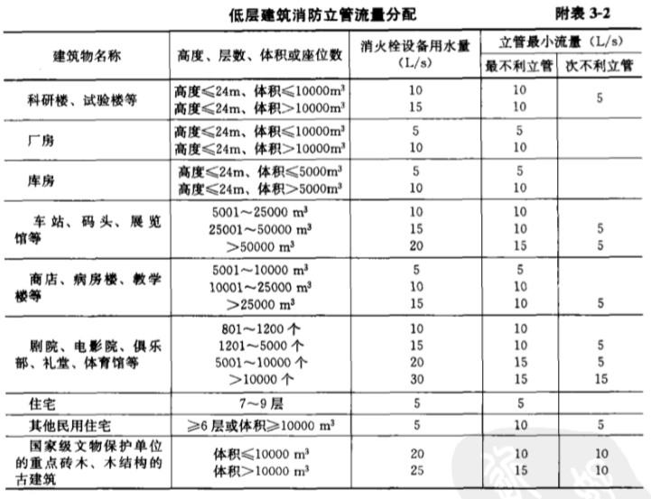

## 3.3 自动喷水灭火系统及布置
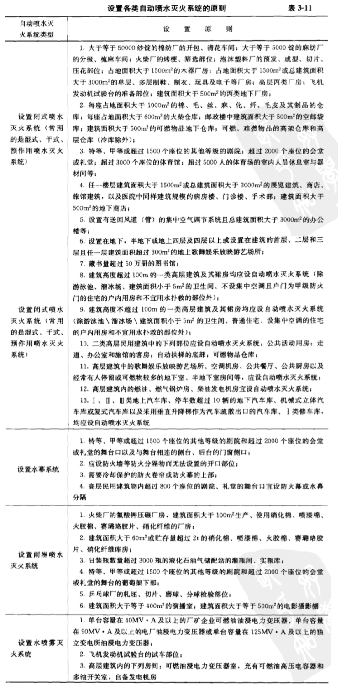

### 3.3.1 自动喷水灭火系统及组成
1. [湿式自动喷水灭火系统](https://baike.baidu.com/item/湿式喷水灭火系统/5661278)
2. [干式自动喷水灭火系统](https://baike.baidu.com/item/干式喷水灭火系统/5661672)
	为减少排气时间，一般要求管网容积不大于2000L。对环境温度无要求，适用于采暖期长而建筑内无采暖的场所。
3. [预作用喷水灭火系统](https://baike.baidu.com/item/预作用喷水灭火系统/5661238)
4. [雨淋喷水灭火系统](https://baike.baidu.com/item/雨淋灭火系统/5956776)
5. [水幕系统](https://baike.baidu.com/item/水幕系统/9316664)

### 3.3.2 喷头及控制配件
1. [喷头](https://baike.baidu.com/item/消防喷淋头/6811685)
	**闭式喷头**的喷口用热敏元件组成的释放机构封闭，达到一定温度时能自动开启。其构造按溅水盘的形式和安装位置可分为：直立型、下垂型、边墙型、普通型、吊顶型、干式下垂型
	**开式喷头**根据用途又分为：开启式、水幕
	
2. 报警阀
	报警阀是消防自动喷水系统的核心部件，主要百有湿式报警阀、干式报警阀度、干湿式报警阀、雨淋阀等；当火灾发生时，火灾探测器报警或管网的喷头破裂喷水，则报警阀工作，其上部的水力警铃报警，压力开关道报警，联动消防水泵。干湿式报警阀是由湿式、干式报警阀依次连接而成，在温暖季节用湿式，寒冷季节用干式。雨淋阀用于雨淋、预作用、水幕、水喷雾自动喷水灭火系统。报警阀有DN50、DN65、DN80、DN125、DN150、DN200等8种规格。
3. 水流报警装置
	主要有**水力警铃、水流指示器、压力开关**。
	水力警铃主要用于湿式喷水灭火系统，宜安装在报警阀附近（其连接管不超过6m）。当报警阀打开消防水源后，具有一定压力的水流冲动叶轮打铃警报。水力警铃不得由电动报警装置取代。
	水流指示器用于湿式喷水灭火系统。当某个喷头开启喷水或管网发生水量泄漏时，管道中的水产生流动，引起水流指示器中浆片随水流而动作，接通延时电路20 ~ 30s之后，继电器触电吸合发出区域水流电信号，送至消防控制室，通常将水流指示器安装于各楼层的配水干管或支管上。
	压力开关垂直安装与延迟器和水力警铃之间的管道上。在水力警铃报警的同时，依靠警铃管内水压的升高自动接通电触点，完成电动警铃报警，向向消防控制室传送电信号或启动消防水泵。
4. 延迟器
	是一个罐式容器，安装于报警阀与水力警铃（或压力开关）之间。用来防止由于水压波动原因引起报警阀开启而导致误报。报警阀开启后，水流需经30s左右充满延迟期后方可冲打水力警铃。
5. 火灾探测器
	目前常用的有感烟、感温探测器，感烟探测器是利用火灾发生地点的烟雾浓度进行探测；感温探测器时通过火灾引起的温升进行探测。火灾探测器布置在房间或走到的顶棚下面，其数量应根据探测器的保护面积和控测区面积计算而定。

### 3.3.3 喷头及管网布置
喷头的布置间距要求在所保护区域内任何部位发生火灾都能得到一定强度的水量。喷水的布置形式应根据顶棚、吊顶装修要求布置成正方形、长方形和菱形，间距计算公式：
正方形布置：
$$
X = 2R\cos45°
$$
长方形布置：
$$
\sqrt{A^2+B^2}\leq2R
$$
菱形布置：
$$
A=4R\cos30°\sin30°\\
B=2R\cos30°\cos30°
$$
$R$——喷头最大保护半径，m，可查表
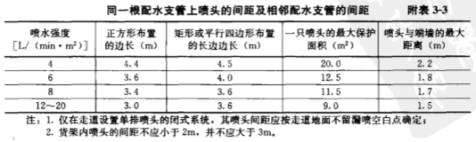
根据成幕状的要求应成线性布置，根据隔离强度要求可布置成单排、双排、防火带形式。
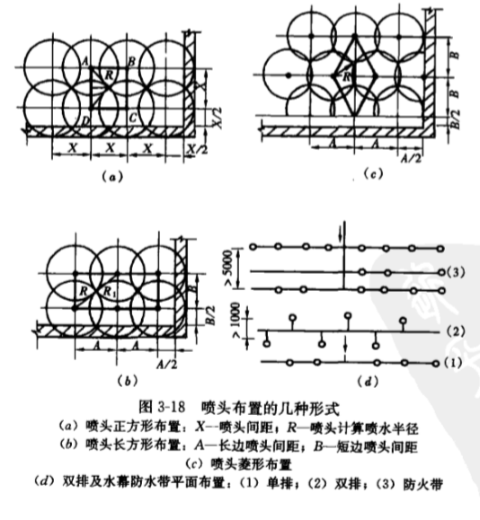
喷头的具体位置可设于建筑的顶板下、吊顶下，喷头距顶板、梁、边墙的距离可查表
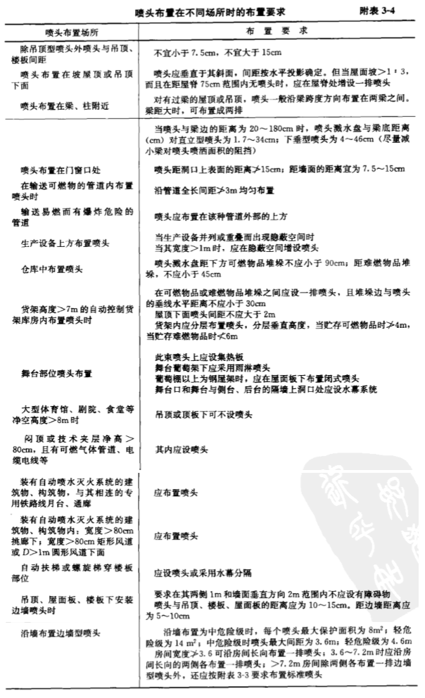
自动喷水灭火管网的布置，应根据建筑平面的具体情况布置成侧边式、中央布置式。一般每根支管上设置的喷头不宜多于8个，一个报警阀所控制的喷头数不宜超过下表规定的数量。

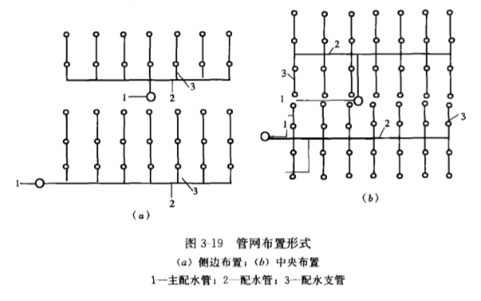

## 3.4 自动喷水灭火系统的水力计算
### 3.4.1 消防喷水灭火系统的水力计算
参考规范GB50014-2017《自动喷水灭火系统》。自动喷水灭火系统的持续喷水灭火时间，应按火灾持续时间不小于1小时确定。
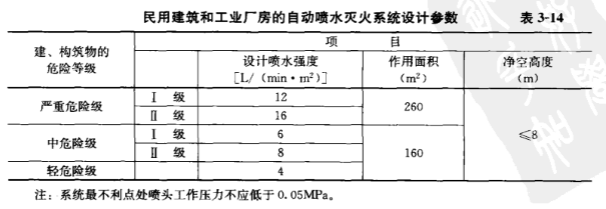
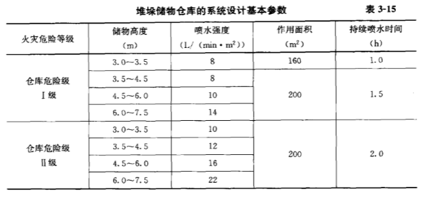
开式喷雾灭火系统的消防用水量及要求工作压力如下表：
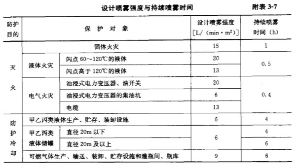

### 3.4.2 管网水力计算
目的在于确定管网各段管径、计算管网所需的供水压力、确定高位水箱的设置高度、选择消防水泵。
方法有两种：
1. 作用面积法
	1. 喷头出流量应按下式计算：
		$$
		q = K\sqrt{10P}
		$$
		$q$——喷头出流量，L/min
		$P$——喷头工作压力，MPa
		$K$——喷头流量系数，标准喷头K=80
	2. 系统的设计流量，应按最不利点处作用面积内喷头的总流量确定：
		$$
		Q_s = \frac{1}{60}\sum_{i=1}^{n}q_i
		$$
		$Q_s$——系统设计流量，L/s
		$q_i$——最不利点处作用面积内个喷头节点的流量，L/min
		$n$——最不利点处作用面积内的喷头个数
		由于各喷头在管网中的位置不同，所处的实际压力亦不同，喷头的实际喷水量与理论值有偏差，自动喷水系统设计秒流量可按理论值的1.15 ~ 1.30倍计算：
		$$
		Q_s = (1.15\sim1.30)Q_L
		$$
	3. 沿程水头损失、局部水头损失
		每米管道的水头损失应按下式计算：
		$$
		i = 0.0000107\frac{V^2}{d_i^{1.3}}
		$$
		$i$——每米管道的水头损失，MPa/m
		$V$——管道内的平均流速，m/s
		$d_i$——管道的计算内径，m，取值应按管道的内径减1mm确定
		沿程水头损失应按下式计算：
		$$
		h = il
		$$
		$h$——沿程水头损失，MPa
		$l$——管道长度，m
		管道的局部水头损失宜采用当量长度法计算，当量长度见下表
		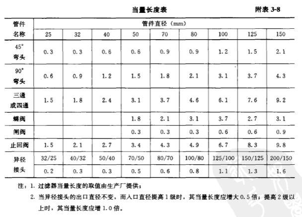
	4. 系统供水压力或水泵所需扬程
   		系统供水压力所需的水压应按下式计算：
		$$
		H = \sum{h}+P_0+Z
		$$
		$H$——系统所需水压或水泵扬程，MPa
		$\sum{h}$——管道的沿程和局部水头损失的累计值，MPa；湿式报警阀、水流指示器取0.02MPa，雨淋阀取值0.07MPa
		$P_0$——最不利点处喷头的工作压力，MPa
		$Z$——最不利点处喷头与消防水池的最低水位或系统入口管水平中心线之间的高程差，MPa
	5. 管道系统的减压措施
        1. 减压孔板
			应设在直径不小于50mm的水平直管段上，前后管段的长度不宜小于该管段直径的5倍。孔口直径不应小于管段直径的30%，且不应小于20mm。减压孔板应采用*不锈钢板*制作。
			水里损失按下式计算：
			$$
			H_k = \xi\frac{V_k^2}{2g}
			$$
			$H_k$——减压孔板水头损失，$10^{-2}MPa$
			$V_k$——减压孔板后管道内水的平均流速，m/s
			$\xi$——减压孔板局部阻力系数
			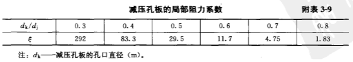
        2. 节流管
			节流管直径宜按上游管段直径的1/2确定，且节流管内水平均流速不大于20m/s，长度不宜小于1m。
			水头损失按下式计算：
			$$
			H_g = \zeta\frac{V_k^2}{2g}+0.00107L\frac{V_g^2}{d_g^{1.3}}
			$$
			$H_g$——节流管的水头损失，$10^{-2}MPa$
			$V_g$——节流管内水的平均流速，m/s
			$\zeta$——节流管中渐缩管与渐扩管的局部阻力系数之和，取0.7
			$d_g$——节流管的计算内径，m，取值应按节流管内径减1mm确定
			$L$——节流管长度，m
        3. 减压阀
			减压阀应设在报警阀组入口前，为防止阻塞，再入口前应装设过滤器。垂直安装的减压阀，水流方向宜向下。
2. 特性系数法
	特性系数法是从系统最不利点喷头开始，沿程计算各喷头的压力、喷水量和管段的累计流量、水头损失，直至某管段累计流量达到设计流量为止。此后的管段中流量不再累计，仅计算水头损失。
	喷头的出流量和管段水头损失应按下式计算：
	$$
	q = K\sqrt{H}\\
	h = 10ALQ^2
	$$
	$q$——喷头处节点流量，L/s
	$H$——喷头处水压，kPa
	$K$——喷头出流量系数，玻璃球喷头K=0.133，或水压H用$nH_2O$时K=0.42
	$h$——计算管段沿程水头损失，kPa
	$L$——计算管段长度，m
	$Q$——管段中流量，L/s
	$A$——比阻值，$s^2/l^2$，查下表
	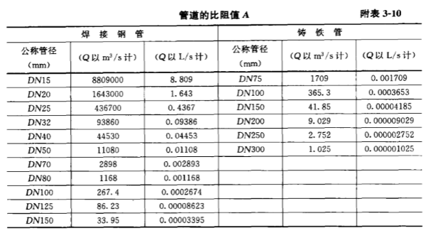

## 3.5 水喷雾灭火系统

## 3.6 固定消防水炮灭火系统

## 3.7 其他固定灭火设施介绍

## 3.8 高层建筑消防给水系统

## 3.9 地铁给排水及消防设计系统（补充）
### 3.9.1 设计原则和标准
主要设计原则：
1. 地铁给排水利用城市自来水水源，在取得消防部门、自来水公司同意后，可以采用消防泵直接抽取
2. -
3. 排水采用雨污分流
4. -

车站：20L/s，区间：10L/s自动喷水系统按中危II级
车站消火栓设置：
站台层公共区采用两支DN65单口

### 3.9.2 系统设计
### 3.9.3 与其他专业的接口
### 3.9.4 

# 第 4 章 建筑内部排水系统
# 第 5 章 建筑内部排水系统的计算

# 第 6 章 建筑雨水排水系统
## 6.1 建筑雨水排水系统分类与组成
### 6.1.1 建筑雨水排水系统分类

重力半有压流也称87雨水斗系统。
### 6.1.2 建筑雨水排水系统的组成
1. 普通外排水系统：由檐沟、雨落管组成。
    根据鉴于两、管道通水能力、屋面形状、面积确定雨落管间距。一般民用建筑雨落管间距8-12m，工业建筑雨落管间距18-24m。适用于普通住宅、一般公共建筑、小型单跨厂房。
	
2. 天沟外排水系统：由天沟、承雨斗、排水立管组成。
    特点：屋面不设雨水斗，管道不穿过屋面，排水安全可靠。
    天沟一般以伸缩缝、沉降缝、变形缝为界限。一般不超过50m。坡度不宜小于3‰。立管距地1m处设置检查口。坡度一般在0.003 ~ 0.006。天沟末端设置溢流口，溢流口比天沟上檐低50 ~ 100mm。适用于长度不超过100m的多跨工业厂房。
	
3. 雨水内排水系统：雨水斗、连接管、悬吊管、立管、排出管、埋地干管、附属构筑物等组成。
	适用于跨度大、特别长的多跨建筑。

	1. 雨水斗
        设在屋面收集雨水，并将雨水引入排水管道的装置。分为**重力式、重力半有压式、虹吸式**。
		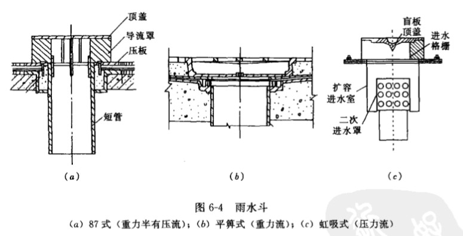
    1. 连接管
        连接雨水斗和悬吊管的一段竖向短管。其一般与雨水斗同径，一般不小于100mm，下端用斜三通与悬吊管连接。
    2. 悬吊管
        在屋架、楼板、梁下、架空在柱子上的雨水横管。其管径不小于连接管管径，不大于300mm，坡度不小于0.005。重力流中当悬吊管长度>15m时，应设检查口，检查口间距不大于20m。87式一根悬吊管上雨水斗不大于4个。长度大于15m的悬吊管上设检查口或带法兰盘的三通，位置宜靠近墙柱利于检修。
    3. 立管
        承接悬吊管或雨水斗雨水的管道。管径不得小于悬吊管管径。一根立管连接的悬吊管根数不多于2根。立管在距地1m处设检查口。
    4. 排出管
        布置在立管和检查井之间有较大坡度的横管。排出管管径不得小于立管管径。排出管与下游埋地干管在检查井的接管方式为管顶平接，且平面上水流转角不小于135°。
    5. 埋地管
        连接检查井、排气井的室外埋地管道。敷设于室外地下，最小管径为200mm，最大为600mm。坡度按下表设计：
		
    6. 附属构筑物
        用于埋地雨水管道的检修、清通、排气的装置，包括检查井、检查口井、排气井等。
        检查井适用于敞开式内排水，布置在排出管与埋地管连接处，埋地管转弯、变径、较长直线管路上。井深不小于0.7m。
        检查口井适用于密闭式排水系统。
        
### 6.1.3 雨水排水系统的选用
应根据建筑物的类型、屋面面积大小、形式及当地气候条件等情况，经过技术经济的比较后选择合适的雨水排水系统。
1. 檐沟外排水宜按重力流设计，常用于多层住宅，或建筑体量相似的建筑。
2. 长天沟外排水宜按漫流管压力流设计。常用于多跨工业厂房，汇水面积大。
3. 高层建筑屋面雨水宜按重力流设计。
4. 工业厂房、库房、公共建筑的大型屋面宜按压力流设计。

高层建筑裙房面积较大，宜单独排放。

## 6.2 雨水内排水系统中的水气流动规律
### 6.2.1 单斗雨水排水系统
按降雨历时，系统的泄流状态可分为三个阶段：降雨开始到掺气比最大的初始阶段$(0\leq t < t_A)$，掺气比最大到掺气比为零的过渡阶段$(t_A\leq t < t_B)$，和不掺气的饱和阶段$(t\geq t_B)$。
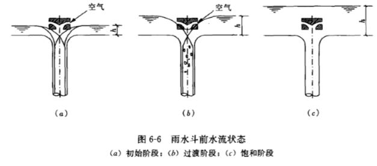
1. 初始阶段$(0\leq t < t_A, \alpha<1/3)$
	1. 雨水斗和连接管
	2. 悬吊管与立管
	3. 埋地干管
2. 过渡阶段$(t_A\leq t < t_B, 1/3\leq\alpha<1)$
	1. 雨水斗和连接管
	2. 悬吊管和立管
		
	3. 埋地干管
3. 饱和阶段$(t\geq t_B,\alpha=1)$
	4. 雨水斗和连接管
	5. 悬吊管和立管
	6. 埋地干管
### 6.2.2 多斗雨水排水系统
1. 初始和过渡阶段
2. 饱和阶段

## 6.3 雨水排水系统的水力计算
### 6.3.1 雨水量计算
屋面雨水排水系统雨水量的大小是设计计算雨水排水系统的依据，其值与暴雨强度$q$、汇水面积$F$、径流系数$\psi$有关，一般屋面径流系数取$\psi=0.9$。
1. 设计暴雨强度$q$
	有设计重现期$P$和屋面集水时间$t$两个参数。一般性建筑物取2 ~ 5年，重要公共建筑物不小于10年。由于屋面面积较小，集水时间较短，屋面集水时间按5min计算。
	$$q_j = \frac{167A(1+c\lg P)}{(t+b)^n} $$
2. 汇水面积$F$
	单位是$m^2$。按水平投影面积计算。考虑到大风作用，雨水倾斜降落的影响，高出屋面的毗邻侧墙，应附加其最大受雨面正投影的一半作为有效汇水面积计算。窗井、贴近高层建筑外墙的地下车库出入口坡道，应附加其高出部分侧墙面积的一半。同汇水区内高处的侧墙多于一面时，按有效受水侧墙面积的一半折算汇水面积。（书上原话有点难理解，总结成下面几点）
	1. 四周有墙，按水平投影面积
	2. 一侧侧墙，高出屋面侧墙或窗井以0.5倍计入屋面汇水面积。
	3. 两面相对侧墙，但面积不等时，按$0.5(S_1-S_2)$。
		当两面相邻侧墙，按$0.5\sqrt{S_1+S_2}$。
	4. 三面侧墙，$S_低+$第2条或第3条。
	5. 四面墙，最低墙不计算，按第4条。
3. 雨水量计算公式
	$$Q = \frac{\psi Fq_5}{10000}$$
	$$Q = \frac{\psi Fh_5}{10000}$$

### 6.3.2 系统计算原理与参数
1. 雨水斗泄流量
	雨水斗的泄流量与流动状态有关，重力流状态下，雨水斗的排水状况是自由堰流，通过雨水斗的泄流量与雨水斗的进水口直径和斗前水深有关，可按环形溢流堰计算
	$$Q = \mu\pi Dh\sqrt{2gh}$$
	$Q$——通过雨水斗的泄流量，$m^3/s$
	$\mu$——雨水斗进水口的流量系数，取0.45
	$D$——雨水斗进水口直径，$m$
	$h$——雨水斗进水口前水深,$m$
	在半有压流、压力流状态下，排水管内产生负压抽吸，所以通过雨水斗的泄流量与雨水斗出水口直径、雨水斗前水面至雨水斗出水口处的高度、雨水斗排水管中的负压有关
	$$Q = \frac{\pi d^2}{4}\mu\sqrt{2g(H+P)}$$
	$Q$——雨水口出水口泄流量，$m^3/s$
	$\mu$——雨水斗出水口流量系数，取0.95
	$d$——雨水斗出水口内径，$m$
	$H$——雨水斗前水面至雨水斗出水口处的高度，$m$
	$P$——雨水斗排水管中的负压，$m$
	
2. 天沟流量
	可按明渠均匀流计算
	$$v = \frac{1}{n} R^{\frac{2}{3}} I^\frac{1}{2}$$
	$$Q=vw$$
	$Q$——天沟排水流量，$m^3/s$
	$v$——流速
	$n$——天沟粗糙度系数
	$I$——天沟坡度
	$w$——天沟过水断面积
	$R$——水力半径
	
3. 横管
	可按圆管均匀流计算
	$$v = \frac{1}{n} R^{\frac{2}{3}} I^\frac{1}{2}$$
	$$Q=vw$$
	$Q$——天沟排水流量，$m^3/s$
	$v$——流速，不小于0.75m/s，但小于1.8m/s
	$n$——天沟粗糙度系数
	$I$——天沟坡度
	$w$——天沟过水断面积
	$R$——水力半径
	$$I = (h+\Delta h)/L$$
	$h$——压力差最大负压0.5m，最大正压1m
	$\Delta h$——位置水头
	$L$——横管长度
4. 立管
	$$Q= 7890K_p^{-\frac{1}{6}}\alpha^\frac{5}{3}d^\frac{8}{3}$$
	$Q$——立管排水流量，$L/s$
	$K_p$——粗糙高度，m，塑料管取$15\times10^{-6}m$，铸铁取$25\times10^{-5}m$
	$\alpha$——充水率，塑料0.3，铸铁0.35
	$d$——管道计算内径，m
	
	重力流立管最大允许流量查表
	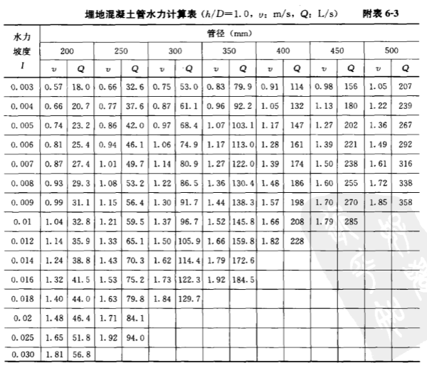

	重力半有压流系统状态下，雨水排水立管按水塞流计算，铸铁管充水率$\alpha=0.57\sim0.35$，小管径取大值，大管径取小值。重力半有压流系统除了重力作用外，还有负压抽吸作用，所以，重力半有压流系统立管的排水能力大于重力流。其中单斗系统的管径与雨水斗口径、悬吊管管径相同，多斗系统立管管径根据立管设计排水量确定，查下表
	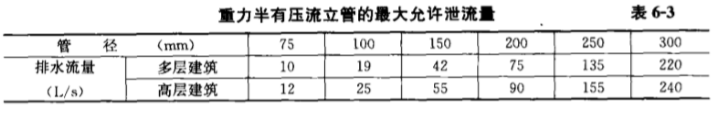
5. 压力流（虹吸式）
	1. 沿程阻力损失计算
		管道的沿程阻力损失按海曾-威廉公式计算
		$$R = \frac{2.959\times Q^{1.85}\times10^{-4}}{C^{1.85}\times d_j^{4.87}}$$
		$R$——单位长度的阻力损失，$kPa/m$
		$Q$——流量，$L/s$
		$d_j$——管道的计算内径，m，内壁喷塑铸铁管塑膜厚度为0.0005m
		$C$——海森威廉系数，塑料管130，内壁喷塑铸铁管100，钢管120，铸铁管100
		常用可查表
		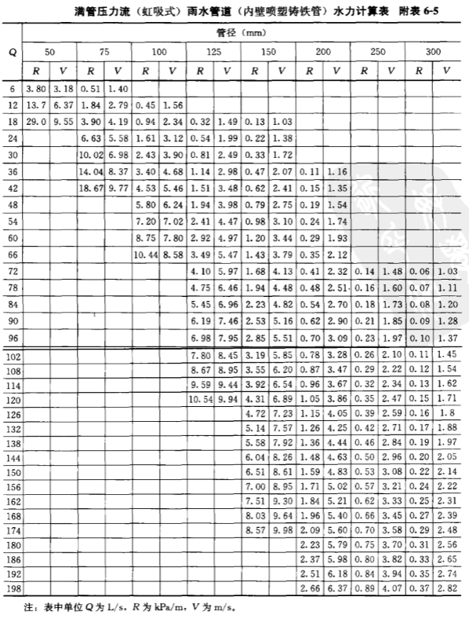

	2. 局部阻力损失计算
		$$h_j = 10\xi\frac{v^2}{2g}$$
		$h_j$——管件的局部阻力损失，kPa
		$v$——流速，m/s
		$\xi$——关键局部阻力系数，下表
		

	3. 阻力损失估算
		管路的局部阻力损失可以折算成等效长度，按沿程水头损失估算
		$$L_0 = kL$$
		$L_0$——等效长度，m
		$L$——设计长度，m
		$k$——考虑管件阻力引入的系数：钢管、铸铁管k=1.2~1.4，塑料管k=1.4~1.6

		1. 计算管路阻力损失估算
			计算管路单位等效长度的阻力损失可按下式计算
			$$R_0 = \frac{E}{L_0} = \frac{9.81H}{L_0}$$
			$R_0$——计算管路单位等效长度的阻力损失，kPa/m
			$E$——系统可以利用的最大压力，kPa
			$H$——雨水斗顶面至雨水排出口的几何高差，m
			$L_0$——计算管路等效长度，m
		2. 悬吊管阻力损失估算
   			悬吊管单位等效长度的阻力损失按下式计算
			$$R_{x0} = \frac{P_{max}}{L_{x0}}$$
			$R_{x0}$——悬吊管单位等效长度的阻力损失，kPa/m
			$P_{max}$——最大允许负压值，kPa
			$L_{x0}$——悬吊管等效长度，m

	4. 管内压力
		横向管道的位置水头变化微小，立管内的位置水头增加很大。所以系统中的不同断面管内的压力变化很大，为使各个雨水斗泄流量平衡，不同支路计算到某一节点的压力差不大于5 ~ 10kPa。
		系统某断面处管内的压力按下式计算：
		$$P_i = 9.8H_i - (v_i^2/2+\sum h_i)$$
		$P_i$——i断面处管内的压力，kPa
		$H_i$——雨水斗顶面至i断面的高度差，m
		$v_i$——i断面处管内流速，m/s
		$\sum h_i$——雨水斗顶面至i断面的总阻力损失，kPa

		压力流（虹吸式）雨水排水系统的最大负压值在悬吊管与总立管的连接处。选用铸铁管、钢管，允许的最大负压值为-90kPa；选用塑料管，小管径（de=50 ~ 160mm）允许最大负压值为-80kPa，大管径（de=200 ~ 315mm）允许的最大负压值为-70kPa。

	5. 系统的余压
		排水管系统的总水头损失与排水管出口速度水头之和应小于雨水斗天沟底面至排水管出口的几何高差，其压力余量宜稍大于10kPa。系统压力余量为：
		$$\Delta P = 9.8H - (v_n^2/2+\sum h_n)$$
		$$
		$$
		$$
		$$

	6. 管内流速
		压力流雨水排水管道系统内的流速和压力直接影响系统的正常使用，为使管道有良好的自净能力，悬吊管设计流速不宜小于1m/s，立管的设计流速不宜小于2.2m/s，系统的最大流速通常发生在立管上，为减小水流噪声，立管的设计流速宜小于6m/s，最大不大于10m/s。系统底部排出管的流速小于1.8m/s，以减少水流对检查井的冲击。
		
6. 溢流口计算
	溢流口的功能主要是雨水系统事故时排水和超量雨水排除。一般建筑物屋面雨水排水工程与溢流设施的总排水能力，不应小于10年（重要建筑物50年）重现期的雨量。溢流口的孔口尺寸可按下式近似计算：
	$$Q = mb\sqrt{2g}h^{\frac{3}{2}}$$
	$Q$——溢流口服务面积内的最大降雨量，L/s
	$b$——溢流口宽度，m
	$h$——溢流口高度，m
	$m$——流量系数，取385
	$g = 9.81$

### 6.3.3 设计计算步骤

# 第 7 章 建筑内部热水供应系统
## 7.1 热水供应系统的分类,组成和供水方式
### 7.1.1 热水供应系统的分类
1. 局部热水供应系统
   	采用各种小型加热器在用水场所就地加热, 供局部范围的一个或几个用水点。 
   	* 优点:     
        1. 热水传送管道短,热损失小     
        2. 设备系统简单,造价低     
        3. 维护管理方便,灵活    
        4. 改建,增设较容易
   
    * 缺点:	     
        1. 小型加热器效率低     
        2. 制水成本高     
        3. 使用不方便舒适   
        4. 每个用水场所均需设置加热装置, 占用建筑总面积较大
	
    * 适用条件：
  		热水用量小且较分散的建筑(单元式居住建筑, 小型饮食店, 诊所, 分散的工业企业建筑)
     
2. 集中热水供应系统     
	在锅炉房,热交换站或加热间将水集中加热后,通过热水管网输送到整幢或几幢建筑的热水系统     
    * 优点:
     	1. 设备集中, 便于管理     
     	2. 加热设备热效率高, 加热成本底
     	3. 占总建筑面积少
     	4. 使用方便舒适   
    * 缺点:
     	1. 设备系统复杂, 投资较大
     	2. 需专门维护人员
     	3. 管网较长,热损大
     	4. 建成后难扩建

    * 适用条件:
   		热水用量较大, 用水点集中.(高标准居住建筑, 旅馆, 医院, 体育馆, 游泳池, 公共浴室, 集中的工业企业建筑) 
3. 区域热水供应系统
   	在热电厂,区域性锅炉房或热交换站将水集中加热后, 通过市政热力管网输送至整个建筑, 居民区, 城市街坊或整个工业企业热水供应系统。
	* 优点:
     	1. 便于集中统一维护管理和热能的综合利用；
     	2. 有利于减少环境污染；
     	3. 设备热效率和自动化程度较高；
     	4. 热水成本低，设备总容量小，占用总面积少；使用方便舒适，保证率高。   
    * 缺点:
     	1. 设备、系统复杂，建设投资高；
     	2. 需要较高的维护管理水平；
     	3. 改建、扩建困难。
    * 适用条件:
   		建筑布置较集中，热水用量较大的城市和工业企业，目前在国外特别是发达国家中应用较多。

### 7.1.2 热水供应系统的组成
室内集中热水供应系统主要由`热媒系统（第一循环系统）、热水供应系统（第二循环系统）、附件`组成。
1. 热媒系统（第一循环系统）
	热媒系统由热源、水加热器和热媒管网组成。

	热媒系统由热源、水加热器和热媒管网组由锅炉生产的蒸汽（或高温热水）通过热媒管网送到水加热器加热冷水，经过热交换蒸汽变成冷凝水，靠余压经疏水器流到冷凝水池，冷凝水和新补充的软化水经冷凝水循环泵再送回锅炉加热为蒸汽，如此循环完成热的传递作用。

	对于区域性热水系统不需设置锅炉，水加热器的热媒管道和冷凝水管道直接与热力网连接。 

	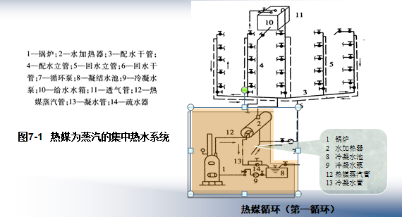

2. 热水供水系统（第二循环系统）
	热水供水系统由热水配水管网和回水管网组成。

	被加热到一定温度的热水，从水加热器输出经配水管网送至各个热水配水点，而水加热器的冷水由高位水箱或给水管网补给。

	为保证各用水点随时都有规定水温的热水，在立管和水平干管甚至支管设置回水管，使一定量的热水经过循环水泵流回水加热器以补充管网所散失的热量。

	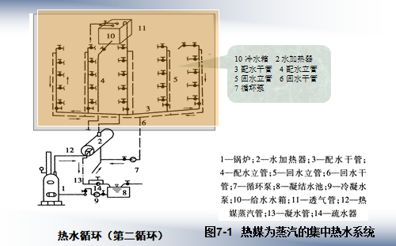

3. 附件
	包括蒸汽、热水的控制附件及管道的连接附件，如温度自动调节器、疏水器、减压阀、安全阀、自动排气阀、膨胀罐、管道伸缩器、闸阀、水嘴等。

### 7.1.3 热水供应的供水方式
1. 按热水加热方式的不同，有直接加热和间接加热之分
	* 直接加热
		也称一次换热，是利用以燃气、燃油、燃煤为燃料的热水锅炉，把冷水直接加热到所需热水温度，或者是将蒸汽或高温水通过穿孔管或喷射器直接通入冷水混合制备热水。 
		
		* 优点：
			1. 热效率高、节能的特点；
			2. 蒸汽直接加热方式具有设备简单、热效率高、无需冷凝水管。
		* 缺点：
			存在噪声大，对蒸汽质量要求高，冷凝水不能回收，热源需大量经水质处理的补充水，运行费用高等缺点。 
		* 适用条件：
			具有合格的蒸汽热媒、且对噪声无严格要求的公共浴室、洗衣房、工矿企业等用户。

		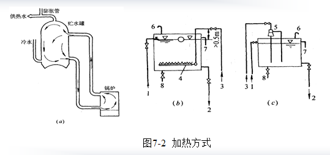

	* 间接加热
		也称二次换热，是将热媒通过水加热器把热量传递给冷水达到加热冷水的目的，在加热过程中热媒（如蒸汽）与被加热水不直接接触。 

		* 优点：
			1. 回收的冷凝水可重复利用
			2. 只需对少量补充水进行软化处理
			3. 运行费用低，且加热时不产生噪声
			4. 蒸汽不会对热水产生污染，供水安全稳定。 
		* 缺点：

		* 适用条件：
			要求供水稳定、安全，噪声要求低的旅馆、住宅、医院、办公楼等建筑。
		
		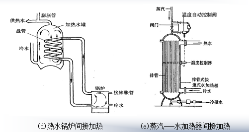

2. 按热水管网的压力工况，可分为开式和闭式两类
	* 开式
		开式热水供水方式，即在所有配水点关闭后，系统内的水仍与大气相通。

		该方式一般在管网顶部设有高位冷水箱和膨胀管或高位开式加热水箱，系统内的水压仅取决于水箱的设置高度，而不受室外给水管网水压波动的影响，可保证系统水压稳定和供水安全可靠。 

		缺点是，高位水箱占用建筑空间和开式水箱易受外界污染。

		适用于用户要求水压稳定，且允许设高位水箱的热水系统。 

		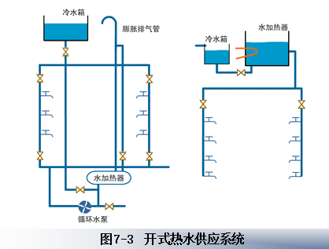
	
	* 闭式
		闭式热水供水方式，即在所有配水点关闭后，整个系统与大气隔绝，形成密闭系统 。

		该方式中应采用设有安全阀的承压水加热器，有条件时还应考虑设置压力膨胀罐，以确保系统安全运转。

		具有管路简单、水质不易受外界污染的优点，但供水水压稳定性较差，安全可靠性较差，适用于不宜设置高位水箱的热水供应系统。

		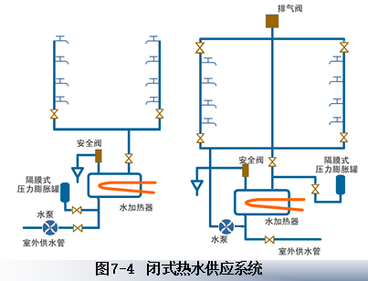

3. 按热水管网设置循环管网的方式不同，有全循环、半循环、无循环热水供水方式
	* 全循环
		全循环供水方式，是指热水干管、热水立管和热水支管都设置相应循环管道，保持热水循环，各配水嘴随时打开均能提供符合设计水温要求的热水。 

		该方式用于对热水供应要求比较高的建筑中，如高级宾馆、饭店、高级住宅等。

		

	* 半循环
		半循环供水方式，又有立管循环和干管循环之分。

		立管循环方式是指热水干管和热水立管均设置循环管道，保持热水循环，打开配水嘴时只需放掉热水支管中少量的存水，就能获得规定水温的热水。 

		该方式多用于设有全日供应热水的建筑和设有定时供应热水的高层建筑中。

		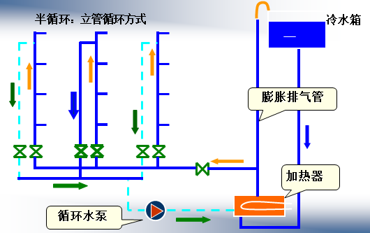

		干管循环方式是指仅热水干管设置循环管道，保持热水循环，多用于采用定时供应热水的建筑中。

		在热水供应前，先用循环泵把干管中已冷却的存水循环加热，当打开配水嘴时只需放掉立管和支管内的冷水就可流出符合要求的热水。

		

	* 无循环
		无循环供水方式，是指在热水管网中不设任何循环管道。

        对于热水供应系统较小、使用要求不高的定时热水供应系统，如公共浴室、洗衣房等可采用此方式。

		

4. 按热水管网运行方式不同，可分为全天循环方式和定时循环方式
	* 全天循环
		全天循环方式，即全天任何时刻，管网中都维持有不低于循环流量的流量，使设计管段的水温在任何时刻都保持不低于设计温度。

	* 定时循环
		定时循环方式，即在集中使用热水前，利用水泵和回水管道使管网中已经冷却的水强制循环加热，在热水管道中的热水达到规定温度后再开始使用的循环方式。

5. 按热水管网采用的循环动力不同，可分为自然循环方式和机械循环方式
	* 机械循环
		利用水泵强制水在热水管网内循环，造成一定的循环流量，以补偿管网热损失，维持一定的水温。

		目前实际运行的热水供应系统，多数采用这种循环方式。
	* 自然循环
		自然循环方式，即利用热水管网中配水管和回水管内的温度差所形成的自然循环作用水头（自然压力），使管网内维持一定的循环流量，以补偿热损失，保持一定的供水温度。 

		因一般配水管与回水管内的水温差仅为5～10℃，自然循环作用水头值很小，所以实际使用自然循环的很少，尤其对于中、大型建筑采用自然循环有一定的困难。

6. 按热水配水管网水平干管的位置不同，可分为下行上给供水方式和上行下给供水方式
	选用何种热水供水方式，应根据建筑物用途，热源供给情况、热水用量和卫生器具的布置情况进行技术和经济比较后确定。 

	在实际应用时,常将上述各种方式按照具体情况进行组合。

	* 下行上给
		蒸汽间接加热机械强制全循环干管下行上给的热水供水方式，适用于全天供应热水的大型公共建筑或工业建筑。

		热水锅炉直接加热机械强制半循环干管下行上给的热水供水方式，适用于定时供应热水的公共建筑。

		

	* 上行下给
		为蒸汽直接加热干管上行下给不循环供水方式，适用于工矿企业的公共建筑、公共洗衣房等场所。

## 7.2 热水供应系统的热源、加热设备和贮热设备
### 7.2.1 热水供应系统的热源
1. 集中热水供应系统
	1. 当条件许可时，宜首先利用工业余热、废热、地热和太阳能作热源。利用烟气、废气作热源时，烟气、废气的温度不宜低于400℃。利用地热水作热源时，应按地热水的水温、水质、水量和水压，采取相应的升温、降温、去除有害物质、选用合适的设备及管材、设置贮存调节容器、加压提升等技术措施，以保证地热水的安全合理利用。利用太阳能作热源时，为保证没有太阳的时候不间断供应热水，应附设一套电热或其他热源的辅助加热装置。
	2. 选择能保证全年供热的热力管网为热源。为保证热水不间断供应，宜设热网检修期用的备用热源。在只能有采暖期供热的热力管网时，应考虑其他措施（如设锅炉）以保证热水的供应。
	3. 选择区域锅炉房或附近能充分供热的锅炉房的蒸汽或高温热水作热源。
	4. 当无（1）、（2）、（3）所述热源可利用时，可采用专用的蒸汽或热水锅炉制备热源，也可采用燃油、燃气热水机组或电蓄热设备制备热源或直接供给生活热水。
	
2. 局部热水供应系统的热源
	宜因地制宜，采用太阳能、电能、燃气、蒸汽等。当采用电能为热源时，宜采用贮热式电热水器以降低耗电功率。

3. 利用废热（废气、烟气、高温无毒废液等）作为热媒
	应采取下列措施：
	1. 加热设备应防腐，其构造便于清理水垢和杂物。
	2. 防止热媒管道渗漏而污染水质。
	3. 消除废气压力波动和除油。

4. 采用蒸汽直接通入水中或采取汽水混合设备的加热方式 
	宜用于开式热水供应系统，并应符合下列要求：
	1. 蒸汽中不含油质及有害物质。
	2. 当不回收凝结水经技术经济比较合理时。
	3. 应采用消声混合器，加热时产生的噪声应符合现行的《城市区域环境噪声标准》的要求。
	4. 应采取防止热水倒流至蒸汽管道的措施。

### 7.2.2 局部加热设备
1. 燃气热水器
	燃气热水器的热源有`天然气、焦炉煤气、液化石油气、混合煤气`4种。
	依照燃气压力有低压（P≤5kPa）、中压（5kPa＜P≤150kPa＝热水器之分。
	民用和公共建筑生活、洗涤用燃气热水设备一般采用低压，工业企业生产所用燃气热水器可采用中压。
	按加热冷水的方式不同，燃气热水器有**直流快速式**和**容积式**之分。
	**直流快速式燃气热水器**一般安装在用水点就地加热，可随时点燃并可立即取得热水，供一个或几个配水点使用，常用于厨房、浴室、医院手术室等局部热水供应。
	**容积式燃气热水器**具有一定的贮水容积，使用前应预先加热，可供几个配水点或整个管网用水，可用于住宅、公共建筑和工业企业的局部和集中热水供应。

2. 电热水器
	电热水器产品分**快速式**和**容积式**两种。
	**快速式电热水器**无贮水容积或贮水容积很小，不需在使用前预先加热，在接通水路和电源后即可得到被加热的热水。该类热水器具有体积小、重量轻、热损失少、效率高、容易调节水量和水温、使用安装简便等优点，但电耗大，尤其在一些缺电地区使用受到限制。目前市场上该种热水器种类较多，适合家庭和工业、公共建筑单个热水供应点使用。
	**容积式电热水器**具有一定的贮水容积，其容积可由10L到10$m^3$。该种热水器在使用前需预先加热，可同时供应几个热水用水点在一段时间内使用，具有耗电量较小、管理集中的优点。但其配水管段比快速式热水器长，热损失也较大。一般适用于局部供水和管网供水系统。

3. 太阳能热水器
	太阳能热水器是将太阳能转换成热能并将水加热的装置。
	优点：结构简单、维护方便、节省燃料、运行费用低、不存在环境污染问题。
	缺点：受天气、季节、地理位置等影响不能连续稳定运行，为满足用户要求需配置贮热和辅助加热设施、占地面积较大，布置受到一定的限制。
	太阳能热水器按组合形式分为**装配式**和**组合式**两种。
	**装配式太阳能热水器**一般为小型热水器，即将集热器、贮热水箱和管路由工厂装配出售，适于家庭和分散使用场所。
	**组合式太阳能热水器**，即是将集热器、贮热水箱、循环水泵、辅助加热设备按系统要求分别设置而组成，适用于大面积供应热水系统和集中供应热水系统。
	太阳能热水器按热水循环方式分**自然循环**和**机械循环**两种。
	**自然循环太阳能热水器**是靠水温差产生的热虹吸作用进行水的循环加热。该种热水器运行安全可靠、不需用电和专人管理。但贮热水箱必须装在集热器上面，同时使用的热水会受到时间和天气的影响 。
	
	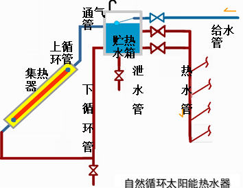

	机械循环太阳能热水器是利用水泵强制水进行循环的系统。该种热水器贮热水箱和水泵可放置在任何部位，系统制备热水效率高，产水量大。为克服天气对热水加热的影响，可增加辅助加热设备，如煤气加热、电加热和蒸气加热等措施，适用于大面积和集中供应热水场所。

	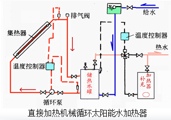
	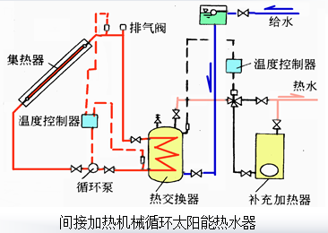

### 7.3.2 集中热水供应系统的加热和贮热设备
1. 热水锅炉
	集中热水供应系统采用的热水锅炉主要有**燃煤、燃油、燃气**3种。
	**燃煤锅炉**使用燃料价格低，运行成本低，但存在因燃煤产生的烟尘和二氧化硫对环境的污染问题。目前许多城市为解决日益严重的城市空气污染问题，已开始限制甚至禁止市区内燃煤锅炉的使用。
	**燃油（燃气）锅炉**通过燃烧器向正在燃烧的炉膛内喷射雾状油（或通入煤气），燃烧迅速，且比较完全，具有构造简单、体积小、热效率高、排污总量少的优点。
	随着生活水平的提高，人们对环保要求也越来越严格，燃油（燃气）锅炉的市场正急剧扩大，使用日益广泛。

2. 水加热器
	集中热水供应系统中常用的水加热器有`容积式水加热器、快速式水加热器、半容积式水加热器、半即热式水加热器`。
	1. 容积式水加热器
		容积式水加热器是内部设有热媒导管的热水贮存容器，具有加热冷水和贮备热水两种功能，热媒为蒸汽或热水，有卧式和立式之分。
		常用的容积式水加热器有传统的U型管型容积式水加热器和导流型容积式水加热器。
		**U型管型容积式水加热器**的优点是具有较大的贮存和调节能力，可提前加热，热媒负荷均匀，被加热水通过时压力损失较小，用水点处压力变化平稳，出水温度较稳定，对温度自动控制的要求较低，管理比较方便。但该加热器中，被加热水流速缓慢，传热系数小，热交换效率低，且体积庞大占用过多的建筑空间，在热媒导管中心线以下约有20％~25％的贮水容积是低于规定水温的常温水或冷水，所以贮罐的容积利用率较低。此外，由于局部区域水温合适、供氧充分、营养丰富，因此容易滋生军团菌，造成水质生物污染。U型管型容积式水加热器这种层叠式的加热方式可称为“层流加热”。

	2. 快速式水加热器
		针对容积式水加热器中“层流加热”的弊端，出现了“紊流加热”理论：即通过提高热媒和被加热水的流动速度，来提高热媒对管壁、管壁对被加热水的传热系数，以改善传热效果。**快速式水加热器**就是热媒与被加热水通过较大速度的流动进行快速换热的一种间接加热设备。
		
		根据热媒的不同，快速式水加热器有**汽一水、水一水**两种类型，前者热媒为蒸汽，后者热媒为过热水。根据加热导管的构造不同，又有单管式、多管式、板式、管壳式、波纹板式、螺旋板式等多种型式。这种水加热器是将被加热水通入导管内，热媒（即蒸汽）在壳体内散热。

		快速式水加热器具有效率高，体积小，安装搬运方便的优点，
       	缺点是不能贮存热水，水头损失大，在热媒或被加热水压力不稳定时出水温度波动较大，仅适用于用水量大，而且比较均匀的热水供应系统或建筑物热水采暖系统。

	3. 半容积式水加热器
		半容积式水加热器是带有适量贮存与调节容积的内藏式容积式水加热器，是由英国引进的设备。由**贮热水罐、内藏式快速换热器、内循环泵**3个主要部分组成。其中贮热水罐与快速换热器隔离，被加热水在快速换热器内迅速加热后，通过热水配水管进入贮热水罐，当管网中热水用量低于设计用水量时，热水的一部分落到贮罐底部，与补充水（冷水）一道经内循环泵升压后再次进入快速换热器加热。

		内循环泵的作用：
		* 提高被加热水的流速，以增大传热系数和换热能力
		* 克服被加热水流经换热器时的阻力损失
		* 形成被加热水的连续内循环，消除了冷水区或温水区，使贮罐容积的利用率达到100％。内循环泵的流量根据不同型号的加热器而定，其扬程在20～60kPa之间

		半容积式水加热器具有体型小（贮热容积比同样加热能力的容积式水加热器减少2/3）、加热快、换热充分、供水温度稳定、节水节能的优点，但由于内循环泵不间断地运行，需要有极高的质量保证。

	4. 半即热式水加热器
		半即热式水加热器是带有超前控制，具有少量贮存容积的快速式水加热器。热媒蒸汽经控制阀和底部入口通过立管进入各并联盘管，冷凝水入立管后由底部流出，冷水从底部经孔板入罐，同时有少量冷水进入分流管。入罐冷水经转向器均匀进入罐底并向上流过盘管得到加热，热水由上部出口流出。部分热水在顶部进入感温管开口端，冷水以与热水用水量成比例的流量由分流管同时入感温管，感温元件读出瞬间感温管内的冷、热水平均温度，即向控制阀发出信号，按需要调节控制阀，以保持所需的热水输出温度。只要一有热水需求，热水出口处的水温尚未下降，感温元件就能发出信号开启控制阀，具有预测性。加热盘管内的热媒由于不断改向，加热时盘管颤动，形成局部紊流区，属于“紊流加热”，故传热系数大，换热速度快，又具有预测温控装置，所以其热水贮存容量小，仅为半容积式水加热器的1/5。同时，由于盘管内外温差的作用，盘管不断收缩、膨胀，可使传热面上的水垢自动脱落。半即热式水加热器具有快速加热被加热水，浮动盘管自动除垢的优点，其热水出水温度一般能控制在±2.2℃内，且体积小，节省占地面积，适用于各种不同负荷需求的机械循环热水供应系统。

3. 加热水箱和热水贮水箱
	加热水箱是一种简单的热交换设备，在水箱中安装蒸汽多孔管或蒸汽喷射器，可构成直接加热水箱。在水箱内安装排管或盘管即构成间接加热水箱。加热水箱适用于公共浴室等用水量大而均匀的定时热水供应系统。热水贮水箱（罐）是一种专门调节热水量的容器。可在用水不均匀的热水供应系统中设置，以调节水量，稳定出水温度。

### 7.2.4 加热设备的选择
加热设备是热水供应系统的核心组成部分，加热设备的选择是关系到热水供应系统能否满足用户使用要求和保证系统长期正常运转的关键。应根据热源条件、建筑物功能及热水用水规律、耗热量和维护管理等因素综合比较后确定。
1. 选用局部热水供应设备时，应符合下列要求：
	* 需同时供给多个卫生器具或设备热水时，宜选用带贮热容积的加热设备
	* 当地太阳能资源充足时，宜选用太阳能热水器或太阳能辅以电加热的热水器
	* 热水器不应安装在易燃物堆放或对燃气管、表或电气设备产生影响及有腐蚀性气体和灰尘多的场所
	* 燃气热水器、电热水器必须带有保证使用安全的装置。严禁在浴室内安装直接排气式燃气热水器等在使用空间内积聚有害气体的加热设备
2. 集中热水供应系统的加热设备选择，应符合下列要求
	1. 热效率高，换热效果好、节能、节省设备用房
	2. 生活热水侧阻力损失小，有利于整个系统冷、热水压力的平衡
	3. 安全可靠、构造简单、操作维修方便
	4. 具体选择水加热设备时，应遵循下列原则：
		* 当采用自备热源时，宜采用直接供应热水的燃气、燃油等燃料的热水机组，亦可采用间接供应热水的自带换热器的热水机组或外配容积式、半容积式水加热器的热水机组
		* 热水机组除满足上述1、2、3基本要求外，还应具备燃料燃烧完全、消烟除尘、自动控制水温、火焰传感、自动报警等功能
		* 当采用蒸汽、高温水为热源时，间接水加热设备的选型应结合热媒的供给能力、热水用途、用水均匀性及水加热设备本身的特点等因素，经技术经济比较后确定
		* 当热源为太阳能时，宜采用热管或真空管太阳能热水器
		* 在电源供应充沛的地方可采用电热水器

## 7.3 热水供应系统的管材和附件
### 7.3.1 热水供应系统的管材和管件
1. 。
2. 。
3. 。
4. 。：
	* 。
	* 。
	* 。
	* 。

### 7.3.2 热水供应系统的附件
1. 自动温度调节装置
   
2. 疏水器

3. 减压阀

4. 自动排气阀

5. 膨胀管、膨胀水罐、安全阀
	1. 膨胀管

	2. 膨胀水箱、
   
	3. 安全阀

6. 自然补偿管道和伸缩器

## 7.4 热水供应系统的敷设与保温
### 7.4.1 热水管道的布置与敷设

### 7.4.2 热水供应系统的保温

## 7.5 高层建筑热水供应系统
### 7.5.1 技术要求

### 7.5.2 技术措施

### 7.5.3 供水方式
1. 集中式

2. 分散式

### 7.5.4 管网布置与敷设

# 第 8 章 建筑内部热水供应系统的计算

# 第 9 章 饮水供应
## 9.1 饮水供应
饮水供应有两套系统 : *开水供应系统* , *冷水供应系统*.  开水供应系统分两类, *集中开水供应* , *管道输送开水*. 集中制备一般采用间接加热方式, 不宜采用蒸汽直接加热. 集中开水供应是在开水间制备开水, 每个服务间宜靠近锅炉房,食堂等有热源的地方, 服务半径不宜大于250m. 每层开水加热器服务半径不宜大于70m。

对于标准高的建筑物,如宾馆, 可采用集中制备用管道输送. 为保证水温, 采用机械循环方式, 该系统要求加热器出水水温不小于105℃, 回水温度100℃。

对于中小学, 体育馆, 游泳场, 火车站等人员流动集中的公共场所, 可采用冷水供应系统. 水温可根据建筑物性质决定. 夏季一般不启动加热设备, 冷水温度一般取35~45℃。

冷水供应系统应设置循环管道. 避免水流滞留影响水质, 循环水也应进行消毒处理。

所有饮用水管道应采用铜管, 不锈钢管, 铝塑复合管, 聚丁烯管. 配件与管材相同。

冷水制备三种方式：
1. 自来水烧开后再冷却直饮水温度
2. 自来水净化处理后再经水加热器加热至饮水温度
3. 自来水净化处理后直接共给用户饮水点  

## 9.2 饮水供应的水力计算
饮水定额及小时变化系数

设计最大时饮用水量的计算公式:
$$q_{Emax} = K_h\frac{m q_{E}}{T}$$  
${q}_{Emax}$ 为 设计最大饮用水量, L/s  
${K}_{h}$ 为 小时变化系数  
$q_E$ 为 饮水定额, L/(人.d)
$m$ 为 用水计算单位数, 人数,床位数  
$T$ 为 供应饮用水时间, h  

制备开水所需的最大时耗热量计算:
$$Q_k =( 1.05\sim1.10)(t_k-t_l)q_{Emax}C_B\rho_r$$ 
$Q_k$ 为 制备开水所需最大小时耗热量, W  
$t_k$ 为 开水温度, 集中开水供应系统按100℃计算, 管道输送全循环系统按105摄氏度计算  
$t_l$ 为 冷水计算温度, 查表
$C_B$ 为 水的比热, C=4.19kJ/(kg.℃)  
$\rho _r$ 为 热水密度, kg/L

冬季需要把冷饮谁加热到35~40℃, 制备冷饮水所需的最大时耗热量计算:  
$$Q_k =( 1.05\sim1.10)(t_E-t_l)q_{Emax}C_B\rho_r$$  
$t_E$ 为 冬季冷饮水温度, 一般按40℃计算  
开水供应系统和冷饮水系统管道流速一般不大于1.0m/s, 循环管道的流速可不大于2m/s. 计算管网采用95℃水力计算表.  

## 9.3 管道饮用水净水供应
### 9.3.1 分质供水
生活给水系统: 直接利用市政自来水, 清洗, 洗涤, 冲洗  
饮用净水系统(管道直饮水): 自来水深度净化  
中水供水系统: 回收冲厕, 洗车, 浇洒  
### 9.3.2 管道饮用水净水的水质要求
1. 管道饮用净水的水质要求  
2. 饮用净水(优质直饮水)的处理
	1. 水处理技术        
		1. 活性炭吸附过滤法: 除臭, 除色, 除有机物, 除氯, 除重金属. 有粉状和粒状两类        
		2. 膜分离法:           
			1. 微滤(MF), 工作压力在0.05~0.1MPa           
			2. 超滤(UF), 工作压力在0.1~0.5MPa           
			3. 纳滤(NF), 工作压力不到1MPa           
			4. 反渗透(RO), 工作压力在1~10MPa        
		3. 饮用净水的后处理           
			1. 消毒           
			2. 矿化     
	2. 饮用水深度处理工艺流程  
	
### 9.3.3 饮用净水供应方式和系统设置
1. 管道饮用净水供应方式
管道饮用净水系统一般由供水水泵, 循环水泵, 供水管网, 回水管网,消毒设备组成. 配水管网应设计成密闭式, 将循环管路设计成[同程式](https://baike.baidu.com/item/同程式供水系统/3079593). 常见供水方式有:
	1. 水泵和高位水箱供水
	2. 变频调速泵供水，不设高位水箱.
	3. 屋顶水池重力流供水，不设饮用净水泵，但要设置循环水泵.
2. 管道饮用净水系统设置要求     
设置循环管道,保证干管,立管水循环. 循环管网内水力停留时间不宜超过6h.     饮用净水系统的设置一般应满足以下要求:    
	1. 应设计成环状, 循环管路应为同程式, 进行循环消毒以保证水量水质水压
	2.  设计循环系统的运行时不得影响配水系统的正常压力和饮水嘴的出流率
	3. 饮用净水在供配水系统中各部分不超过4~6小时,供配水管路不应产生滞水现象   						
	4. 各处饮用净水嘴的自由水头应尽量相近, 且不宜小于0.03MPa
	5. 饮用净水管网应独立设置
	6. 一般应优先选用无高位水箱的供水系统, 宜采用变频调速水泵
	7.  配水管网循环立管上下端头设置球阀. 管网应设检修门. 在管网最远端设置排水阀门, 管道最高处设置排气阀, 排气阀应设有滤菌,防尘装置, 排气阀处不得有死水, 排水口应有防污染设备.
### 9.3.4 饮用净水供应系统的水力计算
1. 饮用净水的水量和水压   
	1. 水量要求
饮用净水水嘴的出水量和自由水头应先满足使用要求. 饮用净水应采用一般额定流量最小的水嘴. 饮用净水水嘴额定流量宜为0.04~0.06L/s, 最低工作压力不小于0.03MPa.
	2. 最大时饮用水量$Q_{yh}$
		推荐$Q_{yh}\geq 0.4Q_{yl}$, $Q_{yl}$是系统日用水量.
 2. 饮水净水管网系统水力计算   
 	对供水管网: 管道设计流量=饮用净水设计秒流量+循环水量     
 	对循环水管网: 如采用全天循环, 每条支管会流量可以采用一个饮用净水水嘴的额定流量. 系统回流量为各支管循环流量的总和.    
 	1. 设计秒流量      
 		饮用净水供应系统设计秒流量计算:      
 		$$q_g = q_0m$$     
 		$q_g$ 为 计算管段的设计秒流量, L/s
 		$q_0$ 为 饮水水嘴定额流量, 取0.04~0.06L/s
 		$m$ 为 计算管段的水嘴个数
 		当n小于12个时,m取值

      	|水嘴数量n|1|2|3|4~8|9~12|
      	|:-:|:-:|:-:|:-:|:-:|:-:|
      	|使用数量m|1|2|3|3|4|
		当n大于12个时,
  		$$\sum_{k=0}^{m}p^k(1-p)^{n-k} \geq 0.99$$
  		$n$ 为 水嘴总数      
  		$p$ 为 使用概率      
  		$$p=\frac{aq_h}{1800nq_0}$$      
  		$a$ 为 经验系数, 0.6~0.9     
  		 $q_h$ 为 设计小时流量L/h      
  		 $q_0$ 为 水嘴额定流量      
  		 可查表
  		 
  	2. 管径计算      设计流量确定后, 选择合理的流速, 确定计算管径:       $$d = \sqrt{\frac{4q_g}{\pi u}}$$

	|公称直径(mm)|15~20 | 25~40|$\geq50$|
  	| - | - | - | - |
  	|流速(m/s)|$\leq0.8$|$\leq10$|$\leq10$|
  	
3. 循环流速
	$$q_x = \frac{V}{T_l}$$
	$q_x$ 为 循环流量, L/s(**注意单位**)
	$V$ 为 闭合回路总容积 L 
	$T_l$ 为 饮用净水允许停留时间, 可取4~6h
	
4. 供水泵
	变频调速供水系统中, 水泵流量,扬程计算公式
	$$Q_b = 3600q_s+q_x$$        
	(这个公式怪怪的??)
	$$H_b = h_0+10z+\Sigma h$$
	$Q_h$ 为 水泵流量, L/h
	$q_s$ 为 瞬时高峰用水量, L/s
	$q_x$ 为 循环流量, L/s
	$H_b$ 为 供水泵扬程, kPa
	$h_0$ 为 最不利点水嘴自由水头, kPa
	$z$ 为 最不利水嘴与净水箱的几何高度, m
	$\Sigma h$ 为 最不利水嘴到净水箱的管路总水头损失, kPa
	      
	水头损失$\Sigma h$计算:
	循环水泵的扬程$h_B$ = 供水管网水头损失$h_P$ + 循环管网水头损失$h_X$
	实际有 $h_B\approx h_X$.  
### 9.3.5 饮水净水管道系统中的水质防护
设计时一般应注意以下几点:
1. 管道,设备材料
2. 水池,水箱的设置
	储水容积,调节容积不宜大, 考虑入住率
3. 管网系统设计
	注意末端滞水。立管与配水嘴的支管尽量不超过1m。$DN\geq 32$的干管设计流速				宜大于1m/s, 支管设计宜大于0.6m/s。
4. 防回流

# 第 10 章 居住小区给水排水工程
## 10.1 居住小区给水系统

## 10.2 居住小区给水系统水力计算

## 10.3 居住小区排水系统

## 10.4 居住小区排水系统水力计算

## 10.5 居住小区雨水利用

# 第 11 章 建筑中水系统
## 11.1 建筑中水系统
**中水**是指各种排水经过处理后达到规定的水质标准后，可在生活、市政、环境等范围内杂用的非饮用水。从服务区域上可分为：**城市中水、区域中水、建筑小区中水、建筑物中水**。建筑中水是建筑物中水和小区中水的总称。其主要用途是绿化用水、冲厕、街道清扫、车辆冲洗、建筑施工、消防等用水。适合缺水地区。中水系统设计规模可分为：**城市集中处理、小区相对处理、建筑物分散处理**。
1. 中水水源：
    1. 中水水源应根据排水的水质、水量、排水状况和中水会用的水质、水量选定。原水水源要求供水可靠，原水水质经过适当处理后能达到回用水的水质标准等。
    2. 中水水源一般为生活废水、生活污水、冷却水等。医院污水、生产污水等不能作为中水水源。
    3. 建筑物中水水源按污染程度，一般分为：沐浴排水盥洗排水、空调冷却水系统排污水、冷凝水、游泳池排污水、洗衣排水、普通厨房排水、冲厕排水。可按这样的顺序优先选择。
    4. 建筑物中水水源组合形式：
        1. 优质杂排水组合，包括盥洗排水、沐浴排水、游泳池排污水（有时也包括冷却水），应优先选用。
      	2. 杂排水组合水质相对稍差，处理工艺相对复杂。
      	3. 生活污水，即生活排水总和。水质最差，处理工艺最复杂。公共餐厅内厨房排水不作为中水水源。
    5. 建筑小区中水可选择的水源有：
		小区内建筑杂排水、小区或城市污水处理厂出水、相对洁净的工业排水、小区内的雨水、小区生活污水。建筑小区中水源的选择，要依据水量平衡和技术经济比较确定，并应优先选择水量充裕稳定、污染物浓度第低、睡姿处理难度小、安全且居民宜接受的中水水源。雨水是一种很好的天然水资源，可作为小区中水的补充水源。
2. 原水水量：
	中水水源一般没有准确的统计资料，很难根据原水排水量直接确定中水水源水量。一般根据建筑中作为中水水源给水量的80% ~ 90%作为计算水量。
### 11.1.1 建筑中水系统的组成与形式

### 11.1.2 建筑中水系统的选择

## 11.2 中水的水质、水量与水量平衡
### 11.2.1 中水水源及其水质水量
1. 建筑中水水源
    1. 建筑物中水系统的中水水源
	
    2. 建筑小区中水系统的中水水源
	
2. 中水原水量
	1. 建筑物中水原水量
	2. 建筑小区中水原水量
3. 中水原水水质

### 11.2.2 中水用水的水质与水量
1. 中水用水水质
2. 中水用水量

### 11.2.3 水量平衡
1. 水量平衡计算
2. 水量平衡图
3. 水量平衡措施
## 11.3 建筑中水处理工艺及设施
### 11.3.1 中水处理工艺流程

### 11.3.2 中水处理设施的选型

### 11.3.3 中水处理站

### 11.3.4 安全防护与检测控制

# 第 12 章 专用建筑给水排水工程
## 12.1 游泳池和水上游乐池给水排水设计
### 12.1.1 游泳池和水上游乐池设计的基本数据

1. 水质、水源、水温
	游泳池和水上游乐池饮水、淋浴等生活水质，均应符合现行国家标准《生活饮水卫生标准》。世界级竞赛泳池的水池水质应符合国际游泳协会相关规定。
	一般游泳池、水上游乐池正常使用应符合下表。
	
	游泳池和水上游乐池的初次充水、重新换水、和正常使用中的补充水，均应采用城市生活饮用水。当城市生活饮用水不经济或有困难时，公共使用游泳池和水上游乐池的初次充水、换水、补充水可采用井水泉水、水库水。但需满足水质标准（上表）。
	池水设计温度应符合下表。为便于灵活调节供水温度，设计应留有余地。
	
2. 水量及初次充水时间
	影响补水量的因素包括：池水表面蒸发损失、池子排污损失、过滤设备反冲洗用水消耗、游泳者带出池外的水量损失、防疫要求。补充水量按下表选用
	
	采用直流式给水系统或直流净化给水系统每小时补充水量应不小于池水容积的15%。
	初次充水或泄空后重新充水的时间，宜采用24~48h。
### 12.1.2 池水给水系统
主要类型有：循环净化给水系统、直流式给水系统、直流净化式给水系统。不宜采用定期换水的给水方式。水池给水系统设计的关键是水质保障问题。
1. 循环净化给水系统
	1. 系统设置
		系统将游泳池或水上游乐池中使用过的水，按规定的流量、流速从池中抽取，经过滤净化处理再送回池中重复利用。该系统由*回水管辂、净化设备、加热设备、净化配水管路*组成。优点：耗水量少、可保证水质要求。缺点：系统复杂，投资较大。
	2. 水池循环方式
		水池循环方式是为了保证游泳池的进水水流分布均匀，在池内不产生急流、涡流、死水区，且回水水流不短流，使池内水温均匀。影响因素有池水容量、池水深度、池体形状、池内设施、使用性质、技术经济等。
		游泳池的池水循环方式有
		1. 顺流式，上进下回。结构简单、费用低；但不利池水表面污染、局部沉淀。
		2. 逆流式，下进上回。避免水池表面污物和池底沉淀，池底给水口布置均匀可避免涡流使水流均匀。
		3. 混流式，60%~70%上回，30%~40%下回。卫生条件好。
2. 直流式给水系统
	直接进直接出。优点：结构简单、投资小、维护方便、运行费用少。缺点：易受水源条件影响。
3. 直流净化给水系统
	将天然的地面水或地下水，经过过滤净化和消毒杀菌处理达到游泳池水质标准后，直接进直接出游泳池。优点：避免了建设循环水净化系统的投资高问题。缺点：仅适用于水质良好、水温适宜、水量充沛的城镇。
### 12.1.3 池水循环系统
1. 循环周期
	将池水全部净化一次的时间。确定循环周期的目的是限定池水中污浊物的最大允许浓度，以保证杂质、细菌含量、余氯等在允许范围内。循环周期应根据池子的使用性质、使用人数、池水容积、消毒方式、池水净化设备运行时间、除污效率等因素确定。可参考下表
	
	循环周期的选值应当根据实际情况分析后确定。最科学的运行方式是将其循环周期随使用负荷的变化进行调整。
2. 循环流量
	常用的计算方法有*循环周期计算法*和*人数负荷法*。循环周期计算法按下式计算
	$$q_c = \frac{\alpha_{ad}\cdot V_p}{T_p}$$
	$q_c$——循环流量，$m^3/h$
	$\alpha_{ad}$——管道、过滤净化设备的水容积附加系数，1.05~1.1
	$V_p$——池水容积，$m^3$
	$T_p$——循环周期，h，查上表
	该方法的缺点是没有考虑到使用人数。
3. 循环水泵
	不同用途的游泳池所用的循环水泵应单独设置，以利于控制各自的循环周期和水压。
	循环水泵的设计流量不小于循环流量。扬程不小于送水几何高度、设备和管道阻力损失、流出水头之和。工作主泵不少于两台，以保证净化系统24h运行，白天两台泵，晚上一台泵运行。考虑备用泵的容量，宜按过滤器反冲洗时工作泵和备用泵并联运行，并按反冲洗所需流量和扬程校核循环水泵工况。
	循环水泵应设置在净化设备机房。应设计成自灌式。水泵吸水管流速为1.0 ~ 2.5m/s出水管流速为1.5 ~ 2.5m/s，分别设置真空表、压力表。
4. 平衡水池和均衡水池
	**平衡水池**适用于采用顺流式循环给水系统。目的是保证水有效循环，收集一流水、平衡池水水面、调节水量浮动、安装水泵吸水口、间接向池内补水。当无法设计成自灌式需设置平衡水池。当多个游泳池共用一组净化设备，必须通过平衡水池对水位进行平衡。平衡水池最高水面与泳池水面平行，水池内底表面在最低回水管以下400 ~ 700mm。平衡水池的有效容积按循环水净化系统管道和设备内的水容积之和，且不应小于循环水泵5min的出水量。
	**均衡水池**适用于采用逆流式循环给水系统。为保证循环水泵有效工作而设置低于池水水面的供循环水泵吸水的均衡水池，这是由于逆流式采用逆流式回水，回水管道夹带有气体，均衡水池可以起到气水分离、调节泳池负荷不均匀时溢流回水量的浮动。均衡水池的最高水面低于溢流回水管管底300 ~ 600mm。有效容积按下式计算：
	$$V_b = V_{pb} + V_s + V_{ad}$$
	$V_b$——均衡水池的有效容积，$m^3$
	$V_{pb}$——循环系统管道的水容积和过滤器反冲洗水量，$m^3$
	$V_s$——循环系统设备内的水容积，$m^3$
	$V_{ad}$——溢流回水时附加的水容积，$V_{ad}=A_s\cdot t_0$，$m^3$
	$A_s$——池水表面面积，$m^3$
	$t_0$——溢流回水是溢流水层厚度，m，可取0.005 ~0.010m
	.jpg)
	.jpg)
	.jpg)
	游泳池的补充水管控制阀门出水口应高于水池最高水面（指平衡水池）或溢流水面（指均衡水池）100mm，并应装有倒流防止器。
5. 循环管道及附属装置
	循环管道由循环给水管和循环回水管组成，水流速度分别为2.5m/s以下、0.7 ~1.0m/s。
	一般室内游泳池周围设置管廊，管廊高度不小于1.8m，应留人孔、吊装孔。室外游泳池宜设置管沟布置管道，经济不允许可埋地敷设。
	游泳池给水口、回水口设置应符合：
	1. 数量满足循环流量要求
	2. 位置应使池水水流均匀循环，不短流
	3. 逆流循环时，回水口应设在溢流回水槽内；混流式回水口分别设置在溢流口回水槽和池底最低处；顺流式池底回水口数量应按淹没流量计算，不得少于两个。

	溢流回水槽设置在逆流式或混流式池子的两侧壁或四周，截面尺寸按溢流水量计算，最小截面为200mm$\times$200mm。槽内回水口数量由计算确定，一般不大于3m。槽底有1%坡度。回水口与回水管采用等程连接、对称布置管路，接入均衡池。
	

## 12.2水景工程给水排水

## 12.3 洗衣房、营业性餐厅厨房给水排水设计

## 12.4 公共浴池和健身休闲设施给水排水设计