# 第 4 章 沉淀
## 4.1 杂质颗粒在静水中的沉降
### 4.1.1 杂质在水中自由沉淀
沉淀是去除水中杂质的主要方法之一。作沉降运动的颗粒受到三个力：
1. 重力G
    $$G=\frac{1}{6}\pi d^3\times\rho\times g=\frac{1}{6}\pi d^3\rho g$$
$\rho$ 为 颗粒密度
颗粒体积 为 $\frac{1}{6}\pi d^3$

2. 浮力A
$$A=\frac{1}{6}\pi d^3\rho_0 g$$
$\rho_0$ 为 水的密度

3. 颗粒做沉降运动时收到的水流阻力F
    其值与颗粒在运动方向的投影面积以及动压有关
    $$F = \eta\times\frac{1}{4}\pi d^2\times \frac{1}{2}\rho_0 u^2$$
    $\eta$ 为 阻力系数
    $u$ 为 沉淀速度

三力平衡可得:
$$u = \sqrt{\frac{4g}{3\eta}\cdot \frac{(\rho-\rho_0)}{\rho_0}\cdot d }$$
实验表明，阻力系数是雷诺数的函数。
$$\eta = f(Re)$$
$$Re=\frac{\rho du}{\mu}$$
$\mu$ 为 水的粘滞系数

根据图像，可将颗粒沉速分为三个区：
1. 层流区符合Stokes公式：
    $$u = \frac{1}{18}\frac{(\rho - \rho_0)g}{\mu}d^2$$
2. 紊流区符合Newton公式：
    $$u = \sqrt{\frac{3}{10}\frac{(\rho-\rho_0)}{\rho_0}gd}$$
3. 过渡区符合Allen公式：
    $$u = \sqrt[3]{\frac{4}{225}\frac{(\rho - \rho_0)^2}{\rho_0}\frac{g^2}{\mu})}$$
在水处理领域里，被除去的颗粒沉速大都远小于0.1mm泥沙颗粒的沉速，即7mm/s，而0.1mm的颗粒在水中的沉降仍属于层流状态，所以Stokes公式对水处理很重要。在水处理中一般更多地研究沉降速度，所以常用颗粒沉速代表颗粒尺寸。
### 4.1.2 杂质颗粒在水中拥挤沉降
当在有限的水体中,有大量颗粒沉降时，颗粒之间互相影响，使沉速小于自由沉淀时的沉速。这种现象称为**拥挤现象**。定义沉降减低系数$\beta$：
$$\beta = \frac{u}{u_0}$$
$u$ —— 拥挤沉降时的沉速
$u_0$ —— 自由沉降时的沉速
当水中颗粒体积浓度小于0.2%，即可看作自由沉淀。一般认为$\beta$仅和体积浓度$C_v$有关。
对于非絮凝颗粒，有：$\beta=(1-C_v)^n$。
对于絮凝颗粒，有：$\lg{\beta} = -KC_v$。适用于$C_v\leq25\%$。

[图片来源](https://baike.baidu.com/item/区域沉淀/22124255)
## 4.2 平流沉淀池
### 4.2.1 理想沉淀池理论

水流流速$v = \frac{Q}{HB}$。$u_0$称为截留流速。表面负荷是指单位面积上承受的水流量，即$q = \frac{Q}{BL}$。由图可得几何关系$\frac{u_0}{v} = \frac{H}{L}$。整理可得，对于理想沉淀区，$q = u_0$，表面负荷与截留沉速相等。

观察发现当$u < u_0$时，沉淀效率为$\eta = \frac{h}{H} = \frac{u}{u_0}$。

### 4.2.2 非凝聚性颗粒的静水沉淀实验
实际当中，水中杂质的粒径组成是不一样的，其在理想沉淀区中的沉淀效率也是不同的。所以需要分析杂质颗粒粒径组成情况才能对理想沉淀区的沉淀效率进行计算。这就引出了静水沉淀实验。

实际上，水中颗粒是不均匀的，假定颗粒粒径均匀变化， 将颗粒粒径划分为许多组分，如果划分足够小，则每一组分都可近似看成均匀颗粒。设颗粒总浓度为$C_0$，各组分浓度为$\Delta C_1,\Delta C_2,\cdots,\Delta C_n$，颗粒沉速为$u_1,u_2,\cdots,u_n$。将水至于与上述相同的沉淀筒中进行沉淀试验，并于不同时刻由下部取水口取样。凡沉速$\geq u_i$的颗粒均已沉至取样口以下，故在水中浓度为0。凡沉速$<u_i$的颗粒只有部分沉至底部，上部仍有其组分，且浓度不变。所以水样测出的颗粒浓度应为沉速$<u_i$的颗粒组分的浓度之和$$C_i = \Delta C_{i+1} + \cdots + \Delta C_n$$
称为**水中剩余颗粒浓度**。下图是**颗粒沉速累积曲线**。横坐标为沉速，纵坐标为剩余颗粒浓度百分数$P = C/C_0$（P从0到1，C为剩余颗粒浓度）。

根据图示，易得**总沉淀效率**为

$$\eta = \eta_1 + \eta_2 = (1-P_0) + \frac{1}{u_0}\int_{0}^{P_0}{u{\mathrm{d}P}}$$

由上式可以看出，沉淀效率只与截留沉速有关，即只与表面负荷有关。所以，水量一定，面积越大越好。

### 4.2.3 聚凝性颗粒杂志的静水沉淀试验

## 4.3 斜板、斜管沉淀池
### 4.3.1 斜板、斜管沉淀原理

# 第 5 章 过滤
过滤的目的是用来除水中的悬浮物或除去污泥中的水。用于澄清水的过滤，有颗粒材料过滤、粗滤、微滤、膜滤。
## 5.1 慢滤池和快滤池
1. 慢滤池
    慢滤池池内有粒径为0.3 ~ 1.0mm的石英砂滤层，层厚约1m；其下为支撑滤层的承托层。，承托层由数层粒径由上向下逐渐增大的卵石层构成，粒径变化为1 ~ 32mm，厚约0.5m；承托层下为由沟渠构成的集水系统；滤层上部水深一般为1.2~1.5m；滤池总深度为3.5 ~ 4.0m。滤池工作时，将沉淀以后的水引入滤池上部，由上向下经滤层过滤，杂质被节流于滤层中，清水经下部集水系统收集后，引出池外。
    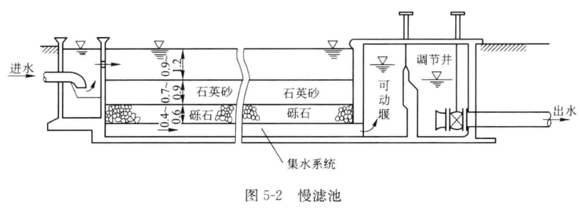
    水在慢滤池的过滤速度一般为0.1 ~ 0.3m/h。过滤速度定义为流量除以过滤面积，即
    $$v = \frac{Q}{A}$$
    $v$——过滤速度，m/h
    $Q$——过滤水的流量，$m^3/h$
    $A$——过滤面积，$m^2$
    过滤速度并非水在滤层的真实流速，实际上是滤池的表面负荷，具有速度的单位因次。
    新投产的慢滤池出水浊度较高，只有经过1 ~ 2星期以后，出水再逐渐变清澈。原因是这段时间里，滤层表面形成了一层致密的滤膜。滤层表面的滤膜是由被截留浊质、在其中的藻类、原生动物、细菌等微生物组成的。滤层表面生成滤膜的过程，称为滤层的成熟过程，所需时间称为*成熟期*。
    慢滤池过滤时，水中的浊质不断被截留在滤膜上，使滤膜阻力变大，滤速减小。需停止工作，用人工方法将滤池表面含泥膜的砂层刮去1 ~ 2cm，再进水过滤。但这又需要2 ~ 3d的成熟期。之后可持续工作数月。慢滤池存在生物净水作用，能使部分氨氮得到去除。同时，开发的机械刮砂设备和洗砂技术，使慢滤池实现了机械现代化。
2. 快滤池
	滤速可达5 ~ 10m/h，比慢滤池高数十倍。未经混凝处理的水经快滤池只有50%~80%的浊质能被去除。故快滤池主要用来过滤经过混凝（或混凝沉淀）以后的水。快滤池的堵塞也比慢滤池快得多，持续过滤时间一般只有数小时。滤层堵塞以后，要用**反冲洗**的方式将滤层中积存的浊质迅速排除。一般反冲洗只用几分钟。
	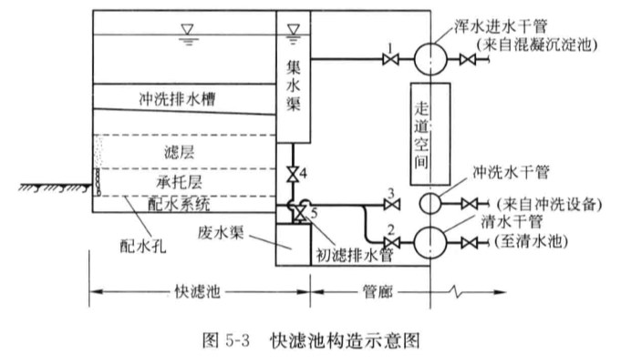
3. 慢滤池、快滤池工作机理的比较
	慢滤池主要依靠在滤层表面生成的滤膜，整个滤层只起支撑膜的作用。所以，在慢滤池中，被截留的浊质主要集中在表层，过滤水头损失也主要在表层。快滤池依靠整个滤层来截留浊质，被截留浊质深入到滤层内部。
	慢滤池除浊机理主要是表面致密滤膜上微孔的筛滤作用。
	快滤池除浊主要是浊质颗粒在滤料表面上黏附的结果。对除浊起主要作用的是滤料的表面积，而不是滤料的粒径。
## 5.2 颗粒滤料
快滤池使用的滤料都是颗粒状材料，应满足以下基本要求：
1. 具有足够的机械强度
2. 具有良好的化学稳定性
3. 具有用户要求的颗粒尺寸和粒度组成

常用滤料有石英砂、无烟煤、石榴石、大理石、磁铁矿、陶粒、聚苯乙烯等。石英砂在中性、酸性水中化学稳定性良好，便宜，但是在碱性水中化学稳定性不佳，不宜在对水中含硅量有严格要求的工业水处理中使用。无烟煤在酸、碱、中性条件下都不溶解，机械强度也能满足要求。无烟煤做多层滤料滤层时，其密度不宜过大，并且滤料密度应比较均匀，否则会使不同种类滤层之间产生混杂。

滤料的粒度分布常用**级配曲线**来表示。滤料的级配情况可通过**筛分曲线**获得。

下图是一次对滤料的筛分实验的结果：
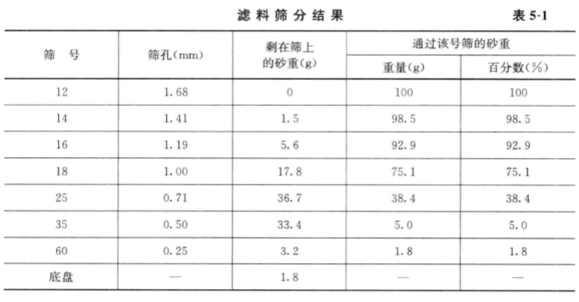
有上述实验的结果可以绘制下图的筛分曲线：
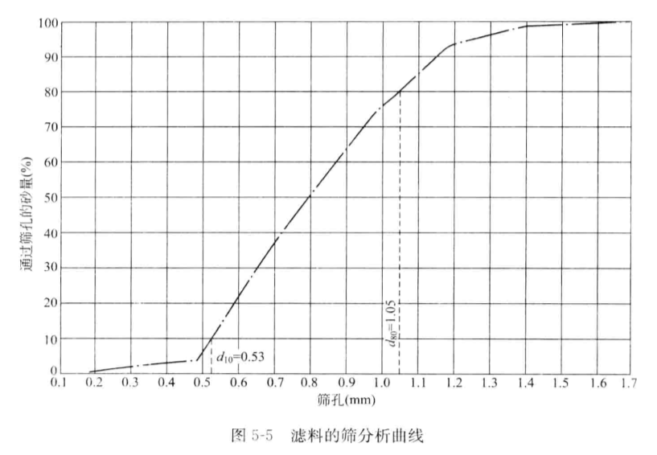
图中可算出不均匀系数$K = \frac{d_{80}}{d_{10}}$。一般以$d_{10}、K$来作为滤料粒度特征。为使滤料均匀，K不大于2.0。

一般滤料颗粒形状是不规则的，所以常用等体积球径来表示。等体积球径求法：筛好的筛盘的筛孔中会卡有部分滤料，拍打使其漏下，取$n$粒漏下的滤料（常取1000粒）称重得$W$，一颗平均质量为$\frac{W}{n}$，滤料密度为$\rho$，则1颗滤料得体积应为$W = \frac{W}{n\rho}$。球体滤料的直径为$d'$，则有
$$\frac{\pi{d'}^3}{6} = \frac{W}{n\rho} \Rightarrow d' = \sqrt[3]{\frac{6W}{\pi n\rho}}$$

有的水产为了降低成本，可购买原砂，自行筛分。筛分方法原理如下图。先根据要求的$d_{10}、K_{80}$，求出$d_{80} = K_{80}d_{10}$，在图中找到$d_{10}、K_{80}$，再根据等分找到$d_{0}、K_{100}$。这便是新滤料的最小粒径$d_0$和最大粒径$d_{100}$。以筛孔为$d_0$和$d_{100}$的两个筛子对原砂进行筛分，便可得到所需滤料。
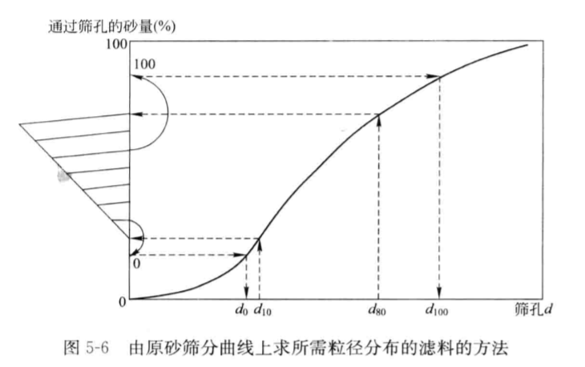

对矿物滤料（如，无烟煤等）加工时，所用的粗、细两个筛盘的孔径是滤料的最大粒径$d_{max}$和最小粒径$d_{min}$。$d_{max}$和$d_{min}$也是滤料粒度特征指标。

下面考察滤料表面积。假定滤料为球形，粒径相等。设球形滤料的直径为$d$，一颗滤料体积为$\frac{1}{6}\pi d^3$，表面积为$\pi d^2$。滤层体积有两部分：滤料、滤料之间的空隙。空隙占比称为**孔隙度$m$**。则单位体积滤料所占体积应为$(1-m)$。相应的球形滤料颗粒数为$\frac{6(1-m)}{\pi d^3}$，滤料总表面积为
$$a = \pi d^2\times \frac{(1-m)}{\frac{1}{6}\pi d^3} = \frac{6(1-m)}{d}$$
若滤料不是球形，其表面积将大于等体积的球形颗粒。非球形颗粒表面积与等体积球形颗粒表面积之比为**颗粒的形状系数$\alpha$**。球形度系数$\psi = \frac{1}{\alpha}$。
常用滤料的形状系数有：
1. 球：$\alpha = 1.0$
2. 河沙：$\alpha = 1.17\sim1.30$
3. 尖角石英砂：$\alpha = 1.50\sim1.67$
4. 无烟煤：$\alpha = 1.50\sim2.13$
利用上述数据可修正公式，得：
$$a = \frac{6\alpha(1-m)}{d}$$

单位体积滤层中的滤料的表面积，称为滤料的**比表面积**。对于粒径相同的均匀滤料，比表面积与滤料粒径呈反比。即滤料越细，比表面积越大。
对于粒径不相等的非均匀滤料，可以将相同粒径的分成一组，然后按组分所占权重计算表面积：
$$a = \sum{a_i}\Delta{P_i} = \sum\frac{6\alpha(1-m)}{d_i}\Delta{P_i}$$
这里引入当量粒径$d_e$，可用下式计算：
$$\frac{6\alpha(1-m)}{d_e} = \sum\frac{6\alpha(1-m)}{d_i}\Delta{P_i}\Rightarrow d_e = \frac{1}{\sum{\frac{\Delta P_i}{d_i}}}$$

单位面积过滤的水量，是滤池的**表面负荷**或**滤速**。单位面积滤层中的滤料的表面积可计算：设滤层厚度为$L$，单位面积滤层的体积为$1\cdot L = L$，滤料的当量粒径为$d_e$，滤层体积与滤料比表面积之积，几位单位面积滤层的滤料表面积：
$$a_L = L\cdot\frac{6\alpha(1-m)}{d_e} = 6\alpha(1-m)\frac{L}{d_e}$$
由式子可知滤层的表面积与比值$\frac{L}{d_e}$成正比。一般自来水厂设计中$\frac{L}{d_e}$一般为800 ~ 1000。

孔隙度$m$和滤料形状有关。对于球形的河砂，$m\approx0.41$。对石英砂、无烟煤等，$m\approx0.5\sim0.55$。以上数据仅为均值，实际上滤料孔隙度还与滤料的级配、粒径、反冲洗后滤层由悬浮状态回落至固定状态的情况有关。事实上，每次反冲洗后，滤层的孔隙度都不相同，因此每次反冲洗后滤料在滤层的级配、排列都不可能完全相同。
## 5.3 快滤池的运行
### 5.3.1 快滤池出水水质和水头损失的变化
快滤池反冲洗结束后恢复过滤时，出水浊度最高，这部分水称为**初滤水**，初滤水的延续时间为**成熟期**。初滤水浊度降至要求之后，进入**有效过滤期**。在有效过滤期内，出水浊度先降低后慢慢升高，到达**泄漏点**，相应浊度值称为**泄露浊度**。这是再进行反冲洗。
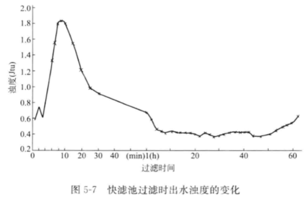

《生活饮用水卫生标准》要求用户（龙头）浊度不得高于1NTU，水厂出水浊度低于0.5NTU甚至0.2NTU。一般初滤水延续30min。反冲洗进行地不彻底或要求浊度很低，初浊水的延续时间会大大加长。排放初滤水会增加水量损耗。

含浊质的水经滤层过滤，水中悬浮物附着于滤料表面。水中悬浮物浓度越高，附着于滤料上的也越多，所以水中悬浮物浓度的降低也越快。当水流过滤层越厚，水中浊质浓度越低，故浓度降低速率越小。综上可得下面的曲线：
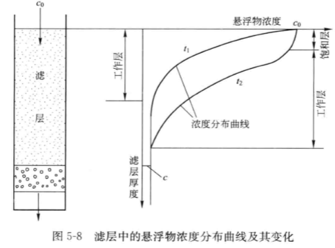
能使水中浓度不断减小的滤层为**工作层**。但附着过程还存在脱落过程，所以上部滤料两过程平衡时则趋近饱和状态，形成**饱和层**。曲线由$t_1\rightarrow t_2$。当工作层移至滤层下缘时，达到泄漏点。滤池由开始进入有效过滤期到出水浊度达到泄露值，称为**水质周期**。滤池水质周期与滤层厚度有关。

当含悬浮物的水通过滤层作等速过滤时，因悬浮物不断被截留在滤层中，导致滤层水头损失不断增大。实验表明，滤层中水头损失与时间呈线性关系。当刚开始过滤时，滤层是清洁的，水在滤层中水头损失最小，称为**初期水头损失**$h_0$。之后$h$逐渐增大，到最大值时，需要进行反冲洗。这段滤池的过滤周期，称为**压力周期**。水在滤层中的水头损失允许达到的最大值，与**过滤作用水头**$H$有关。滤池的过滤作用水头，是指滤前水位与滤后水位（清水池水位）之差。当然还有其他构建水头损失$h'$。显然过滤水头越大，压力周期越长。普通过滤池的作用水头为2.5 ~ 3m。
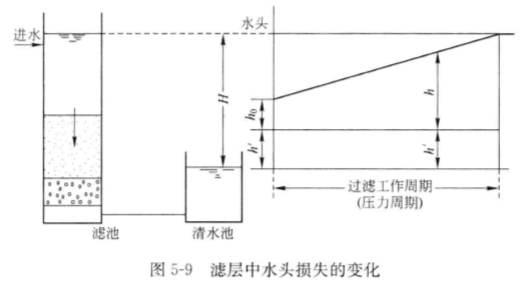
此外，压力周期与滤层厚度有关。一定作用水头条件下，滤层越厚，初期的水头损失$h_0$越大，压力周期越短。
水质周期、压力周期与很多因素有关。如，滤料粒径、滤料性质、滤速、滤前水的悬浮物浓度、滤后水的浊度要求、水中悬浮物性质等。

滤池的经济性，与滤池作用水头是否被充分利用有关。充分利用作用水头，增长过滤时间，实现使滤池水头损失达到最大值的工作周期（压力周期），在运行管理上是经济的。如果滤池作用水头未被充分利用，由于滤池出水的水质恶化而使提前结束过滤工作（达到水质周期），这是不经济的。**滤池最优工作条件是水质周期等于压力周期**。实际当中，影响因素复杂，不可能任何条件下都保持最优工作状态，所以，为避免水质周期小于压力周期的现象，可使水质周期大于压力周期。最优工作点是在一定流速条件下得到的，如果改变滤速，便会有另一最优工作点。所以实际工作时，最优工作点将连成一条线。同时最优工作点视在一定的滤料粒径条件下得到的，如果粒径采取一系列不同的值，便会得到许多相应的最优工作点，呈一条线。

### 5.3.2 快滤池滤层的优化

## 5.4 过滤理论

## 5.5 滤层的反冲洗
### 5.5.1 滤层反冲洗水力学

### 5.5.2 滤层反冲洗的最优化理论

### 5.5.3 滤层的水力分级和层间混杂

### 5.5.4 滤池的配水系统和承托层

### 5.5.5 滤层的气、水反冲洗

### 5.5.6 反冲洗废水的排除装置

### 5.5.7 反冲洗水的供给

## 5.6 几种常见的滤池
### 5.6.1 粗滤料滤池
### 5.6.2 无阀滤池

特点
节省大型阀门，造价较低，冲洗完全自动化，操作管理方便。
但池体结构复杂，滤料处于封闭结构内，装卸困难，冲洗时带走一部分原水，造成部分水浪费。
主要用于中小给水工程，单池面积不宜过大。
单池面积一般不大于$16m^2$

### 5.6.3 表面滤池
### 5.6.4 纤维过滤池
### 5.6.5 虹吸滤池
最大冲洗水头一般为$1\sim2m$。单格滤池的冲洗水是由其他池供给的。

装置特征
利用虹吸原理进水、排除冲洗水，节省两个阀门。
变水头等速过滤，不需要设置滤速控制器。
过滤后水位高于滤层，保持正水头过滤，不发生负水头现象。
小阻力配水系统，不需要设置水箱和水泵。
操作易于自动化控制。
池深大，冲洗效果不够理想，单池面积不宜过大。

滤池分格数
当1格冲洗时，其余数格滤池过滤总水量必须满足该格滤池冲洗强度要求。
$$q\leq\frac{nQ'}{F} \Rightarrow n\geq\frac{3.6q}{v}$$
$q$——冲洗强度，$L/(m^2\cdot s)$
$n$——一组滤池分格数，5 ~ 7
$Q'$——每隔滤池过滤水量，$L/s$
$F$——单格滤池面积，$m^2$

### 5.6.6 移动罩滤池
移动罩滤池是典型的减速过滤滤池。

特点
池体结构简单，使移动冲洗罩对各滤格循序冲洗，无需设置冲洗水箱。
无大型阀门

# 第 6 章 吸附
## 6.1 吸附概述
### 6.1.1 吸附现象
在两相面层中，某物质能够自动地发生富集的现象称为**吸附**。具有吸附能力的物质称为**吸附剂**。被吸附在吸附在吸附剂表面的物质称为**吸附质**。
通常固体[表面自由能](https://baike.baidu.com/item/表面自由能)比较高，有吸附别的物质降低表面自由能的趋势。自由能降低的过程大多是自发过程。因此，吸附过程是一个自发过程。可表示为：
$$A+B\longleftrightarrow A\cdot B(吸附化合物)$$
由于多种化学作用和物理化学作用吸附质被吸附在吸附剂表面，这些作用包括氢键、偶极矩作用、范德华力，更强的吸附可能来自于化学键力。与吸附相反的过程是**脱附**。吸附和脱附的速度一般随着吸附质浓度的增大而增大。如果吸附反应是可逆的，吸附质在吸附剂表面的吸附和脱附同时发生。吸附刚开始时，吸附质在溶液中的浓度大，在吸附剂表面的浓度小，因此吸附的速度大于脱附的速度。随着溶液浓度的降低和吸附剂表面浓度的增加，吸附的速度不断降低，脱附速度不断增大。最终，宏观上表现为溶液浓度不再降低。

按照吸附作用机理，可分为**物理吸附、化学吸附**。在吸附过程中，通常会伴随能量的变化，称为**吸附热**。物理作用、化学作用由于吸附机理的差别而在吸附热、吸附速度以及吸附选择性方面有所不同。*物理吸附*的作用力为分子间作用力即范德华力，其吸附热比较低、吸附速度快而没有选择性。*化学吸附*作用力为化学键力，其吸附热比较高，吸附速度根据化学键类型不同而有较大的差别，并且吸附具有一定的选择性。

### 6.1.2 等温吸附模型
吸附剂能吸附的吸附质的量是吸附剂的重要特性。影响**吸附剂吸附量**的主要因素包括*溶液浓度、温度*。通常研究的是在恒温及吸附平衡状态下，**单位吸附剂的吸附容量**$q_e$和**平衡溶液浓度**$C_e$之间的关系曲线，称为**吸附等温线**。常见的集中吸附等温线如下图。
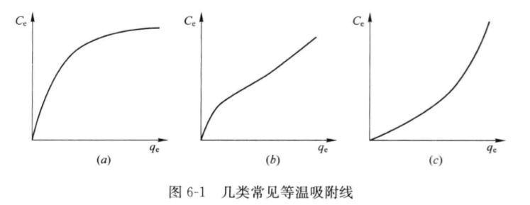
对此有两种比较常用的模型：
1. Freundlich吸附等温式
    它是一个经验公式，形式为：
    $$q_e = KC_e^{1/n}$$
    对等式两边取对数可将等式线性化为：
    $$\lg q_e = \lg K + \frac{1}{n}\lg C_e$$
    $q_e$——饱和吸附容量，单位为吸附质的质量/吸附剂的质量（mg/g），或吸附质摩尔数/吸附剂质量（mmol/g）
    $C_e$——溶液平衡浓度，单位为吸附质质量/体积（mg/L），或吸附质摩尔数/体积（mmol/L）
    $K$和$1/n$是一个特定体系的常数。后来，Halsey和Taylor发展的吸附理论可以推导出Freundlich吸附等温式。

2. Langmuir吸附等温式
    它是一个理论公式，形式为：
    $$q_e = q_{max}\frac{bC_e}{1+bC_e}$$
    常数$q_{max}$与表面吸附的单分子表层浓度有关，且代表了当$C_e$增加时$q_e$的最大值。常数$b$与表面吸附能量有关，当吸附力增大时，$b$值也增加。
    该模型认为。吸附质在均匀固体表面形成单分子层的吸附层，吸附在固体表面的分子间不存在作用力，吸附为动态平衡：
    $$A+B\leftrightharpoons A\cdot B$$
    设$\theta$为某一平衡时刻吸附剂表面被覆盖的百分比，$A$为总吸附位置数量。若吸附剂表面均匀，则被占用的吸附位置为$A\theta$，空余的吸附位置为$A(1-\theta)$。由于被吸附的分子之间不存在作用力，那么吸附速度$V_1$与吸附质的浓度及附空位成正比，脱附速度$V_2$与吸附质浓度成正比，即存在下列两式：
    $$V_1 = k_1CA(1-\theta)\\V_2 = k_2A\theta$$
    同时，由于吸附达到平衡时$V_1 = V_2$，则有：
    $$\theta = \frac{\frac{k_1}{k_2}C_e}{1+bC_e} = \frac{bC_e}{1+bC_e}$$
    设表面最大吸附量为$q_{max}$，平衡时的吸附量为$q_e$，由吸附量及吸附位对应关系得：
    $$\theta = \frac{q_e}{q_{max}}$$
    结合上面两式就可得到理论公式。

## 6.2 活性炭吸附
### 6.2.1 活性炭的制备
活性炭（AC）有两种应用方式：
1. 粉末炭（PAC）
    对受污染水源中的微量臭和味有机物具有良好的吸附性。主要用于臭和味的控制。
2. 粒状炭（GAC）
    是一种良好的生物载体。与臭氧氧化联用，可以控制水中难生物降解的有机物。在废水处理方面广泛应用在三级处理、重金属废水处理、有机工业废水处理等。
任何碳质原料几乎都可以用来制造活性炭。原料中**灰分含量**是衡量其质量的重要因素，一般*灰分越少越好*。活性炭制造分两步：*炭化、活化*。**炭化**又称**热解**，是在隔绝空气条件下对原材料进行加热，温度在600℃以下。有时会先经过无机盐溶液处理。炭化有多种作用：
    * 使原材料分解放出水汽、一氧化碳、二氧化碳、氢等气体。
    * 使原材料分解成碎片，并重新集合成稳定的结构。
**活化**是在有氧化剂作用下，对炭化后的材料加热，以生产活性炭产品。活化过程中，烧掉了炭化时吸附的碳氢化合物，起到了扩大空隙的作用，使活性炭变成多孔结构。

### 6.2.2 活性炭的性质
1. 物理性质
2. 化学性质
3. 吸附性质
    1. 亚甲蓝吸附值
    2. 碘吸附值
    3. 苯酚吸附值
    4. BET比表面积

### 6.2.3 影响活性炭吸附的因素
1. 活性炭的性质
2. 吸附质的性质
3. 其他因素
4. 活性炭与水处理化学药剂的反应
    活性炭是一种具有*还原性*的物质。常与氧化性物质反应，如氧、氯、二氧化氯、高猛酸盐。可用来去除水中的余氯。在反渗透过程中，对游离氯敏感的反渗透膜之间常设活性炭滤柱。去除有机物的同时，可以控制余氯浓度在安全值范围。

### 6.2.4 竞争吸附
活性炭对于单一组分溶液中溶质的吸附，可以用Freundlich吸附等温式或者Langmuir吸附等温式来描述。当溶液中存在*两种或两种以上的溶质*，并用活性炭吸附时，将会产生非常复杂的竞争吸附现象。
1. 两组分竞争吸附模型
    研究目的是探讨多组分条件下，各组分的平衡吸附量情况。多组分竞争吸附中，最基本的是两组分竞争吸附，影响两组分竞争吸附的*主要因素*是**初始浓度、平衡浓度**。模型有如下两个等式：
    $$C_{1\cdot0}-q_1C_c-\frac{q_1}{q_1+q_2} \left( \frac{n_1q_1+n_2q_2}{n_1K_1} \right)^{n_1}=0
    \\
    C_{2\cdot0}-q_2C_c-\frac{q_2}{q_1+q_2} \left( \frac{n_1q_1+n_2q_2}{n_2K_2} \right)^{n_2}=0$$
    $q_1$和$q_2$分别表示平衡时两种化合物的吸附量，$C_{1\cdot0}$和$C_{2\cdot0}$分别表示溶液中两种溶质各自的初始浓度。$C_c$表示活性炭的投加量。这两个方程描述了吸附质的初始浓度、平衡吸附量、活性炭投加量之间的关系。如果要求出$C_{1\cdot e}$和$C_{2\cdot e}$还需要两个式子：
    $$
    q_1 = (C_{1\cdot0}-C_{1\cdot e})/C_c
    \\
    q_2 = (C_{2\cdot0}-C_{2\cdot e})/C_c
    $$
    $C_{1\cdot e}$和$C_{2\cdot e}$分别表示各自的平衡浓度。
    
2. 多组分竞争吸附模型
    当溶液中的吸附值组分种类超过两种时，可将两组分公式扩展得到下式：
    $$
    C_{i\cdot0}-q_iC_c-\frac{q_i}{\sum_{j=1}^{n}q_j} \left( \frac{\sum_{j=1}^{n}n_jq_j}{n_iK_i} \right)^{n_i} = 0
    $$

3. 水中多组分竞争吸附模型的简化处理——EBC模型
    在水处理中，因为吸附质不但种类多，而且很难被分别确认，因此多种组分竞争吸附模型作为一种理想模型很难在实际生产中应用。这一问题的解决来自于替代本底有机化合物模型。该模型思想是把一种主要的目标污染物作为研究对象，其他复杂的多种组分作为一种化合物来看待，称为**替代本底有机化合物模型**。这样可以转化为二组分竞争体系。这样只需测定出目标化合物以及本底化合物的吸附参数和初始浓度，就可确定活性炭的吸附情况。这里应当注意，本底化合物的$K, 1/n$随化合物的组成和活性炭种类而不同。

### 6.2.5 活性炭吸附过程
1. 传质过程
    活性炭的吸附是复杂的动力学过程，其中包括：
    * 吸附质在主体溶液中的传质
    * 吸附质在活性炭表面水膜中的传递
    * 吸附质分子在孔内扩散
    * 最终在活性炭表面吸附
    
    吸附质在主体溶液中的传质是使吸附质*达到活性炭表面*上的过程。这一过程可以通过*机械混合、分子扩散*来实现。吸附质在活性炭表面水膜中的传质过程负荷[Fick第一定律](http://www.engineeringenotes.com/metallurgy/diffusion/diffusion-coefficient-and-laws-ficks-laws-metallurgy/41803)，与*浓度梯度、液膜厚度*有关。梯度越大，液膜越薄，传质速度越快。
    
    吸附质穿过水膜，在到达吸附位置之前的过程，是吸附质在活性炭孔内扩散到吸附位置的过程。吸附质分子到达吸附位置之后，由于其与活性炭表面的作用产生吸附，吸附过程结束。这些连续过程中的最慢者，将会成为整个传质过程的关键步骤。在水处理过程中，通常有机物*在水膜中的扩散*或者*在孔中的扩散*是控制步骤。

2. 穿透曲线
    对于粒状炭，当水连续通过吸附装置时，随时间推移，出水中污染物质的浓度逐渐上升，这称作**污染物的穿透现象**。达到一定时间后污染物浓度上升很快；当吸附装置达到饱和后，出水中污染物浓度几乎完全与进水相同，吸附装置失效。以时间为横坐标，以出水污染物为纵坐标，将水中污染物浓度随时间变化作图，得到的曲线称为**穿透曲线**。$C_A$为允许的污染物出水最高浓度，称为**穿透点**；$C_B$为进水浓度的90%，该点为**饱和点**。**累计通水量**或者**比通水量**（通水量体积/活性炭体积）可作为吸附穿透曲线横坐标。
    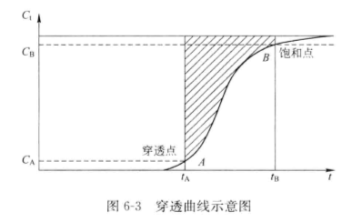
3. 吸附带
    吸附过程中，前端的活性炭可看作未吸附，后端看作已饱和。中间饱和程度从0到100%的部分称为**吸附带**（Mass transfer zone，MTZ）。随时间变化，后端、吸附带逐渐前移，前端未吸附的部分越来越少。当出水浓度大于预定值时，炭层穿透。由此可见，吸附带的长度将影响活性炭层的使用率。
    吸附速度越快、吸附带越短，活性炭层利用率越高。
    吸附带长度$L_{MTZ}$的计算实际中常用Micheals和Weber的模型：
    $$
    L_{MTZ} = Z\frac{V_E-V_B}{V_E-0.5(V_E-V_B)}
    $$
    $Z$——吸附柱高度，m
    $V_E$——滤柱完全耗尽时产水体积，$L(m^3)$
    $V_B$——滤柱穿透时产水体积，$L(m^3)$

4. 空床接触时间（Enpty bed contect time，EBCT）
    是吸附接触装置的重要参数，物理意义是*在吸附装置中不添加任何填料的情况下过水的水力停留时间*。计算式为：
    $$
    EBCT = \frac{V}{B}
    $$
    $V$——进水流量
    $B$——反应器的有效吸附体积
    在某处理水量下，空床接触时间决定吸附装置的体积。经济上，EBCT越小越好；效果上，EBCT越大越好。
5. 临界穿透浓度、吸附柱临界深度
    **临界穿透浓度**$C_{cri}$是指可以接受的污染物最大出水浓度。**吸附柱临界深度**$L_{cri}$是运行一开始就导致出水浓度等于$C_{cri}$的吸附柱深度。有以下关系：
    $$
    \frac{L_{cri}}{Q/A} = EBCT
    $$
    $A$——吸附柱截面积
6. 活性炭利用率（Carbon usage rate，CUR）
    定义为单位处理水量所需的活性炭质量：
    $$
    CUR = \frac{m_{GAC}}{Q_t}
    $$
    $m_{GAC}$——活性炭质量
    $Q_t$——所处理的总水量
    由于总吸附量：
    $$
    Q_e = m_{GAC}\cdot q = Q_t(C_0 - C_e)
    $$
    CUR可表示为：
    $$
    CUR = \frac{C_0 - C_e}{q_e}
    $$
    一般增大CUR的值有利于降低活性炭吸附装置的成本。

## 6.3 活性炭吸附的应用
### 6.3.1 活性炭的功能
1. 臭和味的去除
    随运行时间的延长，由于竞争吸附的作用，粒状活性炭吸附去除臭和味的容量会随着活性炭的天然有机物的增加而逐渐降低。
2. 总有机碳（TOC）的去除
3. 消毒副产物（Disinfection byproducts，DBPs）前驱物的去除
    大多数消毒副产物被认定为致癌物。一般认为，原水中的天然有机物（NOM）是主要的消毒副产物前驱物。大部分胶体状态的NOM会在混凝过程被去除，剩余的NOM可以在氯化消毒以前通过活性炭吸附被去除，这样就可以控制DBPs的生成了。
4. 挥发性有机物（Volatile organic compounds，VOCs）的去除
    三氯乙烯、四氯乙烯比较容易被吸附。氯仿、二氯乙烷较难被吸附。粒状活性炭滤池可用来除去VOC。
5. 人工合成有机物（Synthetic organic chemicals，SOCs）的去除

### 6.3.2 粉末炭的应用
粉末炭特点：粒度小、接触面积大、吸附速度快、吸附效果好，基建费用低。不足是再生困难，运行费用高。应用中应当考虑以下因素：
1. 投加量
    给水处理中粉末炭投加量范围是$2\sim20mg/L$。
2. 接触时间
    对不同类型的化合物，采用的粉末炭吸附所需的接触时间是不同的。一般需要15min。MIB（二甲基异茨醇），则需要更长的接触时间。
3. 投加点的选择
4. 投加方式及设备
5. 粉末炭应用的其他方式

### 6.3.3 粒状活性炭的应用
1. 吸附装置形式
2. 设计参数

### 6.3.4 活性炭纤维（Activated carbon fiber，ACF）的应用

### 6.3.5 生物活性炭技术的应用

## 6.4 活性炭的再生

## 6.5 水处理过程中的其他吸附剂
### 6.5.1 沸石
沸石是一类*疏松的网架状铝硅酸盐矿物*。沸石中含有移动性较大的阳离子和水分子，可以进行阳离子交换。由于天然沸石所具有的离子交换和吸附性质，它可被制成各种*复合吸附剂*或*离子交换剂*。但天然沸石的吸附性能较差，因为其孔道较小，吸附量较少。
常用的是人工处理的沸石。为改善天然沸石的吸附特性，将它的粉体和易燃性微粉按一定比例混合，在高温下灼烧成多孔质高强度沸石颗粒。这种方法*拓宽了孔道，增加了沸石颗粒的表面积，提高水溶液在沸石颗粒中的渗透性，提高了沸石对金属离子的吸附性能*。
沸石作水处理吸附剂的作用：
1. 吸附金属离子
2. 有机污染物吸附剂
3. 氨氮去除剂
4. 作为离子交换剂使用
5. 废水滤料

### 6.5.2 硅藻土

### 6.5.3 粉煤灰

# 第 7 章 氧化还原与消毒
## 7.1 概述
### 7.1.1 氧化剂和消毒方法
常见的氧化剂有氯、臭氧、二氧化氯、过氧化氢、高猛酸盐、高铁酸盐等。

### 7.1.2 化学氧化

### 7.1.3 消毒与灭活

## 7.2 氯氧化与消毒
### 7.2.1 氯的性质

### 7.2.2 氯消毒过程
1. 氯消毒机理
2. 折点加氯法

### 7.2.3 氯化消毒副产物（DBPs）的形成及控制
1. 强化混凝
2. 粒状活性炭吸附
3. 膜滤

### 7.2.4 加氯点

### 7.2.5 加氯设备、加氯间、氯库

## 7.3 臭氧氧化与消毒
### 7.3.1 臭氧的物理化学性质

### 7.3.2 臭氧氧化作用机理
1. 臭氧与无机物作用机理
2. 臭氧与有机物作用机理

### 7.3.3 臭氧与有机污染物间反应动力学

### 7.3.4 臭氧预氧化对水处理效果的影响
1. 除藻除嗅
2. 控制氯化消毒副产物的作用
    1. 臭氧预氧化对三卤甲烷（THMs）的控制作用
    2. 臭氧预氧化对其他氯化消毒副产物的作用
3. 氧化助凝过程
4. 臭氧氧化副产物

### 7.3.5 臭氧中间氧化

### 7.3.6 臭氧消毒

### 7.3.7 臭氧处理工艺

## 7.4 其他氧化与消毒方法

## 7.5 高级氧化概述

# 第 8 章 离子交换
## 8.1 离子交换概述

## 8.2 离子交换反应

## 8.3 离子交换装置及运行操作

## 8.4 离子交换的应用

# 第 13 章 活性污泥法
## 13.1 活性污泥法的理论基础
活性污泥法的讨论主要是在生物反应和净化机理、生物学、反应动力学理论、工艺等方面。目前，活性污泥法是生活污水、城市污水以及有机性工业废水处理中最常用的工艺。
### 13.1.1 活性污泥法的概念与基本流程
往生活污水中通入空气，持续一段时间，污水即能生成褐色絮状体。该絮状体主要由大量微生物群体构成，可氧化分解污水中的有机物，并易于沉淀分离。这种絮凝体就是活性污泥。

活性污泥的形式有很多，但基本流程是一样的。活性污泥法处理系统以**曝气池为核心处理单元**，此外，还有二沉池、污泥回流、剩余污泥排放以及曝气等系统。

初沉池或其他预处理装置处理后的污水回流的活性污泥一起，进入曝气池形成混合液。曝气池是一个生物反应器，通过曝气装置充入空气，有两方面作用：一是保持好氧条件；二是使混合液搅拌，活性污泥能够处于悬浮状态，污水与活性污泥充分接触。

污水中的有机物在曝气池被污泥吸附，并被存活在其中的微生物利用而得到降解，然后流入二沉池，进行固液分离。二沉池溢流堰排出澄清水则为净化后的处理水。二沉池沉淀池底部的沉淀浓缩污泥一部分作为接种污泥返回曝气池，称为**回流污泥**。曝气池中的生化反应引起微生物增值，这就是活性污泥量增加。为保持曝气池内恒定的污泥浓度，还要将一部分污泥排出污水处理系统，该部分污泥称为**剩余污泥**。剩余污泥妥善处理属于固体废物的课程范围。

活性污泥法处理系统有效运行的基本条件：
1. 污水中含有足够的溶解有机物，作为微生物生理的必需营养物质；
2. 混合液中含有足够的溶解氧；
3. 活性污泥在曝气池呈悬浮状态，充分与水接触；
4. 活性污泥连续回流，同时还要及时排出剩余污泥，保证曝气池中活性污泥浓度恒定；
5. 没有对微生物有毒害作用的物质进入。

活性污泥法实际上是自然界水体自净的人工强化模拟。

### 13.1.2 活性污泥的形态与组成
活性污泥是活性污泥法处理系统中的主体物质。在微生物群体新陈代谢的作用下，活性污泥具有将有机物转化为稳定无机物的活力。

活性污泥在外观上呈絮绒颗粒状，又称**生物絮凝体**。静置时，活性污泥立即凝聚成较大的绒粒而下沉。略带土壤气味，颜色根据水质不同，一般为黄色或褐色。活性污泥含水率很高，一般都在99%以上，比重介于1.002 ~ 1.006之间。活性污泥具有较大的比表面积，每毫升活性污泥的比表面积介于20 ~ 100$cm^2$。

活性污泥的固体物质仅占1%以下，由无机物和有机物两部分组成，组成比例因原污水水质不同而异。如，城市污水的活性污泥有机成分占75% ~ 85%。活性污泥中的固体物质的有机成分，主要是由栖息在活性污泥上的微生物群体组成。此外还有在活性污泥上还夹杂着由入流污水挟入的有机固体物质，其中包括某些惰性的难为细菌摄取、利用的所谓“难降解有机物质”。微生物菌体经过自身氧化的残留物，像细胞膜、细胞壁等，也属于难降解的有机物质范畴内。活性污泥的无机组成部分，则全部是由污水挟入的，至于微生物体内的无机盐类，数量极少，可忽略。

活性污泥的四部分：
1. $M_a$具有代谢功能的微生物群体；
2. $M_e$微生物自身氧化的残留物；
3. $M_i$由污水挟带的并由微生物吸附的有机物（含难为细菌降解的惰性有机物）；
4. $M_{ii}$有污水写入的无机物质。

### 13.1.3 活性污泥微生物及其作用
活性污泥中的微生物群体主要由细菌所组成，其数量可占污泥中微生物总数的90% ~ 95%，在某些工业废水中可达100%。细菌以**异养型的原核细菌**为主。正常活性污泥中的细菌数量大致介于$10^7\sim10^8 个/mL$活性污泥之间。可能在活性污泥上形成优势细菌主要有：产碱杆菌属、芽孢杆菌属、黄杆菌属、动胶杆菌属、假单胞杆菌属、大肠埃希氏杆菌等。可能出现的细菌有：无色杆菌属、微球菌属、诺卡氏菌属、八叠球菌属。哪些种属的细菌占优势，则取决于原污水中有机物的性质。上述种属的细菌在适宜的环境条件下，都有较高的增值速率，**时代时间为20 ~ 30min**。具有较强的分解有机物并将其转化为稳定无机物的能力。

菌胶团（絮凝体状团粒）细菌：动胶杆菌属、假单胞菌属、黄杆菌属等。菌胶团细菌式构成活性絮凝体的主要成分，有很强的吸附、氧化分解有机物的能力。细菌形成菌胶团可`防止被微型动物吞噬；在一定程度上免受毒物的影响；具有很好的沉降性能，使混合液在二沉池中迅速完成泥水分离`。

丝状菌在活性污泥中可交叉穿织在菌胶团之间，形成活性污泥絮凝体的骨架，使污泥具有良好的沉淀性能。丝状菌还可保持高的净化效率、低的处理出水浓度和初始悬浮物浓度。但是，**大量异常的丝状菌增殖会引发污泥膨胀现象**。

在活性污泥中存活的原生动物有**肉足虫、鞭毛虫、纤毛虫**。主要捕食细菌。所以，在活性污泥中的原生动物，在种属、数量上随处理水水质和细菌的存活状态变化。

在活性污泥系统启动初期，活性污泥絮凝体尚未很好形成，混合液中游离细菌居多，处理水水质不好。此时出现的原生动物，最初为**肉足虫类**（变形虫）占优势，然后出现的是**游泳型纤毛虫**（如豆形虫、肾形虫、草履虫等）。

活性污泥培育成熟之后，生物絮凝体结构良好，混合液中的细菌多已经聚居在活性污泥上。游离细菌数很少，处理水水质良好，此时出现的原生动物将以**固着型纤毛虫**（钟虫、累枝虫、独缩虫、聚缩虫、盖纤虫）为主。

原生动物不断摄食游离细菌，起到进一步净化水质作用。

活性污泥系统中常见的后生动物有**轮虫、线虫、瓢体虫**。轮虫是处理效果较好的标志。

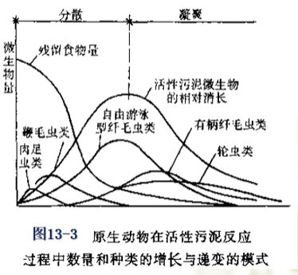

在活性污泥法处理系统中，净化污水地第一承担者是细菌。第二承担者是原生动物。原生动物为活性污泥系统中的指示性生物，可通过显微镜镜检。

### 13.1.4 活性污泥微生物的增值规律
在曝气池内，活性污泥微生物降解有机物导致微生物增殖，实际上就是活性污泥增长。接下来就要研究微生物在曝气池内的增长规律。

纯菌种的增殖规律可以用增殖曲线来表示。活性污泥中微生物种类繁多，其增殖规律复杂，但也可以用增殖曲线表示。

将活性污泥微生物在污水中接种，并在适宜温度、溶解氧充足的条件下培养，按时取样计量，即可得出微生物数量与培养时间之间具有一定规律的增殖曲线。

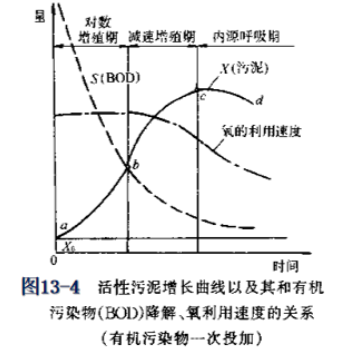

在温度适宜、溶解氧充足、不存在抑制物质条件下，活性污泥增殖速率主要取决于有机物量F、微生物量M的比值F/M。这是有机物降解速率、氧利用速率、活性污泥的凝聚吸附性能的重要影响因素。

活性污泥增殖分为以下四个阶段：
1. 适应期
    又称延迟期、调整期。本阶段前期，微生物酶系统适应环境，微生物不增殖，个体变大。本阶段后期，细胞开始分裂、微生物开始增殖。这个时期的长短取决于培养基污水的主要成分和微生物对它的适应性。
2. 对数增殖期
    又称增殖旺盛期。出现的环境条件是F/M很高，有机物非常充分。微生物以最大速率摄取有机物，也以最大速率增殖。增殖速率与有机物浓度无关，呈零级反应，与生物量有关，呈一级反应。有机物降解、氧的消耗以最大速率进行。这段时期，活性污泥微生物具有很高的能量水平，因而不能形成良好的污泥絮凝体。
3. 减衰增殖期
    又称稳定期、平衡期。随着微生物的不断增殖，有机物浓度不断下降，F/M比值继续下降，有机物质逐步成为微生物的限制因素。此时微生物的增殖过渡到减衰增殖期。在此期间，微生物仍在增殖，但其增殖速率、有机物降解速率大大降低。微生物的增殖速率和有机物浓度有关，呈一级反应。在后期，增殖速率几乎和细胞衰亡速率相等，微生物活体数达到的最高水平。
    这段时间，有机物质含量较低，微生物的活动能力降低，**菌胶团细菌之间易于相互粘附**，活性污泥絮凝体开始形成，凝聚、吸附、沉降性能都有所提高。**一般来说，大多数活性污泥处理厂是将曝气池运行工况控制在这一范围内**。
4. 内源呼吸期
    又称衰亡期。污水中有机物持续下降，达到耗尽的程度，F/M比值很低。微生物由于得不到充足的营养物质，开始大量利用身体内存储的物质或衰亡菌体，进行内源代谢。这段时间，微生物的增殖速率低于自身氧化的速率，导致微生物总量减少，增殖曲线呈下降趋势。实际上，内源呼吸的残留物多是难于降解的细胞壁和细胞膜等物质，所以，活性污泥不会完全消失。这段时间起始阶段，絮凝体形成速率提高，吸附、沉淀性能提高，污泥活性下降。**延时曝气法采取这一时段作为运行工况**。

    活性污泥法转入正常运行后，由于曝气池内混合液的流态不同，所对应的污泥增殖曲线也不同。

    在一般的**推流式曝气池**中，在*曝气池首端*，活性污泥的生长可能处于增长速率上升阶段，也可能处于下降阶段，这取决于污水中的**有机物浓度、回流污泥浓度**；曝气池*末端活性污泥的生长状态*，取决于污水中的**曝气时间**。F/M决定了推流式曝气池某点的状态。因此，一定范围内，控制回流污泥量、曝气时间可获得不同程度的处理效果。

    **完全混合式曝气池**内各点水质均匀，微生物群体性质、数量基本相。在曲线上只是一个点。这取决于*每日进入曝气池的有机物和微生物之间的相对数量*，即**污泥负荷**。

### 13.1.5 活性污泥净化污水地过程
有机物去除的过程实质是有机物被微生物摄取、代谢、利用的过程，结果是污水得到净化、微生物合成新细胞、活性污泥增长。这一复杂的物理、化学、生物过程大致有下列几个净化阶段：
1. 初期吸附去除
    污水开始与污泥接触后的较短时间（5 ~ 10min）内，有机物大量去除，有很高的BOD去除率。这种初期告诉去除现象是由物理吸附、生物吸附共同的作用。活性污泥比表面积大，外部覆盖多糖类的粘质层。污水中呈悬浮、胶体状的有机物被活性污泥聚集、吸附、去除的现象称为**初期吸附去除**。
    **BOD去除率可达到20% ~ 70%**，吸附速率与程度取决于
    * 微生物的活性：决定活性污泥的吸附、凝聚能力。
    * 有机物的组成、物理形态：决定有机物被吸附的难易程度。
    活性强的活性污泥，应具有较大比表面积，而且一般选取处在内源呼吸期的微生物（吸附能力强）。
    被吸附的的微生物表面的有机物，经过数小时曝气后，才能进入微生物体内。所以，`初期吸附去除的有机物是有限的`。回流污泥应进行充分曝气，将贮存在微生物细胞表面和体内的有机物充分代谢，使活性污泥微生物进入内源呼吸期，提高活性。但是，曝气过分活性污泥会使自身氧化过分，也会使初期吸附去除的效果降低。
2. 微生物的代谢
    * 分解代谢：对一部分有机物进行氧化分解，形成稳定的无机物质并提供能量合成细胞
        $$
        C_xH_yO_z + \left( x +\frac{y}{4}-\frac{z}{2} \right)O_2 \stackrel{酶}{\longrightarrow} xCO_2 + \frac{y}{2}H_2O + \Delta H
        $$
    * 合成代谢：一部分有机物用于合成新细胞
        $$
        nC_xH_yO_z + nNH_3 + n\left(x +\frac{y}{4}-\frac{z}{2}-5 \right)O_2 \stackrel{酶}{\longrightarrow} (C_5H_7NO_2)_n + n(x-5)CO_2 + \frac{n}{2}(y-4)H_2O - \Delta H
        $$
    * 内源呼吸：对自身的细胞物质进行氧化分解并提供能量
        $$
        (C_5H_7NO_2)_n + 5nO_2 \stackrel{酶}{\longrightarrow} 5nCO_2 + 2nH_2O + nNH_3 + \Delta H
        $$
    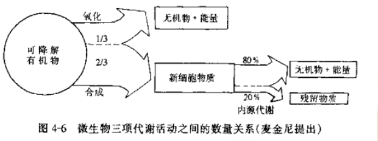

3. 活性污泥的沉淀分离
    泥水分离效果、处理直接关系到系统处理效果，处理不妥将造成二次污染。

### 13.2.6 环境因素对活性污泥微生物的影响
活性污泥微生物只在适合的环境条件下才能存活。能够影响微生物生理活动的因素主要有以下几点：
1. 营养物质
    需按一定比例摄取营养物质，包括：C、N、P、无机盐、生长素等。生活污水可按$BOD_5:N:P = 100:5:1$考虑，其具体数值还与污泥负荷、污泥龄有关。
2. 溶解氧
    对于混合液中的游离细菌，溶解氧浓度保持在0.3mg/L可满足要求。对于絮凝体，溶解氧要扩散至内部深处浓度一般宜保持在不低于2mg/L（以曝气池出口为准）；进口区浓度不宜低于1mg/L。溶解氧过高不经济。
3. pH值
    活性污泥最适宜的pH值范围是6.5 ~ 8.5。过高过低应考虑设置调节池。
4. 温度
    活性污泥微生物多属嗜热菌，适宜温度在15 ~ 30℃。为安全计，一般认为活性污泥处理厂能运行的温度范围是10 ~ 35℃。寒冷地区小型的污水处理厂应考虑将曝气池建于室内；大中型污水处理系统可露天建设，但应考虑适当保温措施。同时还应考虑*提高混合液活性污泥浓度、降低BOD负荷率、延长曝气时间*等，缓解低温的不良影响。过高温度污废水要采取降温措施。
5. 有毒物质（抑制物质）
    大于**有毒物质极限允许浓度**时，毒害、抑制作用才会显露。这类物质主要有重金属、氰化物、无机物、有机物等
    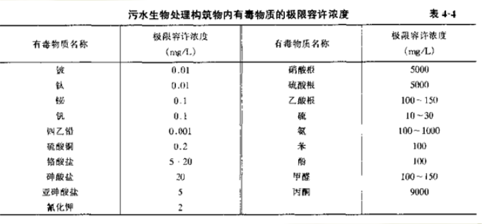

## 13.2 活性污泥的性能指标及其有关参数
### 13.2.1 活性污泥的性能指标
1. 混合液中活性污泥微生物量的指标
    1. 混合液悬浮物质浓度MLSS
        又称混合液污泥浓度，表示单位容积混合液内含有的活性污泥固体物的总量。
        $$
        MLSS = M_a + M_e + M_i + M_{ii}
        $$
        $M_a$——具有代谢功能的微生物群体
        $M_e$——微生物自身氧化的残留物
        $M_i$——由污水挟带的并由微生物吸附的有机物（含难为细菌降解的惰性有机物）
        $M_{ii}$——有污水写入的无机物质
        一般曝气池内MLSS在2000 ~ 6000mg/L，多数在3000 ~ 4000mg/L。
    2. 混合液挥发性悬浮物质固体浓度MLVSS
        表示混合液中活性污泥有机性固体部分的浓度
        $$
        MLSS = M_a + M_e + M_i
        $$
    MLVSS/MLSS用f表示：
    $$
    f = \frac{MLVSS}{MLSS}
    $$
    一般情况下，城市生活污水的f为0.75左右。
2. 活性污泥的沉降性能及其评价指标
    活性污泥的沉降要经历絮凝沉淀、成层沉淀、压缩等全过程，最后才能形成高浓缩污泥层。正常活性污泥在30min内即可完成絮凝沉淀、成层沉淀，进入压缩。压缩（浓缩）的进程相对缓慢，需时较长。
    1. 污泥沉降比SV
        又称30min沉降率。混合液在量筒内静置30min后，形成沉淀污泥的容积占原混合液容积的百分率。
        能相对地反映污泥数量以及污泥的凝聚、沉降性能。一般正常数值为20 ~ 30%。测量方法简单，是评估活性污泥数量和质量的重要指标。
    2. 污泥容积指数SVI
        简称污泥指数。物理意义是从曝气池出口处取出的混合液，经过30min静沉后，每克干污泥形成的沉淀污泥所占容积，以mL计：
        $$
        SVI = \frac{SV}{MLSS}
        $$
        反映活性污泥的凝聚、沉降性能，对生活污水、城市污水介于70 ~ 100为宜。过低说明泥粒细小，无机质含量高，缺乏活性；过高说明污泥沉降性能不好，有产生污泥膨胀的可能。
        由于SVI测定受容器直径影响，所以有稀释污泥指数DSVI作为检测指标。DSVI是指将污泥稀释至1500mg/L测得的污泥指数。
        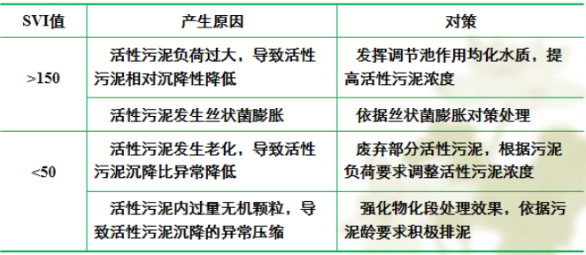

3. 活性污泥的活性评价指标
    活性污泥的比耗氧速率，简称SOUR，一般称OUR为衡量活性污泥生物活性的一个重要指标。OUR是指单位重量的活性污泥在单位时间内所能消耗的溶解氧量，单位为$mgO_2/(gMLVSS\cdot h)$或$mgO_2/(gMLSS\cdot h)$。一般为$8 \sim 20 mgO_2/(gMLSS\cdot h)$。不同温度下的值没有可比性，一般测20℃。
    OUR作用在于反映有机物降解速率，以及活性污泥是否中毒。指标突然下降可用于自动报警装置检测中毒。
### 13.2.2 活性污泥法的设计与运行参数
1. BOD污泥负荷率、BOD容积负荷率
    通过控制F/M，可以控制活性污泥所处的生长期。具体工程应用可表示为：
    $$
    N_S = \frac{F}{M} = \frac{QS_0}{VX}
    $$
    $N_S$——BOD污泥负荷率（又称BOD-SS负荷率），一般用$kgBOD/(kgMLSS\cdot d)$表示
    $Q$——污水流量，$m^3/d$
    $S_0$——原污水有机物的浓度，一般用$mg/L$或$kgBOD/m^3$
    $V$——曝气池有效容积，$m^3$
    $X$——曝气池中活性污泥浓度，一般用$mg/L$或$kgMLVSS/m^3$
    
    BOD污泥负荷率所表示的是曝气池内单位重量（kg）的活性污泥，在单位时间（d）内接受的有机物量（kgBOD）。有时，也以COD表示有机物量，MLVSS表示活性污泥量。

    另一种污泥负荷：
    $$
    N_V = \frac{QS_0}{V}
    $$
    $N_V$——容积负荷率，一般用$kgBOD/(m^3\cdot d)$
    由上可得：
    $$
    N_V = N_SX
    $$
    较高的污泥负荷率可加快有机物降解速率、污泥增长速率，降低曝气池容积，这样经济，但出水水质可能不好；较低的污泥负荷率，有机物的降解速率、活性污泥增长速率降低，增大曝气池容积，基建费用大，但出水水质好。
2. 污泥龄
    又称固体平均停留时间（SRT）、生物固体平均停留时间（BSRT）、细胞平均停留时间（MCRT）。指**在曝气池内，微生物从其生成到排出的平均停留时间**，也就是**曝气池内的微生物全部更新一次所需的时间**。
    在工程上，在稳定条件下，污泥龄是曝气池内活性污泥总量与每日排放的剩余污泥之比。即：
    $$
    \theta_C = \frac{VX}{\Delta X}
    $$
    $\theta_C$——污泥龄，一般用d
    $\Delta X$——曝气池内每日增长的活性污泥量，即应排除系统的活性污泥量，一般用kg/d

    为了维持系统中的生物量恒定，排除污泥量应和污泥增长量相当。

    每日排除污泥量排出系统的污泥量，包括剩余污泥排出的污泥量和随处理水流出的污泥量，表达式：
    $$
    \Delta X = Q_WX_r + (Q-Q_W)X_e
    $$
    $Q_W$——作为剩余污泥排放的污泥量，$m^3/d$
    $X_r$——剩余污泥浓度，回流至曝气池的回流污泥浓度也同此值，$kg/m^3$
    $X_e$——排放处理水中的悬浮固体浓度，$kg/m^3$

    上式可以简化（处理水中悬浮固体浓度很低）：
    $$
    \theta_C = \frac{VX}{Q_WX_r}
    $$

    一般情况，$X_r$是活性污泥特性和二沉池沉淀效果的函数，由下式近似计算：
    $$
    X_r = \frac{10^6}{SVI}r
    $$
    $SVI$——污泥容积指数，mL/g
    $r$——修正系数，与二沉池停留时间、池深等有关，一般取1.2左右

    当世代时间小于污泥龄，菌种就不可能形成优势种属。

3. 污泥回流比
    指从二沉池返回到曝气池的回流污泥量$Q_R$与污水流量Q之比，百分数表示：
    $$
    R = \frac{Q_R}{Q}
    $$
    
    曝气池内混合液污泥浓度X、污泥回流比R、回流污泥浓度$X_r$之间的关系：
    $$
    R = \frac{X}{X_r-X}
    $$

4. 曝气时间
    指污水进入曝气池后，在曝气池中的平均停留时间，也称水力停留时间（HRT）或停留时间，以h计：
    $$
    t = \frac{V}{Q}
    $$
    实际上曝气池的流量应该是流入的污水和回流污泥的总量，所以，上式的时间为**名义停留时间**；包括回流污泥量得到的时间为**实际停留时间**。但是从平均停留时间意义上来说，实际停留时间和名义停留时间的数值是相等的。（*我在这里是这么理解的：名义停留时间可以看作没有回流管道，这按公式是容易理解的，实际停留时间加上回流管道，那么加快了曝气池中流速，停留时间减小，但是循环次数增加，弥补了一次时间上的差距，所以两种方法的平均停留时间是一样的，这里可以看作某一质点在曝气池中的时间按两种算法得到结果都是一样的*）

    名义停留时间：
    $$
    t_m = \frac{V}{Q}
    $$
    实际停留时间：
    $$
    t_s = \frac{V}{(1+R)Q} = \frac{V}{Q+Q_R}
    $$

### 13.3 活性污泥反应动力学及其应用
### 13.3.1 概述
有关动力学模型都是以完全混合式曝气池为基础建立的，经过修正后再应用到推流式曝气池系统。建立模型还有以下假设：
* 活性污泥系统运行处于稳定状态
* 活性污泥在二沉池内不产生微生物代谢活动，泥水分离良好
* 进入系统的有毒物质、抑制物质不超过其毒阈浓度
* 进入曝气池的原污水中不含活性污泥

研究反应动力学的目的是明确各项因素对反应速率的影响，使人们能够创造更适于活性污泥系统运行的环境让系统合理化和科学化。更深的目的是了解反应过程本质。主要内容有：
1. 有机物的降解速率与有机物浓度、活性污泥微生物量等因素之间的关系
2. 活性污泥微生物的增殖速率与有机物浓度、微生物量等因素之间的关系
3. 微生物的耗氧速率与有机物降解、微生物量等因素之间的关系

目前，污水生物处理技术主要以莫诺特公式为基础建立劳伦斯-麦卡蒂模型。

### 13.3.2 反应动力学的理论基础
1. 有机物降解与活性污泥微生物的增殖
    曝气池内，在活性污泥的代谢作用下，有机物得到降解、去除。同步产生的是活性污泥微生物增殖，进而活性污泥增长。

    活性污泥微生物的增殖是微生物合成反应、内源代谢两项生理活动的综合结果。单位曝气池容积内，活性污泥增殖速率为：
    $$
    \left( \frac{dX}{dt} \right)_g = \left( \frac{dX}{dt} \right)_s - \left( \frac{dX}{dt} \right)_e
    $$
    $\left( \frac{dX}{dt} \right)_g$——活性污泥微生物净增殖速率
    $\left( \frac{dX}{dt} \right)_s$——活性污泥微生物合成速率，有下式：
    $$
    \left( \frac{dX}{dt} \right)_s = Y\left( \frac{dS}{dt} \right)_u
    $$
    $\left( \frac{dS}{dt} \right)_u$——活性污泥微生物对有机物的利用（降解速率）
    $Y$——产率系数，即微生物每代谢1kgBOD所合成的MLSSkg数，一般取0.5 ~ 0.65。活性污泥微生物摄取、利用、代谢一个重量单位有机底物而使自身增殖的重量
    $\left( \frac{dX}{dt} \right)_e$——活性污泥微生物内源代谢速率，其值为：
    $$
    \left( \frac{dX}{dt} \right)_e = K_dX
    $$
    $K_d$——衰减速率，即活性污泥自身氧化速率，一般$d^{-1}$

    综上，可得活性污泥微生物增殖的基本方程为：
    $$
    \left( \frac{dX}{dt} \right)_g = Y\left( \frac{dS}{dt} \right)_u - K_dX
    $$
    
    活性污泥微生物在曝气池内每日增殖量为：
    $$
    \Delta X = Y(S_0-S_e)Q - K_dVX = Y_{obs}S_rQ
    $$
    $S_e$——活性污泥处理后，出水中残留的有机物浓度，一般$kgBOD/m^3$
    $S_r$——污水中被利用的有机物浓度，$S_r = S_0 - S_e$，一般$kgBOD/m^3$
    $Y_{obs}$——表观产率，实测所得的微生物增殖量，不包括由于内源呼吸而减少的那部分微生物质量：
    $$
    Y_{obs} = \frac{Y}{1+K_d\theta_c}
    $$

    变换上式，可得：
    $$
    \frac{\Delta X}{XV} = Y\frac{QS_r}{XV} - K_d = \frac{1}{\theta_c}
    $$
    令
    $$
    q = \frac{Q(S_0-S_e)}{XV} = \frac{QS_r}{XV}
    $$
    $q$——BOD比降解速率，量纲与污泥负荷相同，一般$kgBOD/(kgMLSS\cdot d)$

    由上可得：
    $$
    \frac{1}{\theta_1} = Yq-K_d
    $$

2. 有机物降解与需氧量
    曝气池内，活性污泥微生物对有机物的氧化分解和其自身氧化都是需氧过程。这两部分氧化过程所需要的氧量，一般用以下公式：
    $$
    \Delta O_2 = aQS_r + bVX
    $$
    $\Delta O_2$——混合液需氧量，一般$kgO_2/d$
    $a$——活性污泥微生物对有机物氧化分解过程的需氧量，即活性污泥微生物每代谢1kgBOD所需氧量kg数
    $b$——每千克活性污泥单位时间内，进行自身氧化所需的氧的kg数，即污泥自身氧化需氧速率，一般$d^{-1}$

    上式可改写为下列形式：
    $$
    \frac{\Delta O_2}{XV} = a\frac{QS_r}{XV} + b = aq+b
    \\
    \frac{\Delta O_2}{QS_r} = a + \frac{XV}{QS_r}b = a+\frac{b}{q}
    $$
    $\frac{\Delta O_2}{XV}$——单位重量污泥的需氧量$kgO_2/(kgMLVSS\cdot d)$
    $\frac{\Delta O_2}{QS_r}$——去除每kgBOD的需氧量，一般$kgO_2/(kgBOD\cdot d)$
    可以看出BOD比降解速率q高、污泥龄小，则每kg活性污泥的需氧量较大，单位容积曝气池的需氧量$\frac{\Delta O_2}{XV}$较大。
    当活性污泥法处理系统在高BOD比降解速率条件下运行时，活性污泥的污泥龄较短，每降解单位重量BOD的需氧量就较低。这是因为，在高负荷条件下，一部分被吸附而未被摄入细胞体内的有机物随剩余污泥排出。在高负荷条件下，活性污泥微生物的自身氧化作用很低，需氧量较低。当BOD-污泥去除负荷率较低，污泥龄较长，微生物对有机物的分解较彻底，微生物的自身氧化作用较强，降解单位BOD的需氧量较大。

    生活污水：$a\approx0.42\sim0.53, b\approx0.1\sim0.2$

### 13.3.3 莫诺特公式及其推广
1. 莫诺特（Monod）公式
    $$
    \mu = \mu_{max}\frac{S}{K_S + S}
    $$
    $\mu$——微生物的比增殖速率，即单位生物量的增殖速率，$h^{-1}$或$d^{-1}$
    $\mu_{max}$——微生物最大比增殖速率，$h^{-1}$或$d^{-1}$
    $K_S$——饱和常数（半速率常速），$mg/L$，当$\mu = \frac{1}{2}\mu_{max}$
    $S$——反应器中微生物周围的底物浓度，即有机物浓度，可用BOD表示，mg/L
    
    假定微生物比增殖速率与底物的比降解速率v成正比，则：
    $$
    v = v_{max}\frac{S}{K_S + S}
    $$
    $v$——底物的比降解速率，即单位生物量的增殖速率，$h^{-1}$或$d^{-1}$
    $v_{max}$——底物最大比降解速率，$h^{-1}$或$d^{-1}$

    对污水处理，底物即有机污染物，探究底物的比降解速率比微生物的比增殖速率更实际、应用性更强。

    对完全混合式曝气池，底物的比降解速率为：
    $$
    v = \frac{d(S_0 - S)}{Xdt} = -\frac{dS}{Xdt} = \frac{1}{X}v_{max}\frac{XS}{K_S+S} = v_{max}\frac{S}{K_S + S}
    $$

2. 莫诺特公式的推论
    1. 在高底物浓度的条件下
        $$
        -\frac{dS}{dt} = v_{max}X = K_1X
        $$

        这一条件下，微生物处于对数增殖期。底物以最大的速率进行降解，与底物浓度无关，呈零级反应。

    2. 在低底物浓度的条件下
        $$
        v = v_{max}\frac{S}{K_S} = K_2S
        \\
        \Rightarrow -\frac{dS}{dt} = K_2XS
        $$
    
    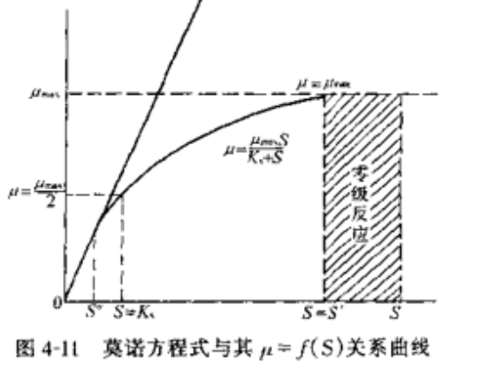

    微生物处于衰减增殖期、内源呼吸期。底物降解速率与底物浓度呈一级反应，底物浓度为底物降解限制因素。

    城市污水属于低底物浓度污水，$COD\leq400mg/L, BOD_5\leq300mg/L$。在曝气池中浓度更低，所以，城市污水的活性污泥法应当用低浓度条件下的公式。
    
3. 莫诺特公式在完全混合曝气池中的应用
    完全混合曝气池内活性污泥一直处在衰减增殖期。池内有机物浓度均一，与出水浓度相同，且较低。

    完全混合曝气池的混合活性污泥法处理系统。在稳定条件下，对系统中的有机物进行物料衡算，得：
    $$
    S_0Q + RQS_e - (Q+RQ)S_e - V\frac{dS}{dt} = 0
    \\
    \Rightarrow \frac{Q(S_0-S_e)}{V} = \frac{dS}{dt}
    $$
    $RQ$——回流污泥量，$m^3/d$
    
    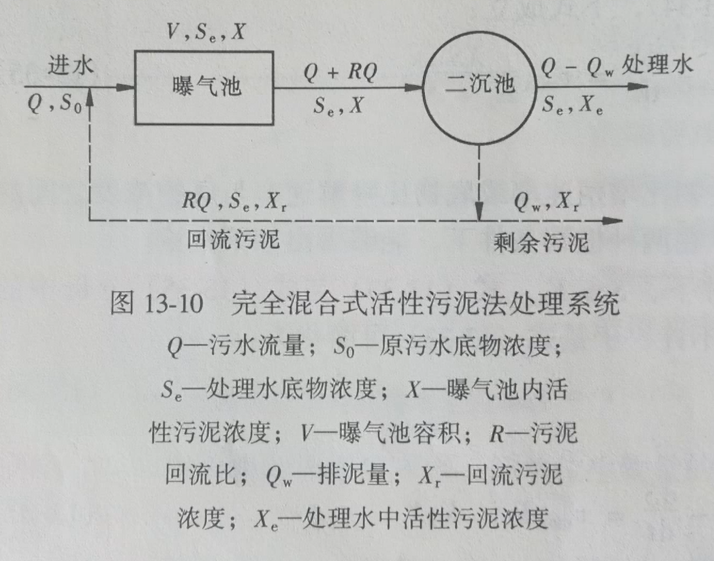

    在稳定运行时，完全混合曝气池内各点的有机物降解速率是一个常数。
    由低浓度公式和上述特点，整理得：
    $$
    \frac{Q(S_0-S_e)}{XV} = \frac{S_0-S_e}{Xt} = K_2S_e
    $$
    根据完全曝气池的特征，得：
    $$
    \frac{dS}{dt} = v_{max}\frac{XS_e}{K_s+S_e} \Longrightarrow \frac{Q(S_0-S_e)}{XV} = \frac{S_0-S_e}{Xt} = v_{max}\frac{S_e}{K_s+S_e}
    $$

    对特定条件下的特定污水来说，这里的动力学参数$K_2、v_{max}、\mu_{max}、K_S、Y、K_d、a、b$等值是常数。底物一般指有机物，可用BOD、COD、TOC等指标表示。污泥浓度可用MLSS、MLVSS表示。当采用不同指标时，对应的动力学参数数值也不同，动力学参数的量纲和单位中包含不通过的指标因素。

### 13.1.4 劳伦斯-麦卡蒂（Lawrence-McCarty）模型
1. 劳伦斯-麦卡蒂模型的基本概念
    1. 微生物比增值速率
        单位重量微生物（活性污泥）的增殖速率，即比增殖速率，仍以$\mu$表示。以$\frac{dX}{dt}$表示微生物的增殖速率，则：
        $$
        \mu = \frac{1}{X}\frac{dX}{dt}
        $$
        *（这里我是这样理解的：一定增殖速率，污泥浓度越大，就要求单位时间浓度下降大。如果浓度下降速率小，并不能说明增殖速率小，因为可能是在低浓度的时候进行增殖。这样理解就和之前莫诺特公式的推导一样了）*
    2. 生物固体平均停留时间
        劳伦斯-麦卡蒂进一步强调了污泥龄，进一步指出污泥龄是微生物在活性污泥系统中的平均停留时间，或将其称为生物固体平均停留时间、细胞平均停留时间，以$\theta_c$表示。

2. 劳伦斯-麦卡蒂基本模型
    劳伦斯-麦卡蒂模型以$\theta_c$、单位底物利用速率$q$作基本参数，并以第一、第二基本模型建立。
    1. 第一基本模型
        表示微生物净增殖速率与有机物被微生物利用速率之间的关系：
        $$
        \frac{1}{\theta_c} = Yq-K_d
        $$
        表示了生物固体平均停留时间$\theta_c$、底物比利用速率q、生物衰减速率$K_d$之间的定量关系。
    2. 第二基本模型
        基于莫诺特公式，表示有机物的比降解速率等于微生物对底物的比利用速率，即：
        $$
        v = q
        $$
        整理可得：
        $$
        \frac{1}{X}\frac{dS}{dt} = q = \frac{v_{max}S}{K_D+S}
        $$
        表示有机物的比利用速率（降解速率）与反应器（曝气池）内生物浓度及微生物周围有机物浓度之间的关系。

3. 劳伦斯-麦卡蒂模型的推论与应用
    1. 处理水有机物浓度$S_e$与生物固体平均停留时间$\theta_c$之间的关系：
        对完全混合式，有：
        $$
        S_e = \frac{K_s\left( \frac{1}{\theta_c}+K_d \right)}{Yv_{max}-\left( \frac{1}{\theta_c}+K_d \right)}
        $$
        对某一特定条件，$K_S、K_d、Y、v_{max}$都是常数，所以，$S_e = f(\theta_c)$
        
        实际活性污泥处理系统工程中采用：
        $$
        \theta_c = (2 \sim 20)(\theta_c)_{min}
        $$
        $(\theta_c)_{min}$——处理水底物浓度$S_e$下降、有机物去除率$E$上升，由急变缓的一个临界值

    2. 反应器内活性污泥浓度$X$与$\theta_c$之间的关系
        对完全混合式，有：
        $$
        X = \frac{\theta_cY(S_0-S_e)}{t(1+K_d\theta_c)}
        $$
        反应器内生物浓度$X$是生物平均停留时间$\theta_c$、曝气时间、进水底物浓度、出水底物浓度的函数。

    3. 活性污泥的两种产率系数（合成产率系数$Y$与表观产率系数$Y_{obs}$）与$\theta_c$值得关系
        产率系数是活性污泥微生物摄取、利用、代谢单位重量有机物$\Delta S$而使自身增殖的重量$\Delta X$的分数：
        $$
        Y = \frac{\Delta X}{\Delta S}
        $$
        $Y$——微生物增值总量的系数，不包括由于微生物内源呼吸而使其本身质量消亡的部分，也称为合成产率系数

        由于微生物的內源呼吸、自身氧化作用，实际测定的产率系数要低于Y值，这就是表观产率系数$Y_{obs}$。实际当中可调整$\theta_c$选定$Y_{obs}$
    4. 按莫诺特公式的推论，在低浓度条件下，有机物的比降解速率遵循一级反应规律，所以对完全混合曝气池：
        $$
        \frac{Q(S_0-S_e)}{V} = K_2XS_e
        \\
        q = \frac{Q(S_0-S_e)}{XV} = K_2S_e
        $$
        可以用来确定曝气池的容积$V$。

### 13.3.5 IWA（国际水协会）的活性污泥法动力学模型
以上的数学模型都是静态的，仅考虑了污水含碳有机物的去除。1970年推出的Lawrence-McCarty模型，强调了生物固体停留时间SRT的重要性——污水处理水质和污泥龄有关，而污泥龄可通过污泥量的排放控制，因此该模型比前述的模型更有意义。
1. Andrews模型
    引入底物在生物絮凝体中的贮存机理，区别溶解和非溶解性底物，解释有机物的快速去除等现象
2. WRC模型
    强调了非存活细胞的生物代谢活性，认为有机物的降解可以在不伴随微生物量增长的情况下完成
3. IAWQ（原IAWPRC国际水污染研究及控制协会，现IWA）模型
    1985年推出1号模型ASM1，包含13种组分、8种反应过程。特点是描述了碳氧化过程、含氮物质的硝化和反硝化；缺点是未包含磷的去除。
    1995年推出ASM2，包含了除磷过程。有19种组分、19种反应、22个化学计量系数、42个动力学参数。
    1998年推出ASM3，对反映速率采用“开关函数”反映反应过程中受到的促进或抑制作用；采用矩阵表示化学计量系数、转换系数、反应过程。（人工神经网络也有开关函数这个概念，模拟神经元被激发）
    应用IWA模型的最大障碍在于检测、度量、测定模型重多参数值和有机物不同的组分值。

## 13.4 活性污泥法的各种演变及应用
### 13.4.1 传统活性污泥法
又称普通活性污泥法（Conventional Activated Sludge，简写CAS）。有机物在曝气池内降解，经历了吸附、代谢完整过程，活性污泥经历了从首段增长速率较快到末端的增长速率很慢或到内源呼吸期的过程。

由于有机物浓度沿池长逐渐降低，需氧速率也是沿池长逐渐降低。溶解氧浓度在池首端和前端混合液中较低，甚至可能不足，但沿池长逐渐增高，在池末端溶解氧含量已经充足，一般可达到规定的2mg/L。

主要优点：
* 处理效果好
* $BOD_5$去除率可达90%以上
* 对污水处理程度比较灵活，可适当调节

适用于：
* 处理净化程度、稳定程度较高的污水

存在问题：
* 曝气池首端有机负荷高，耗氧速率高。为避免溶解氧不足的问题，进水有机物不宜过高
* 耗氧速率沿池长变化，但供氧速率难与其吻合、适应。前段可能出现供氧不足的现象，池后段可能出现溶解氧过剩的现象
* 曝气池容积大，占地多，基建费用高
* 对进水水质、水量变化适应性较低

### 13.4.2 渐减曝气活性污泥法
渐减曝气活性污泥法（Tapered Aeration）是针对传统活性污泥法中由于沿曝气池池长均匀供氧，在池末端供氧与需氧量差距较大，严重浪费能源，而提出的一种能使供氧量、混合液需氧量相适应的运行方式，即供氧量沿池长逐步递减，使其接近需氧量。目前的传统活性污泥法一般都采用这种供氧方式。

### 13.4.3 分段进水活性污泥法
分段进水活性污泥法又称阶段曝气活性污泥法或多段进水活性污泥法（Step-feed Activated Sludge，简写SFAS）

污水沿池长分段注入曝气池，有机负荷、需氧量得到均衡，一定程度缩小需氧量与供氧量之间的差距，有助于降低能耗，又能充分发挥活性污泥的降解功能
污水分散均衡注入，提高了曝气池对水质、水量冲击负荷的适应能力。

### 13.4.4 吸附——再生活性污泥法
又称生物生物吸附活性污泥法系统、接触稳定法（Contact Stabilization Activated Sludge，简称CSAS）。主要特点是将活性污泥对有机物降解的两个过程，分别在各自的反应器内进行。

史密斯实验是将含有溶解性和非溶解性混合有机物的污水和活性污泥一起进行曝气，得到下图。对此解释：第一次下降是活性较强的活性污泥对污水中有机物吸附，称为初期吸附去除。之后回升是因为胞外水解酶将吸附的非溶解状态的有机物水解成溶解性小分子，部分有机物有机物又进入污水使$BOD_5$浓度上升。这时活性污泥微生物进入营养过剩的对数增殖期，能量水平很高，微生物处于分散状态，污水中存活大量游离细菌，促使$BOD_5$浓度上升。最后有机物浓度下降，活性污泥微生物进入减速增殖期和内源呼吸期，$BOD_5$浓度下降。

吸附——再生活性污泥法以上述为基础。污水和经过在再生池充分再生且活性很强的活性污泥同步进入吸附池，在这里充分接触30 ~ 60min，使很大部分呈悬浮、胶体、部分溶解的有机物被活性污泥吸附，使污水中有机物浓度降低。污泥在再生池中进行分解、合成代谢反应，然后活性污泥微生物进入内源呼吸期，污泥的活性恢复，再进入吸附池能高效工作。

优点：
* 污水与活性污泥在吸附池内接触时间较短，因此，吸附池容积一般较小，吸附池、再生池容积之和，仍低于传统活性污泥曝气池的容积，基建费用较低
* 本工艺对水质、水量的冲击负荷具有一定的承受能力
* 当吸附池内的污泥遭到破坏，可由再生池內污泥补救

缺点：
* 处理效果低于传统法，不宜处理溶解性有机物含量较高的污水

### 13.4.5 完全混合活性污泥法
完全混合活性污泥法（Completely Mixed Activated Sludge，简写CMAS）特征是应用完全曝气池，污水回流到曝气池后，立即与池内混合液充分混合，池内混合液水质与处理水相同。

优点：
* 进入曝气池的污水很快被池内已存在的混合液所稀释和均化，原污水在水质、水量的变化对活性污泥的影响降到极小程度。所以这种工艺对冲击负荷有较强的适应能力。

适用于：
* 处理工业废水，特别是高浓度有机废水。可通过对F/M的调整，将整个曝气池的工况控制在良好的状态。

缺点：
* 各部分有机物浓度相同，活性污泥微生物相同，这种情况下，微生物对有机物降解的推动力低，导致活性污泥易于膨胀
* 相同F/M的情况下，其处理水底物浓度大于推流式曝气池活性污泥系统

### 13.4.6 延时曝气活性污泥法
延时曝气活性污泥法（Extended Aeration Activated Sludge，简写EAAS）又称完全氧化活性污泥法。

主要特点：
* F/M负荷非常低，曝气时间长，一般多在24h以上，活性污泥在池内长期处于内源呼吸期，剩余污泥量少且稳定，无需进行厌氧消化处理。这种工艺是污水、污泥综合处理系统。

优点：
* 处理水稳定性高
* 对原污水水质、水量变化适应性强

缺点：
* 曝气时间长
* 池容积大
* 基建费用较高
* 占用较大的土地面积

适用于：
* 处理水质要求高
* 不宜采用污泥处理技术的小城镇污水和工业废水
* 处理水量不宜过大

理论上，系统是不产生污泥的，但实际上仍有剩余污泥，主要是一些难于生物降解的内源代谢残留物。

### 13.4.7 高负荷活性污泥法

### 13.4.8 纯氧曝气活性污泥法

### 13.4.9 选择器活性污泥法

## 13.5 曝气及曝气系统
### 13.5.1 氧转移原理
1. 菲克（Fick）定律

2. 双膜理论

3. 氧总转移系数$K_{La}$值得确定

### 13.5.2 氧转移的影响
1. 污水水质

2. 水温

3. 氧分压

### 13.5.3 氧转移速率、供氧量的计算
1. 氧转移速率的计算

2. 氧转移效率、供气量的计算
    1. 氧转移效率（氧利用效率）为：

    2. 供气量

    3. 需氧量

### 13.5.4 曝气系统与空气扩散装置
空气扩散装置一般也称为曝气装置、曝气头。广泛应用于活性污泥系统的空气扩散装置分为**鼓风曝气、机械曝气**。空气曝气装置的作用是**充氧、搅拌与混合**。技术性能指标有：
* 动力效率$E_P$
* 氧的利用率$E_A$或称氧的转移效率
* 充氧能力$E_L$

1. 鼓风曝气系统与空气扩散装置
    1. 微气泡空气扩散装置
        1. 扩散板

        2. 扩散管

        3. 膜片式微孔空气扩散器

    2. 中气泡空气扩散器
        1. 穿孔管

        2. 网状膜空气扩散装置

    3. 水力剪切式空气扩散装置
        1. 倒盆式空气扩散装置

        2. 固定螺旋空气扩散装置

    4. 水力冲击式空气扩散装置
        1. 密集多喷嘴空气扩散装置

        2. 射流式空气扩散装置

    5. 水下空气扩散装置

2. 机械曝气装置
    1. 竖轴式机械曝气装置
        1. 泵形叶轮曝气器

        2. 倒伞型叶轮曝气器
   
    2. 卧轴式机械曝气装置
        1. 转刷曝气器

        2. 盘式曝气器

## 13.6 活性污泥法污水处理系统的过程控制与运行管理
### 13.6.1 活性污泥的培养驯化

下面介绍城市污水处理厂几种常用的污泥培养方法：
1. 间歇培养

2. 低负荷连续培养

3. 接种培养

### 13.6.2 活性污泥法系统的主要控制方法与控制参数
1. 试运行

2. 正常运行
    1. 对供气量（曝气量）的调节

    2. 回流污泥量的调节

    3. 剩余污泥排放量的调节

3. 活性污泥法处理系统运行效果的检测
    检测项目有：
    1. 反映处理效果的项目：
    2. 反映污泥情况的项目：
    3. 反映微生物的营养和环境条件的项目：

### 13.6.3 活性污泥处理系统运行中的异常情况
1. 污泥膨胀

2. 污泥解体

3. 污泥腐化

4. 污泥上浮

5. 泡沫问题

6. 异常生物相

## 13.7 活性污泥的脱氮除磷原理及应用
### 13.7.1 脱氮原理与工艺技术

1. 氮的吹脱处理

2. 污水生物脱氮原理
    污水生物处理中氮的转化包括**同化、氨化、硝化、反硝化**作用
    1. 同化作用

    2. 氨化作用

    3. 消化作用
        1. 消化过程

        2. 环境因素对硝化反应的影响
            1. 温度
            2. 溶解氧
            3. 碱度、pH
            4. C/N比
            5. 有毒物质jiandu

    4. 反硝化作用
        1. 反硝化过程
        2. 环境因素对反硝化过程的影响
            1. 温度
            2. 溶解氧
            3. 碱度、pH
            4. 碳源有机物
            5. C/N比
            6. 有毒物质jiandu

3. 生物脱氮工艺技术
    1. 传统脱氮工艺
        1. 三级脱氮系统

        2. 二级生物脱氮系统

        3. 单机生物脱氮系统

    2. 前置反硝化脱氮工艺

### 17.7.2 除磷原理与工艺技术
除磷技术分为**化学除磷、生物除磷**。
1. 化学除磷
    1. 加二价钙除磷
    2. 投加三价铁盐和吕盐除磷
    3. 投加二价铁盐除磷
2. 生物除磷原理

    影响生物除磷效果的环境影响因素：
    1. 厌氧/好氧条件的交替
    2. 硝酸盐和易降解有机物
    3. 污泥龄
    4. 温度
    5. pH
    6. $BOD_5/TP$

3. 生物除磷工艺流程
    1. Phostrip除磷工艺

    2. 厌氧——好氧除磷工艺

### 13.7.3 同步脱氮除鳞工艺
1. Bardenpho脱氮除磷工艺

2. A-A-O法同步脱氮除鳞工艺 

### 14.7.4 污水生物脱氮除磷理论与技术的新进展
传统废水脱氮除磷工艺仍存在一下问题：
* 硝化菌群增值速度慢，且难以维持较高生物浓度，特别是在冬季低温环境。因此造成系统总水力停留时间较长，有机负荷较低，增加了基建投资和运行费用
* 系统为维持较高生物浓度及获得良好的脱氮效果，必须同时进行污泥回流、消化液回流，增加了动力消耗及运行费用
* 抗冲击能力弱，高浓度氨氮和亚硝酸盐进水会抑制硝化菌生长

1. SHARON工艺

2. OLAND工艺

3. ANAMMOX工艺

4. De-ammonification工艺

5. 反硝化聚磷（Denitification Dephosphatation）工艺

## 13.8 活性污泥法的发展与新工艺
### 13.8.1 氧化沟

1. 氧化沟的基本构造和工艺简况
    1. 氧化沟的基本构造

    2. 氧化沟的工艺简况

    3. 主要缺点

2. 氧化沟的曝气装置

3. 常用的氧化沟系统
    1. 卡罗赛尔（Carrousel）氧化沟

    2. 交替工作氧化沟系统

    3. 奥贝尔（Orbal）氧化沟系统

    4. 曝气-沉淀一体氧化沟

### 13.8.2 AB法污水处理工艺

### 13.8.3 间歇式活性污泥法（SBR）

1. 间歇式活性污泥法工作原理

    1. 进水阶段

    2. 反应阶段

    3. 沉淀阶段

    4. 排水阶段

    5. 闲置阶段

2. 间歇式活性污泥法处理系统的工艺特征

### 13.8.4 SBR工艺的发展及其主要的变形工艺

1. ICEAS工艺

2. CASS（CAST，CASP）工艺

3. DAT-IAT工艺

    1. DAT-IAT工艺的操作过程
        1. 进水阶段

        2. 反应阶段

        3. 沉淀阶段

        4. 排水阶段

        5. 闲置阶段

4. NMITANK工艺

    1. 好氧处理系统

    2. 脱氮除磷系统

5. MSBR工艺

    1. MSBR的基本组成

    2. MSBR的运行

### 13.8.5 膜生物反应器

1. 膜生物反应器的组成

2. 膜生物反应器的特性

3. 膜生物反应器的分类

4. 膜生物反应器的研究和应用

# 第 14 章 生物膜法
## 14.1 生物膜法的基本概念
### 14.1.1 生物膜的形成及其净化过程

### 14.1.2 生物膜的载体

### 14.1.3 生物膜法的特征

### 14.1.4 生物膜反应器

## 14.2 生物膜的增长及动力学
### 14.2.1 生物膜的增长过程

### 14.2.2 生物膜理论中的重要参数

## 14.3 生物滤池
### 14.3.1 生物滤池的概念
1. 生物滤池的工作原理
2. 影响生物滤池性能的主要因素
    1. 滤池高度
    2. 负荷
    3. 回流
    4. 供氧

### 14.3.2 普通生物滤池
1. 构造特征
    1. 池体
    2. 滤料
    3. 布水装置
    4. 排水系统
2. 适用范围与优缺点

### 14.3.3 高负荷生物滤池
1. 构造特征
2. 工艺特征
3. 流程系统
4. 需氧与供养
    1. 生物膜量
    2. 生物滤池的需氧量
    3. 生物滤池的供氧
5. 适用范围与特点

### 14.3.4 塔式生物滤池
1. 构造特征
    1. 塔身
    2. 滤料
    3. 布水装置
    4. 通风
2. 工艺特征
    1. 高负荷率
    2. 滤层内部的分层
3. 适用条件与优缺点

### 14.3.5 曝气生物滤池

## 14.4 生物转盘
### 14.4.1 概述
**生物转盘**又称**浸没式生物滤池**，由多个平行排列浸没在氧化槽中的盘片所组成。

### 14.4.2 生物转盘
60年代产生，有功耗低的特点。
1. 生物转盘的构造特征
    单轴单级式、多轴多级式。
    1. 盘片
        1. 形状：一般为圆心。近年来开始采用正多角形、呈同心圆状波纹或放射状波纹
        2. 盘片直径：一般多介于2.0 ~ 3.6m之间。有的现场组装可达5m。大转盘可缩小接触反应槽的平面面积，减少占地面积。常用3m。
        3. 盘片间距：主要考虑其不为生物膜增厚所堵塞，并保证通风效果。盘片间距的标准间距为30mm，如采用多级，则前数级的间距为25 ~ 35mm，后数级为10 ~ 20mm。
        4. 盘片材料：大多采用塑料，减轻重量。平板盘多以聚氯乙烯塑料制成，而波纹的则多采用聚酯玻璃钢。
    2. 接触反应槽
        盘片浸没于反应槽污水中的深度不小于盘片直径的35%。接触反应槽应呈与盘材外形基本吻合的半圆形。盘片边缘与槽内面应留有100mm的间距。多级生物转盘的接触反应槽分为若干格，格与格之间设导流槽。
    3. 转轴
        支承盘片并带动其转动的重要部件。转轴两端安装固定在接触反应槽两端的支座。长度0.5 ~ 7m，直径50 ~ 80mm，轴心高于液面150mm。
    4. 驱动装置
        包括动力设备】减速装置、传动链条等。大型转盘，一般一台转盘设一套驱动。中小型转盘，可一套驱动带3 ~ 4级转盘转动。转速是重要的运行参数。

2. 生物转盘的净化机理

3. 典型工艺流程

4. 特征
    1. 微生物浓度高
    2. 生物相分级
    3. 污泥龄长
    4. 对超高浓度有机污水、超低浓度污水都可采用生物转盘
    5. 生物膜上的微生物的食物链较长，因此污泥量较少，约为生活污泥系统的1/2。
    6. 接触反应槽不需要曝气，污泥无需回流。所以动力消耗低。
    7. 不需要经常调节生物污泥量
    8. 设计合理、运行正常的生物转盘不产生滤池蝇
    
    缺点：
    1. 所需的场所较大，建设投资高，适用于小量废水处理
    2. 性能受环境气温及其他因素影响较大
## 14.5 生物接触氧化法
### 14.5.1 生物接触氧化池的构造及形式
1. 生物接触氧化池的构造
    1. 池体
    2. 填料
        蜂窝状填料
        波纹状板填料
        软性填料
        半软性填料
        盾形填料
        不规则粒状填料
        球形填料
        弹性填料
    3. 布气布水装置
2. 接触氧化池的形式
    按曝气位置分为分流式、直流式。
    
    分流式接触氧化池

    单侧曝气型接触氧化池

    直流式接触氧化池

### 14.5.2 生物接触氧化法的特征
有较高的生物浓度，一般10 ~ 20g/L
生物膜有丰富的生物相，有大量丝状菌，但并不会膨胀，形成了稳定的生态系统，污泥产量低
具有较高的氧利用率
具有较强的耐冲击负荷能力
生物膜活性高
没有污泥膨胀的问题

### 14.5.3 生物接触氧化处理技术的工艺流程

### 14.5.4 生物接触氧化工艺的设计与计算
1. 设计计算方法
    $$
    t = \frac{V}{Q}
    $$

### 14.5.4 生物接触氧化工艺的运行与管理

## 14.6 生物流化床
### 14.6.1 生物流化床的构造
1. 床体
2. 载体
3. 布水装置
4. 脱膜装置

### 14.6.2 生物流化床的特点
1. 生物量大，容积负荷高
2. 微生物活性高
3. 传质效果好
4. 较高的生物量和良好的传质条件使生物流化床可以在维持相同处理效果的同时，减小反应容积及占地面积，节省投资。

### 14.6.3 生物流化床的工艺类型
1. 液流动力流化床
2. 气流动力流化床
3. 机械搅拌流化床

## 14.7 其他新型生物膜反应器和联合处理工艺
### 14.7.1 其他新型生物膜反应器
1. 移动床生物膜反应器
2. 微孔膜生物反应器
3. 复合式生物膜反应器
    1. 复合式活性污泥-生物膜反应器
    2. 序批式生物膜反应器

### 14.7.2 生物膜/悬浮生长联合处理工艺
1. 活性生物滤池
2. 普通生物滤池/活性污泥工艺

## 14.8 生物膜法的运行管理
### 14.8.1 生物膜的培养与驯化

### 14.8.2 生物膜处理系统运行管理
1. 生物膜法运行中应注意的问题
    1. 防止生物膜过厚

    2. 维持较高的DO

    3. 减少出水悬浮物浓度

2. 生物膜法的日常管理