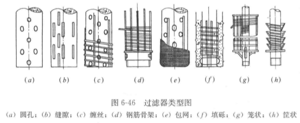

# 第 2 章 水资源评价
## 2.1 地表水资源量与地下水资源量
1. 水资源量定义
   针对一定区域一定时间内，降水量形成地表与地下水资源量之和
   $$W=P-E_s=P_r+R_s$$
   $E_s$为蒸散发量
   $P_r$下渗地下水补给量
   $R_s$地表径流量
   
   由于地表蒸散发量和下身不及地下水量，不容易测量和估算，实际中按下式
   $$W=R+G-D$$
   $R$地表水资源量
   $G$地下水资源量
   $D$两者重复计算量
2. 地表水资源量计算
   对于站网完整、有较长实测径流资料的区域，采用水文控制站径流数据计算径流量。如果评价分区降水量比较均匀，采用面积法计算。
   $$W = \sum_{i=1}^{n}W_i\frac{F_{c,i}}{F_i} = \sum_{i=1}^{n}W_i(1+\frac{F_{d,i}}{F_i})$$
   $F_c$该区面积
   $F_d$未控面积？？？？听不清
   如果分区控制站上下游降水量（以mm计）相差较大，应进行降水量修正
   $$W  = \sum_{i=1}^{n}W_i(1+\lambda_i\frac{F_{d,i}}{F_i})$$
   对于无资料地区可用水文比拟法、参数等值法、水文模型法。
3. 实测径流系列的一致性改正
   分项还原法
   $$W_n = W_g+W_h\pm W_r\pm W_d\pm W_o$$
   $W_n$自然径流量
   $W_g$水文站实测径流量
   $W_h$河道外用水耗损量（工业农业用水）
   $W_r$大中型水库蓄水变量
   $W_d$跨流域跨区间引水量
   $W_o$其他影响水量
   还现改正
   以前的天然径流量换算到下垫面条件下的天然径流量。其目的是消除下垫面的变化对径流系列一致性的影响。
   降雨径流模式法
   $$R = f(P)$$
   可用于还原计算
4. 地下水资源量计算
   地下水中参与现代水循环且可以更新的额动态淡水量。
   水均衡法
   总补给量=总排泄量
   以多年平均的总补给量或总排泄量来评价地下水资源量。
   1. 山丘区地下水资源量计算
   以排泄项计算，开采条件下的山丘区地下水资源量为
   $$G_m = R_{gm} + Q_{gm} + q_m$$
   $G_m$山丘区地下水资源量
   $R_{gm}$河川径流量
   $Q_{gm}$地下潜流量
   $q_m$地下水开采净消耗量
   南方地区地下潜流量和地下水开采净消耗量较小，可忽略
   $$G_m = R_{gm}$$
   2. 平原区地下水资源量
   以补给项计算，平原区地下水资源量
   $$G_{pb} = Q_p + Q_s+Q_{sm}$$
   $Q_p$降水入渗补给量
   $Q_s$地表水体入渗补给量
   $Q_{sm}$山前侧向入进水量
   扣除来自山丘区的水量，平原区降水形成的地下水资源量称为平原区域地下水资源量
   $$G_{lp} = Q_p+\theta_2\cdot Q_s$$
   $Q_p$降水的入渗补给量
   $Q_s$地表水体的入渗补给量
   $\theta_2$来自平原区降水的入渗补给量占地表水体入渗补给量$Q_s$的比例
   3. 混合区地下水资源量的计算
   区域内含两种地貌的评价区
   在非汛期，假定山丘区径流全部都是河川基流，则混合区地下水资源量为
   $$G = R_{gm}+Q_{sm}+q_m+Q_p+\theta_2 Q_s$$
   在汛期，山丘区河川基流占山丘区河川径流量的比例记为K
   $$G = (R_{gm}+Q_{sm}+q_m) + Q_p+ [1-K(1-\theta_2)] Q_s$$
   

# 第 3 章 需水预测
## 3.1 生活工业需水预测

## 3.2 农业需水预测

## 生态需水预测
# 第 4 章 供水预测
## 4.1 蓄水工程可供水量
1. 供水工程与可供水量
	水工程是指在江河、湖泊、地下水源进行开发、利用、控制、调配、保护的各类工程。其中为社会、国民经济各部门提供水量的工程，称为**供水工程**。按取水方式不同可分为：
	* 蓄水工程
	* 引水工程
	* 提水工程
	* 调水工程
	
	**可供水量**是指在不同水平年、不同保证率的情况下，考虑需水要求，供水工程可提供的能满足一定水质要求的水量。
	**区域可供水量**指在不同水平年不同来水情况下，通过各项工程设施，在合理开发利用的前提下，能满足一定水质要求，可供各部门使用的水量。
2. 蓄水工程可供水量计算原理
	蓄水工程包括水库、塘坝，其特点是具有一定的调蓄容积，能够对来水在时间空间进行重新分配。
	蓄水工程可供水量的计算原理是水库径流调节原理。基本方程式如下：
	$$V_{t+1} = V_t + Q_t - W_t - R_t$$
	$V_{t+1}$——水库第$t$时段末蓄水量
	$V_t$——水库第$t$时段初蓄水量
	$Q_t$——水库第$t$时段净来水量
	$W_t$——水库第$t$时段供水量
	$R_t$——第$t$时段河道下泄水量
	水库供水量不能大于河道下泄流量，以保证生态需水要求。
	可供水量计算代表年法
	年内来水过程Q_t需水过程D_t计算供水过程W_t，合并W_tS_t为一项S_t。
	调节计算按水力年度进行，从蓄水期开始，起始水位可定位死水位，计算期末水位回落至死水位。
	具体每个时段$t$，先按以需定供原则，确定S_t
	检验时段末蓄水量$V_{t+1}$是否在允许范围内。若在，转入t+1时段计算。若不在，调整S_t，确保V_{t+1}在允许范围内，再转入t+1时段计算。
	若V_{t+1}过大说明来水过大，水库需要去水；过小，要限制供水，再转入t+1时段计算。
	如此计算直到计算期末，将各时段供水量相加，即可获得相应代表年的年可供水量。如果年可供水量小于年蓄水量，即表示缺水，两者之差是缺水量
3. 可供水量计算长系列法
	需具有30年以上的径流系列和综合利用各部门相应的用水资料。基本方程同上。此法计算长度要求不同，计算结果精度高。
	长系列法计算
	1. 以需定供
		设D_t表示第t时段各用水户总用（需）水量；水库第t时段可用水量为
		$$WU_t = V_t + Q_t$$
		若$WU_t\geq D_t$，则水库第t时段可供水量W_t=D_t，缺水量为0。
	2. 以供定需
		如果$WU_t\leq D_t$，则水库第t时段内总放水量
		$$TW_t = WU_t - V_e$$
		$V_e$第t时段允许最大有效蓄水量。将各水利年度各时段可供水量相加得到年可供水量系列，将系列从大到小排平，可获得年可供水量频率曲线。根据该曲线可获得不同保证率下的年可供水量。
	3.结合调度图的可供水量计算长系列法

## 4.2 引堤工程可控水量
1. 引水工程可供水量
	引水工程借重力作用将地表水源引水，并自流到目的地。
	引水工程没有调蓄容积，不具有调节作用，其可供水量按下式计算：
	$$W_d = \sum_{t=1}^{T}W_{d,t} = \sum_{t=1}^{T}\min(Q_t,Y_t,D_t)$$
	$W_d$——年可供水量
	$W_{d,t}$——年内各时段可供水量
	$Q_t$——第$t$时段引水口的可引水量
	$Y_t$——第$t$时段工程的引水能力
	$D_t$——第$t$时段的需水量
2. 引水工程可供水量计算代表年法
	可采用代表年计算引水工程可供水量。
	以灌溉饮水工程为例
	1. 选择代表年组
	2. 计算代表年组的河流可引流量过程和供水区的需水过程，按照上式，逐时段进行可供水量计算
	3. 累加获得各个代表年的可供水量。选最小年可供水量，作为设计保证率下可供水量。
3. 引水工程可供水量计算长系列法
	长系列法：根据历年的引水工程处河流可引流量过程线，和已定供水区的需水过程线，逐年逐时段进行比较，从而确定年可供水量频率曲线和不同保证率下的年可供水量。
	* 选择有代表性的系列年组，假定系列年数为N年。
	* 计算历年的河流可引流量过程和供水区需水过程。
	* 以月（或旬或5日）作为计算时段，逐时段进行可供水量计算。当同一时段的供水量小于需水量时，即表示该时段供水遭到破坏。
	* 将年内各时段供水量相加，得到年可供水量。通过年可供水量频率曲线，可得到不同保证率下的年可供水量。
	* 统计N年中，年供水量满足需水量的正常供水年数为m，按期望值经验公式计算，获得正常供水保证率。
4. 提水工程可供水量
	提水工程利用水泵等，抽水装置把水提升到一定高度，然后自流或有压输送到目的地。包括地表水提水工程（泵站）、地下水提水工程（机电井）。提水工程可供水量计算：
	$$W_p = \sum_{t=1}^{T}W_{p,t} = \sum_{t=1}^{T}\min(Q_t,P_t,D_t)$$
	$W_p$——提水工程年可供水量
	$W_{p,t}$——年内各时段可供水量
	$Q_t$——第$t$时段引水口的可提水量
	$P_t$——第$t$时段泵站提水能力
	$D_t$——第$t$时段的需水量
5. 提水工程可供水量计算方法
	地表提水工程
	可供水量可采用代表年法或长系列法计算，基本步骤与引水工程相同。
	地下提水工程
	主要限制因素是地下水可开采量，对于地下水开采利用较高的地区，特别考虑补给量与开采量之间的平衡关系。

上面的都是对大型工程的计算。小工程还可使用经验法。
## 4.3 区域可供水量
1. 问题概化
	分区可按水系分区、行政区分区、行政水系分区
	* 水源概化
	* 供水工程概化
	* 用户概化
	* 退水概化
2. 分区可供水量计算
	控制性工程：大型水库、重要中型水库、中小型蓄水工程、引水工程、提水工程。
	对于分区内各类供水工程，假定长系列或代表年的来水过程、需水过程已知，各类工程运用方法已经确定。对于任意时段，分区可供水量可按下式计算：
	$$W_s = W_k + W_m + W_d + W_p$$
	$W_s$——分区可供水量
	$W_k$——分区内控制性工程的供水量
	$W_m$——分区内中小型蓄水工程的供水量
	$W_d$——引水工程的供水量
	$W_p$——提水工程的供水量
	分区内各类用户的供水量为：
	$$W_s = W_h + W_i + W_a + W_e$$
	$W_s$——分区内用户可供水量
	$W_h$——分区内生活供水量
	$W_i$——工业供水量
	$W_a$——农业供水量
	$W_e$——生态环境供水量
	进一步可分类计算出各类用户的回归水量，总回归水量计算如下：
	$$W_b = \beta_1W_h + \beta_2W_i + \beta_3W_a$$
	$\beta_1$——生活回归水系数
	$\beta_2$——工业回归水系数
	$\beta_3$——农业回归水系数
	分区出境水量$W_{out}$：
	$$W_{out} = W_{in} + W_l - W_s + W_b -\Delta W$$
	$ W_{in}$——分区入境水量
	$W_l$——分区自产水量
	$W_s$——分区内供水量
	$W_b$——相应的回归量
	$\Delta W$——时段末分区内蓄水量增量
3. 区域可供水量计算
	分区之间水量联系：
	$$W_{out} = W_{in} + W_l - W_c -\Delta W$$
	$W_c = W_s - W_b$——本区消耗水量
	$\Delta W = V_e - V_o$——????视频听个鬼????湖北口音愣是说出了西班牙语打舌音？？？！！！
	上有分区出境水量就是其下游紧邻分区的入境水量。
	按照各分区间水量联系，依次进行各个分区水量计算。具体计算顺序为先支流后干流，先上游后下游。

# 第 6 章 取水工程
## 6.1 地表水资源供水特征
### 6.1.1 地表水源的供水特征
1. 水量充沛，分布较广，总溶解固体含量较低，硬度小
2. 时空分布不均，受季节影响较大
3. 保护能力差，易受污染
4. 泥沙和悬浮物含量较高，常需净化处理后才能使用
5. 取水条件及取水构筑物一般比较复杂
### 6.1.2 水源选择原则
1. 水源选择前，必须进行水源的勘察
2. 水源的选用应通过技术经济比较后综合确定
3. 用地表水作城市供水水源时，其设计枯水流量的保证率，应根据城市规模和工业大用户的重要性选定，一般可采用90% ~ 97%。镇供水水源的设计枯水量保证率，可根据具体情况适当降低。
4. 地下水与地表水联合使用
	可发挥各个水源供水能力，而且能够降低整个给水系统的投资，提高供水系统的安全可靠性。
5. 确定水源、取水地点和取水量等，应取得水资源管理、卫生防疫、航运等有关部门书面同意。

## 6.2 地表水取水工程
### 6.2.1 影响地表水取水的主要因素
1. 取水河段的径流特征
	1. 河流历年的最小流量和最低水位
	2. 河流历年的最大流量和最高水位
	3. 河流历年的月平均流量、月平均水位以、年平均流量、年平均水位
	4. 河流历年的春秋两季流冰期的最大、最小流量和最高、最低水位
	5. 其他情况下，如潮汐、形成冰坝冰塞时的最高水位及相应流量
	6. 上述相应情况下河流的最大、最小、平均水流速度和在河道中的分布情取水构筑物设计最高水位应按百年一遇频率确定，设计枯水位的保证率应根据水源情况和供水重要性选定，一般可采用90% ~ 99%。
2. 河流泥沙运动及河床演变
	1. 泥沙运动
		泥沙在水中的运动状态可分为**床沙（河床表面静止泥沙）、推移质、悬移质**。
		静止泥沙开始运动的水流速度称为启动流速：
		砂莫夫公式：（未考虑率粘结力，仅适用于$d\geq0.2mm$的较粗颗粒）
		$$
		V_c = 1.14\sqrt{\frac{\rho_s - \rho}{\rho}gd}\left( \frac{h}{d} \right)^\frac{1}{6}
		$$
		张瑞瑾公式（考虑粘结力，使用粗细沙）：
		$$
		V_c = \left( \frac{h}{d} \right)^{0.14}\left( 17.6\frac{\rho_s - \rho}{\rho}d+6.05\dfrac{10+h}{d^{0.72}}\times10^{-7} \right)^\frac{1}{2}
		$$
		张红武公式（考虑水温）：
		$$
		V_c = 3.5\left( \frac{\rho_s - \rho}{\rho}g \right)^{\frac{2}{9}}\frac{\nu^\frac{5}{9}}{\sqrt{d}}h^\frac{1}{6}
		$$
		启动流速一般为止动流速的1.2 ~ 1.4倍。

	2. 河床演变
		影响因素：
		1. 河段的来水量及其变化：来水量变化使水力条件改变，影响水流挟沙能力
		2. 河段的来沙量、来沙组成及其变化
		3. 河段的水面坡降
		4. 河床地质情况
		
		河床演变一般表现为：
		1. 纵向变形
		2. 横向变形
		3. 单向变形
		4. 往复变形
		
		按河流在平面上的河床形态和演变特征，可将河段分为四种类型：
		1. 顺直型河段
		2. 弯曲型河段
		3. 游荡型河段
		4. 汊道型河段
3. 河床与岸坡的岩性和稳定性
4. 江河中的泥沙和悬浮物
5. 河流的冰冻情况
6. 河道中水工构筑物、天然障碍物

### 6.2.2 地表水取水位置的选择

## 6.4 地下取水工程
地下水取水构筑物：从地下含水层取集表层渗透水、潜水、承压水和泉水等地下水的构筑物，如**管井、大口井、复合井、辐射井**等。

管井——由凿井机械开凿, 用于开采深层地下水，井深一般300m以内，最深可达1000m以上
大口井——由人工开挖或沉井法施工，广泛用于取集含水层厚度20m以内的浅层地下水
辐射井——由集水井和若干水平铺设的辐射形集水管组成。用于集取含水层厚度较薄的浅层地下水，比大口井效率高，但施工难度大
复合井——上部大口井与下部管井的组合。用于地下水位较高、厚度较大的含水层。同时集取上部孔隙潜水和下部厚层基岩高水位的承压水。在一些需水量不大的小城镇和不连续供水的铁路给水站中被较多地应用
渗渠——壁上开孔，用于取集含水层厚度4~6m、水位深度小于2m 的浅层地下水及河床地下水或地表渗透水。 我国东北、西北地区应用较多

### 6.4.1 管井
俗称机井，井壁为管状，含水层中进水部分采用填砾过滤器以防漏砂及堵塞。地下水构筑物中应用最广的一种，适用于任何岩性与地层结构。按其过滤器是否贯穿整个含水层，分为**完整井、非完整井**。通常由**井室、井壁管、过滤器、沉淀管**构成。 当抽取结构稳定的岩溶裂隙水时，管井可不装井壁管和过滤器。当有几个含水层，且各含水层水头相差不大时，可用多层过滤器管井。

特点：
* 直径50~1000mm，井深可达1000m以上。常见直径多小于500mm，井深300m以内。
* 施工方便，适应性强，应用范围广，能用于各种岩性、埋深、含水层厚度和多层次含水层的取水工程。

1. 管井构造
    1. 井室
    	安装水泵、控制柜等设备， 保持井口免受污染和维护管理的场所。应有一定的采光、采暖、通风、防水和防潮设施。井口应高出地面0.3~0.5m ，一般用粘土或水泥等不透水材料封闭。
    	抽水设备：深井泵、潜水深井泵和卧式水泵等。
    	1. 深井泵房
    		由**泵体、扬水管、泵座、电动机**组成。泵体、扬水管安装在管井内。泵座、电动机安装在井室内
    		有**地面式、地下式、半地下式**。
    	2. 深井潜水泵房
    		由电动机、水泵、扬水管组成。电动机、水泵浸没在动水位以下。控制设备安装在井室内。
    		井室相当于阀门井，用于小水量管井。结构简单、使用方便、重量轻、运转平稳、无噪声。
    	3. 卧式泵房
    		采用卧式水泵，一般情况，井室、泵房合建。井室与泵房分建时，则类似于阀门井。常用于地下动水位较高的情况，井室多设于地下。
	
    2. 井管（井壁管）
    	用于加固井壁、隔离水质不良的或水头较低的含水层。 应有足够的强度，内壁平整光滑，轴线不弯曲，便于设备安装和管井清洗。 井壁管材料:钢管、铸铁管、钢筋混凝土管。分**异径井管、同径井管**两类。井壁管内径应比水泵设备的外径大100mm。 
    	* 钢管用于任意井深的管井
    	* 铸铁管适于井深小于250m的管井
    	* 钢筋混凝土管适于井深小于150m的管井
	
    3. 过滤器
    	安装于井壁含水层段，用以集水和保持填砾与含水层的稳定。过滤器应有足够的强度和良好的透水性。 
    	组成：过滤器由过滤骨架和过滤层组成。
    	* 过滤骨架分类：管型和钢筋型。 
    	* 按管型分类：按其上孔眼的特征又分为圆孔及长条（缝隙）型两种。
    	* 过滤层：分布于骨架外，有缠丝和滤网及砾石充填层等种类，和不同骨架组成各种类型的过滤器。

    	

    	填砾过滤器：钢筋骨架过滤器、圆孔或条孔过滤器、缠丝过滤器、包网过滤器 
    	砾石水泥过滤器：取材容易、制作方便、价格低廉，但强度较低、重量大、易堵塞。适用于各种砂、砾、卵石含水层。填砾层高度应超过过滤器顶部8 ~ 10m,以保证填砾层出现下沉, 过滤层仍充满砾层。

    4. 沉砂管
    	接在过滤器的下面，用以沉淀进入井内的细心砂粒和自地下水中析出的沉淀物。防止沉砂堵塞过滤器，其直径与过滤器一致。沉淀管长度2~10m,井深<10m,长度取2m;井深>90m,长度取10m。在稳定的裂隙和岩溶基岩地层取水时，可不设过滤器。

2. 管井的井群系统及其合理布局
	1. 管井的井群系统
		1. 自流井井群
		2. 虹吸式井群
		3. 卧式泵取水井群
		4. 深井泵取水井群
	2. 井群的合理布局
		1. 水井的平面布局
		2. 水井的垂直布局
		3. 水井的井数、井距

### 6.4.2 管井和井群的出水量计算
1. 管井出水量计算的理论公式
	1. 完整井稳定井流出水量计算
		$$
		\varphi_R-\varphi_{rw} = \frac{Q}{2\pi}\ln\frac{R}{r_w}
		$$
		$Q$——井的出水量，$m^3/d$
		$R$——影响半径，m
		$r_w$——井的半径，m
		$\varphi_R$——外边界R处的势函数。潜水，$\varphi_R = \frac{1}{2}KH_0^2$；承压水，$\varphi_R = KMH_0$
		$\varphi_{rw}$——内边界（井壁）$r_w$处的势函数。潜水，$\varphi_R = \frac{1}{2}KH_w^2$；承压水，$\varphi_R = KMH_w$
		$K$——含水层的渗透系数，m/d
		$M$——承压水含水层的厚度，m
		$H_0$——含水层的天然水位，m
		$h_w$——$r_w$处含水层的动水位，m

### 6.4.3 管井施工
1. 凿井
2. 井管安装、填砾、管外封闭
3. 洗井和抽水试验
4. 管井的验收

### 6.4.4 大口井
1. 大口井的构造
2. 大口井的施工
3. 大口径的出水量计算
	1. 理论公式
		1. 井底进水大口井出水量计算
		2. 井壁进水、井底和井壁同时进水的出水量计算
	2. 经验公式
		1. 井壁进水
		2. 井壁井底同时进水
4. 大口井进水允许流速校核
5. 大口井设计要点

### 6.4.5 复合井

### 6.4.6 辐射井
1. 辐射井的形式
2. 辐射井的构造与施工
	1. 集水井
	2. 辐射管
3. 辐射井的出水量计算
	1. “大井”法
		1. 根据辐射管的长度L和根数n
		2. 根据辐射管分布范围所固定的面积A
	2. 辐射管互阻系数法

### 6.4.7 渗渠
1. 渗渠的形式
2. 渗渠的构造
3. 渗渠出水量计算
	1. 截取地下水的渗渠
		1. 潜水含水层中完整式渗渠的出水量计算，表达式为：
		2. 潜水含水层中非完整式渗渠的出水量计算
	2. 同时集取河床和岸边地下水的完整式渗渠的出水量计算
4. 渗渠的水力计算
5. 渗滤设计要点
	1. 渗滤位置选择
	2. 渗滤平面布置