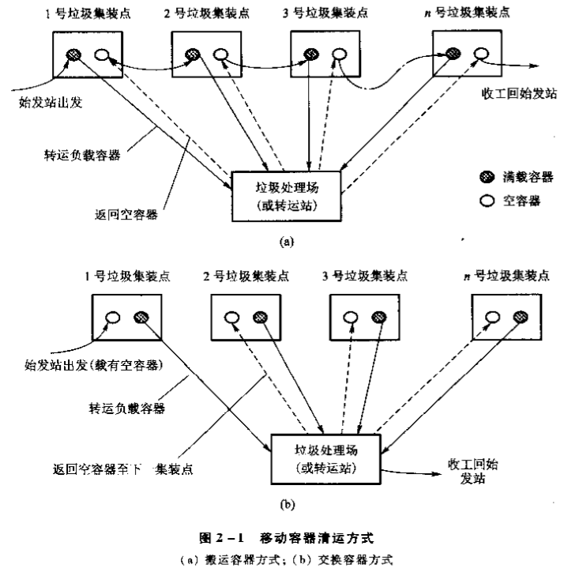
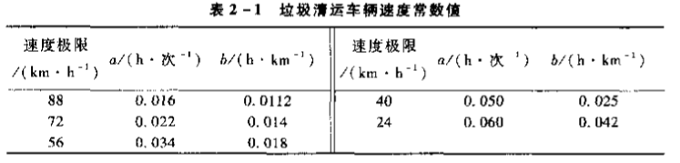

# 第 1 章 绪论
## 1.1 固体废物的来源与分类
### 1.1.1 固体废物的来源
人类产生的粪便、动植物残骸。机械加工的屑末。化工生产的废渣，特别含汞、铅、砷、氰化物等。原子能产业的放射性废渣。
### 1.1.2 固体废物的分类
按*化学性质*可分为：有机固体废物、无机固体废物。
按*污染特性*可分为：
1. 一般固体废物
   不具有危险特性的固体废物。
2. 危险废物
   列入国家危险废物名录或国家规定的危险废物鉴别标准和鉴别方法认定的、具有危险特性的废物。
3. 放射性固体废物
   凡放射性核素含量超过国家规定限值的固体、液体、气体的统称。

按*固体废物来源*可分为：
1. 工矿业固体废物
   工矿企业生产或原料加工过程中排出的废物。可细分为矿冶、能源、钢铁、化学、石油化工、有色金属等。
2. 生活垃圾
   城市日常生活中或者为城市日常生活提供服务的活动中生产的物体废物，以及被法律法规视作城市生活垃圾的固体废物。城市生活垃圾也称城市固体废物。
3. 其他固体废物
   农业生产、禽畜养殖、农副产品、林业生产所产生的固体废物。
### 1.1.3 固体废物的排放量
## 1.2 固体废物的危害及污染控制
### 1.2.1 固体废物污染
固体废物污染特点：呆滞性大、扩散性小对环境污染主要通过水、气、土壤进行。

### 1.2.2 固体废物污染危害
1. 对土壤环境的影响
   影响土壤微生物碳循环、氮循环。有害物质可能在土壤中积累。
2. 对大气环境的影响
   固体废物中的细微颗粒、粉尘可随风飘起。填埋场溢出沼气一定程度消耗氧。
3. 对水环境的影响
   固体废物随渗滤液进入地下水，使地下水污染。
### 1.2.3 固体废物污染控制
固体废物污染控制需从两方面入手，一是减少固体废物的排放量，二是防止固体废物污染。
可采取的措施有：
1. 积极推行清洁生产审核，实现经济增长方式的转变，限期淘汰污染严重的落后生产工艺设备
2. 采用清洁的资源能源
3. 采用精料
4. 改进生产工艺
5. 加强生产过程控制
6. 提高产品质量和寿命
7. 发展物质循环利用工艺
8. 进行综合利用
9. 进行无害化处理与处置

固体废物处理包括破碎、分选、压实等。固体废物处理是指对无回收价值或确属不能再利用的固体废物，采取长期置于与生物圈隔离地带的技术，也是固体废物最终归宿的手段，故称**最终处置技术**
为有效控制生活垃圾的污染，可采取以下控制措施：
1. 鼓励城市居民使用采用环保物质资料
2. 积极推进城市垃圾分类收集制度
3. 改进城市的燃料结构，提高城市的燃气化率
4. 城市生活垃圾综合利用
5. 进行城市垃圾无害化处理与处置
## 1.3 固体污染管理
### 1.3.1 相关固体废物管理法规

### 1.3.2 “三化”原则和“全过程”原则
1. 固体废物污染防治的“三化”原则
    1. 资源化
    从固体废物中回收有用物质和能量，加速物质循环。它包括物质回收、能量转换、创造经济价值的广泛的技术和方法。
    2. 无害化
    通过适当技术对废物进行处理，使其对环境不污染。
    3. 减量化
    通过一定的技术手段，一方面减少固体废物的排出量；另一方面减少固体废物容量（减小数量和体积）。
2. “全过程”管理原则
    对其生产——收集——运输——综合利用——处理——贮存——处置实行全过程管理，在每一个环节都将其作为污染源进行严格控制。其基本对策是避免生产（clean）、综合利用（cycle）、妥善处置（control）的所谓 **“3C”原则**。即通过对固体废物实施减少（reduce）、再利用（reuse）、在循环（recycle）策略实现节约资源、降低环境污染及资源永续利用的目的。
    依据上述原则，可将固体废物从产生到处置的全过程分为五个连续或不连续的环节进行控制。
    1. 第一阶段：各产业活动清洁生产。通过改变原材料、改进工艺、更换产品来减少或避免废物的产生。
    2. 第二阶段：对生产过程中产生的废物，尽量进行系统内的回收利用。
    3. 第三阶段：对以产生的固体废物进行系统回收。
    4. 第四阶段：无害化、稳定化处理
    5. 第五阶段：最终处置
### 1.3.3 固体废物管理制度
1. 分类管理
2. 工业固体废物申报登记制度
3. 固体废物污染环境影响评价制度及其防止设施的“三同时”制度
4. 排污收费制度
5. 期限治理制度
6. 进口废物审批制度
7. 危险废物行政代执行制度
8. 危险废物经营许可制度
9. 危险废物转移报告单制度
### 1.3.4 我国固体废物管理标准
1. 分类标准
    主要包括《国家危险废物名录》、《危险废物鉴别标准》、建设部颁布的《城市垃圾生产源分类及垃圾排放》、《进口废物环境保护控制标准》等。
2. 方法标准
    主要包括固体废物采样、处理、分析方法的标准。
3. 污染控制标准
    1. 废物处置控制标准
        对某种特定废物的处置标准、要求。
    2. 设施控制标准
4. 综合利用标准
# 第 2 章 固体废物的收集、贮存及清运
## 2.1 城市生活垃圾的收集与清运
### 2.1.1 城市垃圾的收集、贮存及清运
三个阶段构成一个运收系统。第一阶段垃圾发生源到垃圾桶，即搬运贮存（运贮）；第二阶段是清运车沿路线收集，并运至垃圾转运站或处理厂或处置场，即垃圾的清除阶段（清运）；特指垃圾远途运输，需大容量运输工具，即转运。
1. 垃圾产生源的清运管理
    城市垃圾源主要包括固定形式垃圾源（固定源）、流动形式垃圾源（流动源）。
    1. 城市居民住宅区垃圾源清运管理
        1. 低层居民住宅区垃圾清运
            1. 居民自备垃圾容器，把垃圾搬运到指定集装点，再由物业管理或环卫部门指派专门人员定期将垃圾运送出去。
            优点：居民自觉，节省大量人力物力。
            缺点：物业或环卫部门收集不及时将会影响居民区环境卫生
            2. 专门的手机工作人员负责定期、按时地将每一户居民家中地垃圾清运至集散点或收集车。
            优点：对居民极为便利，利于管理。
            缺点：物业、环卫部门要相应耗费较多劳动力和作业时间。
        2. 中高层居民住宅垃圾清运
            1. 对没有设垃圾道的住宅，类似于低层住宅区。楼层越高，清运费用越大。
            2. 设有垃圾通道的中高层住宅，只需投入垃圾通道。再由专门垃圾收集工作人员从垃圾见把垃圾转运。
            3. 利用气流系统将住宅楼内的垃圾直接通过管道从住宅区运送到设在远处的垃圾转运站或处理厂。
            4. 小型家庭垃圾破碎机
                主要适合处理家庭厨房产生的易裂解食物垃圾。
    2. 商业区与企事业单位垃圾清运
        垃圾源主要包括商业垃圾、建筑垃圾、城市污水处理厂产生的污泥。
    3. 城市公共场所垃圾清运
        包括街道、绿化、广场等。产生垃圾主要包括落叶、纸屑、塑料袋、灰尘等。清运方式有两种：
        1. 配备专门的卫生工作人员，定时定点清扫收集。
        2. 环卫部门指派专门人员负责清理公共垃圾。
2. 贮存管理
    1. 垃圾贮存方式
        分为家庭贮存、单位贮存、公共贮存、转运站贮存。
        1. 家庭贮存
        2. 单位贮存
        3. 公共贮存
        4. 转运站贮存
	2. 垃圾贮存容器
		1. 城市垃圾贮存容器的一般要求
			1. 一定的密封隔离性能
			2. 足够耐压强度
			3. 材料与所装垃圾相容
			4. 耐腐蚀、耐燃烧
			5. 使用方便、美观、造价低
		2. 垃圾贮存容器类型
			分为容器式、构筑物式。
      	3. 容器设置数量
      		与服务范围面积大小、居民人数、垃圾类型、垃圾人均产量、垃圾容重、容器大小、收集频率等有关。可按下式计算：
      		$$V_{ave} = \frac{W}{QD_{ave}}$$
      		$$V_{max}=KV_{max}$$
      		$V_{ave}$——垃圾平均日产生体积，$m^3/d$
      		$W$——垃圾日产生量，t/d
      		$Q$——垃圾容重变动系数，一般0.7~0.9
      		$D_{ave}$——垃圾平均容重
      		$K$——垃圾产生高峰时体积变动系数，1.5~1.8
      		$V_{max}$——垃圾产生高峰时日产生最大体积$m^3/d$
      		按下式计算服务范围内垃圾日产生量：
      		$$W = RCYP$$
      		$R$——人口数
      		$C$实测垃圾单位产量，t/（人d）
      		$Y$——垃圾日产量不均匀系数，1.1~1.15
      		$P$——居住人口变动系数，1.02~1.05
      		按下式求出收集点所需设置的垃圾容器数量：
      		$$N_{ave}= \frac{TV_{ave}}{Vf}$$
      		$$N_{max} = \frac{TV_{max}}{Vf}$$
      		$N_{ave}$——平均所需设置的垃圾容器数
      		$V$——单个容器容积
      		$f$——垃圾容器填充系数，取0.75~0.9
      		$T$——垃圾收集周期
      		$N_{max}$——垃圾产生高峰时所需设置垃圾容器个数
      		容器最好集中于收集点附近，收集点服务半径一般不超过70m。
    3. 垃圾分类贮存
      	贮存方式有以下几种：
      	1. 二类贮存
      		按可燃物和不可燃物分开。
      	2. 三类贮存
      		按可燃物、塑料、不可燃物分开。
      	3. 四类贮存
      		按可燃物、经书、玻璃、塑料陶瓷、不可燃物分开。
      	4. 五类贮存
      		在四类基础上，再挑出含重金属的干电池、日光灯、水银温度计等危险废物。
3. 清运操作方法
	分移动式、固定式两种。
	1. 移动容器操作方法（移动式）
		
		集装时间为：
		$$P_{hcx} = t_{pc}+t_{uc}+t_{dbc}$$
		$P_{hcx}$——每次行程集装时间，h/次
		$t_{pc}$——垃圾车装车时间，h/次
		$t_{uc}$——卸空容器放回原处的时间，h/次
		$t_{dbc}$——容器行驶时间，h/次
		一次收集清运操作行程所需时间：
		$$T_{hcs} = \frac{P_{hcs}+s+t}{1-w}$$
		$T_{hcs}$——一次收集清运操作形成所需时间
		$s$——卸车时间，专指垃圾收集车在终点逗留时间
		$t$——运输时间
		$w$——非生产性时间因子，一般取10%~25%
		当装车和卸车时间相对恒定，则运输时间取决于运输距离和速度。运输时间可用下式表示：
		$$t = a+bx$$
		可查表
		
		整理得到：
		$$T_{bcs} = \frac{P_{hcs}+s+a+bx}{1-w}$$
		$$N_d = \frac{H}{T_{bcs}}$$
		$H$——每天工作时数，h/d
		每周收集次数，即行程数，用下式计算：
		$$N_w = \frac{V_w}{V_c f}$$
		$V_w$——每周清运垃圾产量，$m^3/$周
		$V_c$——容器平均容量，$m^3/$次
		$f$——容器平均充填系数
		每周工作时间$D_w$（h/周）为：
		$$D_w = N_wP_{hcs}$$
	2. 固定容器收集操作法（固定式）
		1. 机械装车
			一般使用压缩机进行自动装卸垃圾，每一收集行程所需时间为：
			$$T_{scs} = \frac{P_{scs}+s+a+bx}{1-w}$$
			$T_{scs}$——固定容积收集法每一行程所需时间，h/次
			$P_{scs}$——每次行程集装时间，h/次
			集装时间为：
			$$P_{ses} = c_t t_{uc}+t_{dbc}(N_p-1)$$
			$c_1$——每次行程倒空的容器个数，个/次
			$t_uc$——卸空一个容器的平均时间，h/个
			$N_p$——每一行程经历的集装点数
			$t_{dbc}$——每一行程各集装点之间平均行驶时间
			$$c_t = \frac{Vr}{V_mf}$$
			$V$——收集车容积
			$r$——垃圾压缩比
			$V_m$——垃圾容器体积
			$f$——容器平均填充系数
			每周行程次数：
			$$N_w = \frac{V_m}{Vr}$$
			由此算出每周需要的收集时间：
			$$D_w = \frac{N_wP_{scs}+t_w(s+a+bx)}{H(1-w)}$$
			$D_w$——每周手机时间，d/周
			$t_w$——$N_w$值进到最大整数值
		2. 人工装车
			每次行程集装时间：
			$$P_{scs} = \frac{(1-w)H}{N_d}-(s+a+bx)$$
			每一行程能够收集垃圾的集装点数目为：
			$$N_p=\frac{60P_{scs}n}{t_p}$$
			$n$——收集工人数
			$t_p$——每个集装点需要集装时间，人min/点
			$t_p$为：
			$$t_p = 0.72+0.18c_n+0.014P_{rh}$$
			$c_n$——每一集装点垃圾容器数
			$P_{rh}$——服务到居民家的收集点占全部垃圾收集点的百分数，%。
			估算收集车容积$(m^3)$：
			$$V=\frac{V_pN_p}{r}$$
			$V_p$——每一集装点收集的垃圾平均量，$m^3/$点。
			每周的行程数，即收集次数：
			$$N_w = \frac{N_TF}{N_p}$$
			$N_T$——集装点总数
			$F$——每周容器收集频率，次/周
4. 收集车辆
	1. 收集车类型
		装车形式：前装式、后装式、侧装式、顶装式、集装箱直接上车式
		载重量：2t、5t、10t、15t、30t等
		容积：6、10、20$m^3$
		1. 简易自卸式收集车
		2. 活动斗式收集车
		3. 筒式侧装式密封收集车
		4. 后装式压缩收集车
	2. 收集车辆数配备
		$$建议自卸车数 = \frac{该车收集垃圾日平均生产量}{车额定吨位\times日单班收集次数\times完好率}$$
		$$多功能车数 = \frac{该车收集垃圾日平均生产量}{车箱额定容量\times箱容积利用率\times日单班收集次数定额\times完好率}$$
		$$侧装密封车箱 = \frac{该车收集垃圾日平均生产量}{桶额定容量\times箱容积利用率\times日单班装桶数\times日单班收集次数定额\times完好率}$$
	3. 收集车劳力配备
5. 作业方式

### 2.1.2 城市垃圾收运线路的确定

## 2.2 城市垃圾转运站的设置
### 2.2.1 垃圾转运的必要性

### 2.2.2 转运站类型与设置要求

### 2.2.3 转运站选址要求

### 2.2.4 转运站工艺设计计算

## 2.3 危险废物的收集、贮存及清运
### 2.3.1 危险废物的产生与收集

### 2.3.2 危险废物的贮存

### 2.3.3 危险废物的清运

# 第 3 章 固体废物的预处理
## 3.1 固体废物的压实
### 3.1.1 固体废物压实的目的

### 3.1.2 固体废物压实的原理

### 3.1.3 固体废物压实程度的度量

### 3.1.4 固体废物压实设备

### 3.1.5 固体废物压实设备的选用

## 3.2 固体废物的破碎
### 3.2.1 破碎的目的

### 3.2.2 影响破碎效果的因素

### 3.2.3 破碎方法

### 3.2.4 破碎产物的特性表示

### 3.2.5 破碎工艺

### 3.2.6 破碎设备

### 3.2.7 其他破碎方法

## 3.3 固体废物的分选
### 3.3.1 人工分选

### 3.3.2 筛分

### 3.3.3 重力筛分

### 3.3.4 磁力筛分

### 3.3.5 电力分选

### 3.3.6 其他分选方法

### 3.3.7 分选效果的评价

### 3.3.8 分选回收工艺系统

## 3.4 固体废物的脱水
### 3.4.1 固体废物的水分及分离方法

### 3.4.2 浓缩脱水

### 3.4.3 机械脱水

# 第 4 章 固体废物的物化过程
## 4.1 浮选
### 4.1.1 浮选原理

### 4.1.2 浮选药剂

### 4.1.3 浮选工艺过程

### 4.1.4 浮选设备

## 4.2 溶剂浸出
### 4.2.1 动力学过程

### 4.2.2 浸出过程的化学反应机理

### 4.2.3 几种典型浸出反应

### 4.2.4 影响浸出过程的主要因素

### 4.2.5 浸出工艺

### 4.2.6 浸出设备

## 4.3 固体废物稳定化/固化处理
### 4.3.1 稳定化/固化处理技术所涉及的概念和方法

### 4.3.2 稳定化/固化处理效果的评价指标

### 4.3.3 固体废物的药剂稳定化处理

### 4.3.4 固体废物的固化处理

# 第 5 章

# 第 6 章
固体废物处理的热处理法，包括高温下的焚烧、热解（裂解）、焙烧、烧成、热分解、煅烧、烧结等。
## 6.1 焚烧处理
### 6.1.1 概述
固体废物焚化处理就是将固体废物进行高温分解和深度氧化的处理过程。
连续运行的大型机械化炉排和由机械除尘、静电收尘、洗涤等技术构成了较高效的烟气净化系统。焚烧炉炉型向多样化、自动化发展，焚烧效率和污染治理水平也进一步提高。生活垃圾和危险废物焚烧技术日趋完善，出现了多种移动式机械炉排焚烧炉，如 水平机械焚烧炉、倾斜机械焚烧炉、流化床焚烧炉、回转式焚烧炉、回转式焚烧炉、熔融焚烧炉、等离子体焚烧炉、热解焚烧炉等。焚烧稳定可达850 ~ 1100℃以上。一些焚烧烟气处理系统中，除了使用机械除尘、静电除尘、洗涤除尘、袋式过滤之外，还配置了催化脱硝、脱硫设配。如，静电除尘-半干式洗涤-袋式过滤-催化脱销-静电除尘-湿洗涤-袋式过滤-催化脱硝-活性炭喷雾吸附等烟气处理工艺。
### 6.1.2 焚烧原理
1. 燃烧与焚烧
2. 焚烧原理
	生活垃圾焚烧过程可划分为干燥、热分解、燃烧。实际上是干燥脱水、热化学分解、氧化还原反应的综合过程。
	* 干燥
    	利用焚烧系统热能使固体废物水分汽化、蒸发的过程。按热量传递的方式，可将干燥分为：传到干燥、对流干燥、辐射干燥。目的是为了改善固体废物着火条件和燃烧效果。干燥过程需要消耗较多能量。像高水分固体废物，特别是污泥、废水等，常常需要家兔辅助燃料。
	* 热分解
    	是固体废物中的有机可燃物，在高温作用下进行化学分解和聚合的反应。反应既有吸热又有放热。热分解转化率取决于反应的热力学特性和动力行为。热分解动力学服从[阿伦尼乌斯公式](https://baike.baidu.com/item/阿伦尼乌斯公式)。
	* 燃烧
    	根据可燃物种类和性质，燃烧可分为：
    	* 蒸发燃烧：受热融化、形成蒸汽后进行燃烧反应。
    	* 分解燃烧：受热分解成小分子可燃气体后的燃烧反应。
    	* 表面燃烧：未发生明显蒸发、分解，与空气直接反应燃烧。
3. 焚烧技术
	* 层状燃烧技术
		垃圾在炉排上着火燃烧，热量来自上方的辐射、烟气的对流、垃圾层内部。炉排上已着火的垃圾在炉排和气流的翻动下，使垃圾层松动，不断推动下落，引起垃圾底部也着火。主要设备有**固定炉排焚烧炉、水平机械焚烧炉、倾斜机械焚烧炉**。
	* 流化燃烧技术
		利用空气流和烟气流的快速运动，使媒介料和固体废物在焚烧过程中处于流态化状态，并在流态化状态下进行固体废物的干燥、燃烧、燃烬。流化燃烧技术强度高，较适宜焚烧处理低热值、高水分的固体废物。主要设备有**流化床焚烧炉**。
	* 旋转燃烧技术
		主要设备是回转窑焚烧炉。**回转窑焚烧炉**是一可旋转的倾斜钢制圆筒，桶内加装耐火衬里或由冷却水管和有孔钢板焊接的内筒。
4. 焚烧的主要影响因素
	* 固体废物性质
		生活垃圾的低位发热值$\leq3350 kJ/kg$时，焚烧通常需要添加辅助燃料，如掺煤、喷油助燃。一般生活垃圾含水量$\leq50\%$，低位发热值$\leq3350\sim8374 kJ/kg$。
	* 焚烧温度
		对减量化、无害化程度有决定性影响。一般生活垃圾在850~950℃，医疗垃圾、危险固体废物达到1150℃。难氧化分解的甚至要更高温度和催化剂。
	* 停留时间
		无聊停留时间主要指固体废物在焚烧炉内停留时间和烟气在焚烧炉内的停留时间。主要取决于烟气颗粒状污染物和气态分子的分解、化学反应速率。固体废物和烟气的停留时间越长，焚烧反应越彻底。过长则不经济。生活垃圾焚烧处理要求停留时间达到1.5~2h以上。烟气停留时间达到2s以上。
	* 供氧量和物料混合程度
		氧浓度越高，越有利于燃烧，但是炉温会降低。
### 6.1.3 热平衡和烟气分析
1. 固体废物热值
	固体废物热值是指单位质量固体废物在完全燃烧时释放出来的热量。热值有两种表示方式：**高位热值**（粗热值）、**低位热值**（净热值）如果热值包含烟气中水的潜热，则该热值是高位热值。不包括潜热是低位热值。
	要使固体废物维持正常焚烧过程，就要求其具有足够的热值。可以理解为达到一定热值才具备反应所需的活化能。否则，要添加辅助燃料才能维持燃烧。
	计算热值方法有：热量衡算法（精确法）、工程算法、经验公式法、半经验公式法。
	Dulong公式：
	$$HHV = 34000w_C + 143000(w_H - \frac{1}{8}w_O) + 10500w_S$$
	$$LHV = 2.32[14000x_C + 45000(x_H-\frac{1}{8}x_O)-760x_{Cl} + 4500x_S]$$
	Steuer公式：
	$$HHV = 34000(w_C-\frac{3}{4}w_O) + 143000w_H + 9400w_S + 23800\times\frac{3}{4}w_O$$
	Scheurer公式：
	$$HHV = 34000(w_C - \frac{3}{4}w_O) + 23800\times\frac{3}{8}w_O + 144200(w_H - \frac{1}{16}w_O) + 10500w_S$$
	化学便览公式：
	$$LHV = 34000w_C + 143000(w_H - \frac{w_O}{2}) + 9300w_S$$
	$HHV$——高位热值 kJ/kg
	$LHV$——低位热值 kJ/kg
	$w_C,w_H,w_S,w_O$——可燃物中元素质量分数
	$x_C,x_S,x_O,w_H,w_{Cl}$——可燃物中元素摩尔分数
	高位热值和低位热值的相互关系，可用以下分数表示和近似计算：
	$$HHV = LHV + Q_s$$
	$$HHV = LHV + 2420[w_水+9(w_H-\frac{w_{Cl}}{35.5}-\frac{w_F}{19})]$$
	$Q_s$——烟气中水的潜热 kJ/kg（水）

	整个焚烧系统中能量守恒，即：
	$$Q_w + Q_f + Q_n = Q_1+Q_2+Q_3+Q_4+Q_5$$
	$Q_w$——固体废物的热量 kJ
	$Q_f$——辅助燃料的热量 kJ
	$Q_n$——助燃空气的热量 kJ
	$Q_1$——有用热量 kJ
	$Q_2$——化学不完全热损失 kJ
	$Q_3$——机械热损失 kJ
	$Q_4$——烟气显热（含热量）kJ
	$Q_5$——灰渣显热（含热量）kJ
2. 燃烧温度
	许多有害可燃污染物，只有高温和一定条件下才能被有效分解。若系统处于恒压绝热状态，则焚烧系统所有能量都用于提高系统温度和物料的含热。该系统的最终温度称为**理论燃烧温度**或**绝热燃烧温度**。
	实际燃烧温度可以通过系统能量平衡精确计算：
	$$LHV = \sum_{i=1}^{n}\int_{T_1}^{T_2}{w_ic_{pi}\,dT} \approx \sum_{i=1}^{n}{w_ic_{pi}(T_2 - T_1)}$$
	$LHV$——系统的有用热量 kJ
	$T_1$——室温 K
	$T_2$——焚烧炉火焰温度 K
	$w_i$——烟气中第i种成分的质量分数
	$c_{pi}$——烟气各成分质量定压热容 kJ/（kg K）
	烟气组成往往十分复杂，给上式应用造成困难。若以烃类化合物替代固体废物，并设25℃烃类化合物燃烧时产生4.18kJ低位热值约需$1.5\times10^{-3}kg$理论空气，则理论空气质量（kg）为：
	$$m_{理空} = 1.5\times10^{-3}\times\frac{LHV}{4.18} = 3.59\times10^{-4}LHV$$
	如果烃类化合物和辅助燃料完全燃烧、总量以1kg计。烟气各组成成分在燃烧温度范围内的质量定压热容均为$1.254 kg/(kg\cdot K)$，并假设低位热值等于有用热量。则，低位热值与焚烧火焰温度之间的关系可简化为：
	$$LHV = m_烟c_p(T_2 - T_1)$$
	$$LHV = m_{理烟}c_p(T_2-T_1)+m_{过空}c_p(T_2-T_1)$$
	$m_烟$——烟气质量 kg
	$m_{理烟}$——理论烟气质量 kg
	$c_p$——近似质量定压热容 $4.18 kg/(kg\cdot K)$
	$m_{过空}$——过剩空气质量 kg
	如果空气过剩率为$EA=m_{过空}/m_{理空}$,即可用下式近似计算焚烧炉火焰温度$T(K)$：
	$$T = \frac{LHV}{1.254[1+3.59\times10^{-4}{LHV}(1+EA)]} + 298$$

3. 空气和烟气量计算
    * 空气量
		$$V_{理氧} = 1.866w_C+5.56w_H+0.7w_S-0.7w_O$$
		$$V_{理空} = \frac{V_{理氧}}{0.21} = 8.89w_C+26.5w_H+3.33w_S-3.33w_O$$
		$V_{理氧}$——理论氧气量，$m^3/kg$
		$V_{理空}$——焚烧理论（干）空气量，$m^3/kg$
		$w_C,w_H,w_S,w_O$——元素在可燃物料中的质量分数
		实际空气量：
		$$V_空=\lambda V_{理空}$$
		$\lambda$——过剩空气系数
		
	* 烟气量
		$$V_{理烟}=V_{CO_2}+V_{SO_2}+V_{N_2}+V_{H_2O}$$
		$$V_{CO_2} = 1.866w_C$$
		$$V_{SO_2} = 0.7w_S$$
		$$V_{N_2} = 0.79V_{理空}+0.8w_N$$
		$$V_{H_2O} = 11.1w_H+1.24w_{H_2O}+0.016V_{理空}$$
		$V_{CO_2}$——烟气中${CO_2}$的理论量，$m^3/kg$
		$V_{SO_2}$——烟气中${SO_2}$的理论量，$m^3/kg$
		$V_{N_2}$——烟气中${N_2}$的理论量，$m^3/kg$
		$V_{H_2O}$——烟气中${H_2O}$的理论量，$m^3/kg$
		$w_N,w_{H_2O}$——烟气中$N,{H_2O}$的质量分数

		由理论烟气量和过剩空气系数可求得烟气量：
		$$V=(\lambda-0.21)V_{理空}+1.866w_C+11.1w_H+0.7w_S+0.8w_N+1.24w_{H_2O}$$
		或
		$$V=V_{理烟}+(\lambda-1)V_{理空}+0.016(\lambda-1)V_{理空}$$
		$V$——湿烟气量，$m^3/kg$
		$V_{理烟}$——理论烟气量，$m^3/kg$
		$\lambda=V_空/V_{理空}$——过剩空气系数

### 6.1.4 焚烧工艺
1. 概述
	* 焚烧技术、工艺流程：
		间歇焚烧、连续焚烧、固定炉排焚烧、流化床焚烧、回转窑焚烧、机械炉排焚烧、单室焚烧、多室焚烧等
	* 主要组成部分：
		前处理系统、进料系统、焚烧炉系统、空气系统、烟气系统、灰渣系统、余热利用系统、自动化控制系统。
2. 工艺过程
	1. 前处理系统
		主要指固体废物的接受、贮存、分选、破碎。具体包括运输、计量、登记、进场、卸料、混料、破碎、手选、磁选、筛分。
	2. 进料系统
		作用是向焚烧炉定量给料，同时隔开密闭高温烟气。主要有炉排进料、螺旋进料、推料器给料等几种形式。
	3. 焚烧炉系统
		整个工艺的核心，是固体废物进行蒸发、干燥、热分解、燃烧的场所。焚烧炉有多种炉型：固定炉排焚烧炉、水平链条炉排焚烧炉、倾斜机械炉排焚烧炉、回转式焚烧炉、流化床焚烧炉、立式焚烧炉、气化热解炉、气化熔融炉、电子束焚烧炉、离子焚烧炉、催化焚烧炉等。
		
		焚烧炉排有效面积和有效容积为：
		$$A = max\{\frac{Q}{Q_热}，\frac{W}{Q_质}\}$$
		$$V = max\{\frac{Q}{Q_{体热}}，q_V{\theta_烟}\}$$
		$Q_质$——炉排机械负荷，$kg/(m^2\cdot h)$
		$Q_热$——炉排热力负荷，$kg/(m^2\cdot h)$
		$Q$——单位时间固体废物和燃料低位发热值，$kJ/h$
		$Q_{体热}$——燃烧室容积热力负荷，$kg/(m^2\cdot h)$
		$\theta_烟$——烟气停留时间，$s$
		$W$——单位时间垃圾和燃料质量，$kg/h$
		$q_V = \gamma W/(3600\rho)$——烟气体积流量，$m^3/s$

	4. 空气系统
	5. 烟气系统
	6. 其他工艺系统

### 6.1.5 焚烧炉系统

## 6.2 固体废物的热解处理
### 6.2.1 概述

### 6.2.2 热解原理

### 6.2.3 热解工艺

### 6.2.4 典型固体废物的热解

## 6.3 固体废物的其他热处理方法
### 6.3.1 焙烧

### 6.3.2 固体废物的干燥脱水

### 6.3.3 固体废物的热分解和烧成